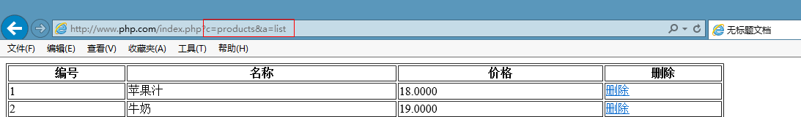

## 1.1  今日目标

1. 了解MVC思想的概念；
2. 理解MVC中每个组件所处理的业务；
3. 理解MVC思想的优缺点；
4. 掌握MVC思想的设计思路；
5. 了解基于MVC思想的单一入口概念；
6. 掌握MVC的实际应用；


## 1.2  MVC介绍

1、MVC是一个编程思想，是一种设计模式

2、思想：将一个功能分解成3个部分，M  V  C

Model（模型）:处理与数据有关的逻辑

View（视图）:显示页面

Controller（控制器）:处理业务逻辑

 


小结：

1、控制器用来接收请求

2、以后不能直接请求模型和视图


## 1.3  MVC演化

#### 1.3.1  显示商品

1、导入products表的数据

2、将上一讲的MyPDO类拷贝到站点下，改名为MyPDO.class.php，这个文件中只存放MyPDO类

3、在站点下创建index.php，代码如下

```php+HTML
<?php
//自动加载类
spl_autoload_register(function($class_name){
	require "./{$class_name}.class.php";
});
//连接数据库
$param=array(
	'user'	=>	'root',
	'pwd'	=>	'root'
);
$mypdo= MyPDO::getInstance($param);
//获取商品数据
$list=$mypdo->fetchAll('select * from products');
?>
<!doctype html>
<html>
<head>
<meta charset="utf-8">
<title>无标题文档</title>
</head>

<body>
	<table border='1' width='980' bordercolor='#000'>
		<tr>
			<th>编号</th> <th>名称</th> <th>价格</th> <th>删除</th>
		</tr>
		<?php foreach($list as $rows):?>
		<tr>
			<td><?=$rows['proID']?></td>
			<td><?=$rows['proname']?></td>
			<td><?=$rows['proprice']?></td>
			<td><a href="">删除</a></td>
		</tr>
		<?php endforeach;?>
	</table>
</body>
</html>
```

运行结果

 


#### 1.3.2  演化一：分离视图

1、创建products_list.html页面（视图页面）,将显示部分的代码拷贝到视图页面上

```php+HTML
<!doctype html>
<html>
<head>
<meta charset="utf-8">
<title>无标题文档</title>
</head>

<body>
	<table border='1' width='980' bordercolor='#000'>
		<tr>
			<th>编号</th> <th>名称</th> <th>价格</th> <th>删除</th>
		</tr>
		<?php foreach($list as $rows):?>
		<tr>
			<td><?=$rows['proID']?></td>
			<td><?=$rows['proname']?></td>
			<td><?=$rows['proprice']?></td>
			<td><a href="">删除</a></td>
		</tr>
		<?php endforeach;?>
	</table>
</body>
</html>
```

2、在index.php页面上加载视图

```php
<?php
//自动加载类
spl_autoload_register(function($class_name){
	require "./{$class_name}.class.php";
});
//连接数据库
$param=array(
	'user'	=>	'root',
	'pwd'	=>	'root'
);
$mypdo= MyPDO::getInstance($param);
//获取商品数据
$list=$mypdo->fetchAll('select * from products');
//加载视图
require './products_list.html';
```


#### 1.3.3  演化二：分离模型

模型的规则

1、一个表对应一个模型，表名和模型名一致（必须的）

2、模型以Model结尾（不是必须的）

代码实现:

1、在站点下创建ProductsModel.class.php页面

```php
<?php
//products模型用来操作products表
class ProductsModel {
	//获取products表的数据
	public function getList() {
		//连接数据库
		$param=array(
			'user'	=>	'root',
			'pwd'	=>	'root'
		);
		$mypdo= MyPDO::getInstance($param);
		//获取商品数据
		return $mypdo->fetchAll('select * from products');
	}
}
```

2、在index.php页面中调用模型的getList()

```php
<?php
//自动加载类
spl_autoload_register(function($class_name){
	require "./{$class_name}.class.php";
});
//实例化模型
$model=new ProductsModel();
$list=$model->getList();
//加载视图
require './products_list.html';
```


#### 1.3.4  演化三：分离基础模型


连接数据库的代码每个模型都要使用，所有我们需要将连接数据库的代码封装到基础模型类中（Model）

   

第一步：在站点下创建Model.class.php页面（基础模型）

```php
<?php
//基础模型
class Model {
	protected $mypdo;
	public function __construct() {
		$this->initMyPDO();
	}
	//连接数据库
	private function initMyPDO() {
		$param=array(
			'user'	=>	'root',
			'pwd'	=>	'root'
		);
		$this->mypdo= MyPDO::getInstance($param);
	}
}
```

第二步：ProductsModel继承基础模型类

```php
<?php
//products模型用来操作products表
class ProductsModel extends Model{
	//获取products表的数据
	public function getList() {
		return $this->mypdo->fetchAll('select * from products');
	}
}
```


#### 1.3.5 演化四：分离控制器

控制器代码放在index.php页面中是不合理的，因为项目中的控制器会很多，而index.php只有一个。所以需要将控制器分离开来

控制器的规则：

1、一个模块对应一个控制器（必须的）

2、控制器以Controller结尾（不是必须的）

3、控制器中的方法以Action结尾（不是必须的）,目的防止方法名是PHP关键字

创建ProductsController.class.php

```php
<?php
//商品模块
class ProductsController {
	//获取商品列表
	public function listAction() {
		//实例化模型
		$model=new ProductsModel();
		$list=$model->getList();
		//加载视图
		require './products_list.html';
	}
}
```

index.php页面

```php
<?php
//自动加载类
spl_autoload_register(function($class_name){
	require "./{$class_name}.class.php";
});
//确定路由
$c=$_GET['c']??'Products';   //控制器
$a=$_GET['a']??'list';		//方法
$c=ucfirst(strtolower($c));		//首字母大写
$a=strtolower($a);				//转成小写
$controller_name=$c.'Controller';	//拼接控制器类名
$action_name=$a.'Action';	//拼接方法名
//请求分发
$obj=new $controller_name();
$obj->$action_name();
```


 

通过在url地址上传递参数来寻址。

c：控制器

a：方法

 


注意：每次请求都要从index.php进入。所以index.php又叫入口文件。

 小结：

 


## 1.4  删除商品

入口(products_list.html)

```html
<td><a href="index.php?c=Products&a=del&proid=<?=$rows['proID']?>" onclick="return confirm('确定要删除吗')">删除</a></td>
```


控制器（ProductsController）

```php
<?php
//商品模块
class ProductsController {
	..
	//删除商品
	public function delAction() {
		$id=(int)$_GET['proid'];	//如果参数明确是整数，要强制转成整形
		$model=new ProductsModel();
		if($model->del($id))
			header('location:index.php?c=Products&a=list');
		else {
			echo '删除失败';
			exit;
		}
	}
}

```

模型（ProductsModel）

```php
<?php
//products模型用来操作products表
class ProductsModel extends Model{
	...
	//删除商品
	public function del($proid) {
		return $this->mypdo->exec("delete from products where proid=$proid");
	}
}

```

视图

```
无
```


## 1.5 作业

1、实现添加和修改功能

