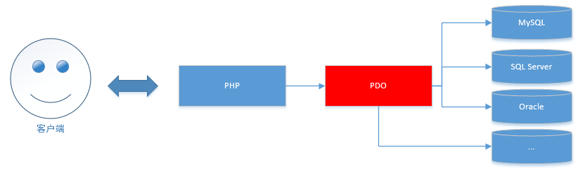
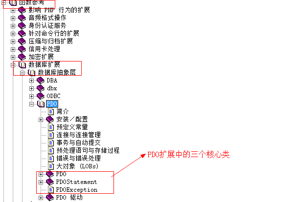
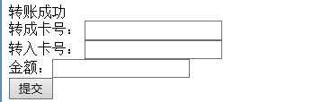
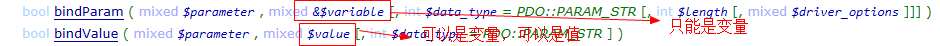

## 1.1  今日目标

1. 理解PDO产生的价值；
2. 了解PDO中三个类各自主要的功能；
3. 掌握PDO类的对象实例化；
4. 了解PDO设置属性的原理；
5. 了解PDOStatement类对象产生的原理；
6. 掌握fetch数据获取的应用；
7. 掌握PDO中预处理的应用；
8. 了解PDO中事务处理的应用；
9. 了解PDO中的三种错误处理模式；
10. 掌握PDO异常的使用；
11. 理解PDO二次封装的意义；
12. 掌握PDO的二次封装；


## 1.2  PDO介绍

#### 1.2.1  连接数据库方式

方法一：mysql扩展【这种方式php7已经淘汰】
方法二：mysqli扩展
方法三：PDO扩展


#### 1.2.2  PDO介绍

PDO（PHP Data Object）扩展为PHP访问各种数据库提供了一个轻量级，一致性的接口。无论访问什么数据库，都可以通过一致性的接口去操作。

 


#### 1.2.3	开启PDO扩展

开启PDO连接MySQL扩展

```php
extension=php_pdo_mysql.dll
```


## 1.3 PDO核心类

1、PDO类：表示PHP和数据库之间的一个连接
2、PDOStatement 类
​	第一：表示执行数据查询语句（select ,show）后的相关结果集
​	第二：预处理对象
3、PDOException类：表示PDO的异常

 


## 1.4 实例化PDO对象

语法

```
__construct($dsn,用户名,密码)
```

#### 1.4.1 DSN

DSN：data source name，数据源名称，包含的是连接数据库的信息，格式如下：

```
$dsn=数据库类型:host=主机地址;port=端口号;dbname=数据库名称;charset=字符集
```

数据库类型：

```
MySQL数据库	=>	mysql:
oracle数据库	=>	oci:
SQL Server 		=>sqlsrv:
具体驱动类型参见手册“PDO驱动”
```

#### 1.4.2	实例化PDO

实例化PDO的过程就是连接数据库的过程

```php
<?php
$dsn='mysql:host=localhost;port=3306;dbname=data;charset=utf8';
$pdo=new PDO($dsn,'root','root');
var_dump($pdo); //object(PDO)#1 (0) { } 
```

#### 1.4.3  注意事项

1、如果连接的是本地数据库，host可以省略

```php
<?php
$dsn='mysql:port=3306;dbname=data;charset=utf8';
$pdo=new PDO($dsn,'root','root');
var_dump($pdo); //object(PDO)#1 (0) { } 
```

2、如果使用的是3306端口，port可以省略

```php
<?php
$dsn='mysql:dbname=data;charset=utf8';
$pdo=new PDO($dsn,'root','root');
var_dump($pdo); //object(PDO)#1 (0) { } 
```

3、charset也省略，如果省略，使用的是默认字符编码

```php
<?php
$dsn='mysql:dbname=data';
$pdo=new PDO($dsn,'root','root');
var_dump($pdo); 
```

4、dbname也可以省略，如果省略就没有选择数据库

```php
<?php
$dsn='mysql:';
$pdo=new PDO($dsn,'root','root');
var_dump($pdo); 
```

5、host、port、dbname、charset不区分大小写，没有先后顺序

6、驱动名称不能省略，冒号不能省略（因为冒号是驱动名组成部分），数据库驱动只能小写


## 1.5  使用PDO

#### 1.5.1  执行数据操作语句

方法:$pdo->exec($sql)，执行数据增、删、改语句，执行成功返回受影响的记录数，如果SQL语句错误返回false。

```php
<?php
//1、实例化PDO
$dsn='mysql:host=localhost;port=3306;dbname=data;charset=utf8';
$pdo=new PDO($dsn,'root','root');
//2执行数据操作语句
//2.1 执行增加
/*
if($pdo->exec("insert into news values (null,'bb','bbbbbb',unix_timestamp())"))
    echo '自动增长的编号是：'.$pdo->lastInsertId (),'<br>';
*/
//2.2 执行修改
//echo $pdo->exec("update news set title='静夜思' where id in (3,4)");
//2.3 执行删除
//echo $pdo->exec('delete from news where id=5');\
//2.4 完善
$sql="update news set title='静夜思1' where ids in (3,4)";
$rs=$pdo->exec($sql);
if($rs){
    echo 'SQL语句执行成功<br>';
    if(substr($sql, 0,6)=='insert')
        echo '自动增长的编号是：'.$pdo->lastInsertId (),'<br>';
    else
        echo '受到影响的记录数是：'.$rs,'<br>';
}elseif($rs===0){
    echo '数据没有变化<br>';
}elseif($rs===false){
    echo 'SQL语句执行失败<br>';
    echo '错误编号：'.$pdo->errorCode(),'<br>';
    //var_dump($pdo->errorInfo());
    echo '错误信息：'.$pdo->errorInfo()[2];
}
```


#### 1.5.2  执行数据查询语句

方法：$pdo->query($sql)，返回的是PDOStatement对象

```php
<?php
$dsn='mysql:dbname=data;charset=utf8';
$pdo=new PDO($dsn,'root','root');
//1、执行数据查询语句
$stmt=$pdo->query('select * from products');
//var_dump($stmt);        //object(PDOStatement)
//2、获取数据
//2.1  获取二维数组
//$rs=$stmt->fetchAll();  //默认返回关联和索引数组
//$rs=$stmt->fetchAll(PDO::FETCH_BOTH);     //返回关联和索引数组
//$rs=$stmt->fetchAll(PDO::FETCH_NUM);      //返回索引数组
//$rs=$stmt->fetchAll(PDO::FETCH_ASSOC);    //返回关联数组
//$rs=$stmt->fetchAll(PDO::FETCH_OBJ);        //返回对象数组

//2.2  获取一维数组,匹配完成后指针下移一条
//$rs=$stmt->fetch();     //关联和索引数组
//$rs=$stmt->fetch(PDO::FETCH_NUM);   //索引数组
//例题：通过while循环获取所有数据
/*
while($row=$stmt->fetch(PDO::FETCH_ASSOC)){
    $rs[]=$row;
}
echo '<pre>';
var_dump($rs);
 */

//3.3  匹配列：匹配当前行的第n列，列的编号从0开始，匹配完毕后指针下移一条
//echo $stmt->fetchColumn();  //获取当前行的第0列
//echo $stmt->fetchColumn(1);  //获取当前行的第1列

//3.4  总行数，总列数
/*
echo '总行数：'.$stmt->rowCount(),'<br>';
echo '总列数：'.$stmt->columnCount();
*/

//3.5 遍历PDOStatement对象（PDOStatement对象是有迭代器的）
foreach($stmt as $row){
    echo $row['proname'],'-',$row['proprice'],'<br>';
}
```

```
stdClass类是所有PHP类的父类
```


#### 1.5.3   PDO操作事务

事务：是一个整体，要么一起执行，要么一起回滚

事务的特性：原子性，一致性，隔离性，永久性

需要将多个SQL语句作为一个整体执行，就需要使用到事务

语法

```mysql
start transaction 或 begin		开启事务
commit	提交事务
rollback	回滚事务
```

例题

创建测试数据

```mysql
create table bank(
       cardid char(4) primary key comment '卡号',
       balance decimal(10,2) not null comment '余额'
)engine=innodb charset=utf8 comment '银行卡号表'

insert into bank values ('1001',1000),('1002',1)
```

PDO操作事务

```php+HTML
<body>
<?php
if(!empty($_POST)){
    $dsn='mysql:dbname=data;charset=utf8';
    $pdo=new PDO($dsn,'root','root');
    $out=$_POST['card_out'];    //转出卡号
    $in=$_POST['card_in'];      //注入卡号
    $money=$_POST['money'];     //金额
    $pdo->beginTransaction();   //开启事务
    //转账
    $flag1=$pdo->exec("update bank set balance=balance-$money where cardid='$out'");
    $flag2=$pdo->exec("update bank set balance=balance+$money where cardid='$in'");
    //查看转出的账号是否大于0，大于0返回true，否则返回false
    $stmt=$pdo->query("select balance from bank where cardid='$out'"); 
    $flag3=$stmt->fetchColumn()>=0?1:0;
    
    if($flag1 && $flag2 && $flag3){
        $pdo->commit ();    //提交事务
        echo '转账成功';
    }
    else{
        $pdo->rollBack ();  //回滚事务
        echo '转账失败';
    }
}
?>
<form action="" method="post">
    转出卡号： <input type="text" name="card_out" id=""> <br>
    转入卡号： <input type="text" name="card_in" id=""> <br>
    金额：<input type="text" name="money" id=""> <br>
    <input type="submit" value="提交">
</form>
</body>
```

运行结果

 

小结：

```
 $pdo->beginTransaction()	开启事务
 $pdo->commit ()			提交事务
 $pdo->rollBack()			回滚事务
```


#### 1.5.4   PDO操作预处理

**复习MySQL中预处理**

预处理好处：编译一次多次执行，用来解决一条SQL语句多次执行的问题，提高了执行效率。

预处理语句：

```mysql
prepare 预处理名字 from 'sql语句'
```

执行预处理

```mysql
execute 预处理名字 [using 变量]
```


**PDO中的预处理——位置占位符**

```php
<?php
    $dsn='mysql:dbname=data;charset=utf8';
    $pdo=new PDO($dsn,'root','root');
    //创建预处理对象
    $stmt=$pdo->prepare("insert into bank values (?,?)");   //?是占位符
    //执行预处理
    $cards=[
        ['1003',500],
        ['1004',100]
    ];
    foreach($cards as $card){
        //绑定参数，并执行预处理,
        //方法一：
        /*
        $stmt->bindParam(1, $card[0]);  //占位符的位置从1开始
        $stmt->bindParam(2, $card[1]);
        $stmt->execute();               //执行预处理
         */
        //方法二：
        /*
        $stmt->bindValue(1, $card[0]);
        $stmt->bindValue(2, $card[1]);
        $stmt->execute();
         */
        //方法三：如果占位符的顺序和数组的顺序一致，可以直接传递数组
        $stmt->execute($card);  
    }
```


**PDO中的预处理——参数占位符**

```PHP
<?php
$dsn='mysql:dbname=data;charset=utf8';
$pdo=new PDO($dsn,'root','root');
//创建预处理对象
$stmt=$pdo->prepare("insert into bank values (:p1,:p2)");   //:p1,:p2是参数占位符
//执行预处理
$cards=[
    ['p1'=>'1003','p2'=>500],
    ['p1'=>'1004','p2'=>1000]
];
foreach($cards as $card){
    //方法一：
    /*
    $stmt->bindParam(':p1', $card['p1']);
    $stmt->bindParam(':p2', $card['p2']);
    $stmt->execute();
     */
    //方法二：但数组的下标和参数名一致的时候就可以直接传递关联数组
    $stmt->execute($card);
}
```


小结：

1、?是位置占位符

2、参数占位符以冒号开头

3、$stmt->bindParam()和$stmt->bindValue()区别

 

4、预处理的好处

```
a)提高执行效率
b)提高安全性
```


## 1.6  PDO异常处理

```php
<?php
try{
    $dsn='mysql:dbname=data;charset=utf8';
    $pdo=new PDO($dsn,'root','root');
    //这是PDO错误模式属性，PDO自动抛出异常
    $pdo->setAttribute(PDO::ATTR_ERRMODE, PDO::ERRMODE_EXCEPTION);
    $pdo->query('select * from newsssssss');  //自动抛出异常
} catch (PDOException $ex) {
    echo '错误信息：'.$ex->getMessage(),'<br>';
    echo '错误文件：'.$ex->getFile(),'<br>';
    echo '错误行号：'.$ex->getLine();
}
```

小结：

1、PDOException是PDO的异常类

2、实例化PDO会自动抛出异常

3、其他操作不会抛出异常，需要设置PDO的异常模式

4、PDO异常模式

```
PDO::ERRMODE_EXCEPTION	抛出异常
PDO::ERRMODE_SILENT		中断
PDO::ERRMODE_WARNING	警告
```


## 1.7  单例模式封装MyPDO类

#### 1.7.1  步骤

1、单例模式

2、初始化参数

3、连接数据库

4、执行增删改

5、执行查询

​	a）返回二维数组

​	b）返回一维数组

​	c）返回一行一列


#### 1.7.2 代码实现

第一部分：单例、初始化参数、实例化PDO

```php
<?php
class MyPDO{
    private $type;      //数据库类别
    private $host;      //主机地址
    private $port;      //端口号
    private $dbname;    //数据库名
    private $charset;   //字符集
    private $user;      //用户名
    private $pwd;       //密码
    private $pdo;       //保存PDO对象
    private static $instance;
    private function __construct($param) {
        $this->initParam($param);
        $this->initPDO();
    }
    private function __clone() {
    }
    public static function getInstance($param=array()){
        if(!self::$instance instanceof self)
            self::$instance=new self($param);
        return self::$instance;
    }
    //初始化参数
    private function initParam($param){
        $this->type=$param['type']??'mysql';
        $this->host=$param['host']??'127.0.0.1';
        $this->port=$param['port']??'3306';
        $this->dbname=$param['dbname']??'data';
        $this->charset=$param['charset']??'utf8';
        $this->user=$param['user']??'root';
        $this->pwd=$param['pwd']??'root';
    }
    //初始化PDO
    private function initPDO(){
        try{
            $dsn="{$this->type}:host={$this->host};port={$this->port};dbname={$this->dbname};charset={$this->charset}";
            $this->pdo=new PDO($dsn, $this->user, $this->pwd);
        } catch (PDOException $ex) {
            echo '错误编号：'.$ex->getCode(),'<br>';
            echo '错误行号：'.$ex->getLine(),'<br>';
            echo '错误文件：'.$ex->getFile(),'<br>';
            echo '错误信息：'.$ex->getMessage(),'<br>';
            exit;
        }
    }
}
//测试
$param=array(
);
$mypdo= MyPDO::getInstance($param);
var_dump($mypdo);
```

第二部分：数据操作部分

```php
<?php
class MyPDO{
    private $type;      //数据库类别
    private $host;      //主机地址
    private $port;      //端口号
    private $dbname;    //数据库名
    private $charset;   //字符集
    private $user;      //用户名
    private $pwd;       //密码
    private $pdo;       //保存PDO对象
    private static $instance;
    private function __construct($param) {
        $this->initParam($param);
        $this->initPDO();
        $this->initException();
    }
    private function __clone() {
    }
    public static function getInstance($param=array()){
        if(!self::$instance instanceof self)
            self::$instance=new self($param);
        return self::$instance;
    }
    //初始化参数
    private function initParam($param){
        $this->type=$param['type']??'mysql';
        $this->host=$param['host']??'127.0.0.1';
        $this->port=$param['port']??'3306';
        $this->dbname=$param['dbname']??'data';
        $this->charset=$param['charset']??'utf8';
        $this->user=$param['user']??'root';
        $this->pwd=$param['pwd']??'root';
    }
    //初始化PDO
    private function initPDO(){
        try{
            $dsn="{$this->type}:host={$this->host};port={$this->port};dbname={$this->dbname};charset={$this->charset}";
            $this->pdo=new PDO($dsn, $this->user, $this->pwd);
        } catch (PDOException $ex) {
            $this->showException($ex);
            exit;
        }
    }
    
    //显示异常
    private function showException($ex,$sql=''){
        if($sql!=''){
            echo 'SQL语句执行失败<br>';
            echo '错误的SQL语句是：'.$sql,'<br>';
        }
        echo '错误编号：'.$ex->getCode(),'<br>';
        echo '错误行号：'.$ex->getLine(),'<br>';
        echo '错误文件：'.$ex->getFile(),'<br>';
        echo '错误信息：'.$ex->getMessage(),'<br>';
    }
    //设置异常模式
    private function initException(){
        $this->pdo->setAttribute(PDO::ATTR_ERRMODE,PDO::ERRMODE_EXCEPTION);
    }

    //执行增、删、改操作
    public function exec($sql){
        try{
            return $this->pdo->exec($sql);
        } catch (PDOException $ex) {
            $this->showException($ex, $sql);
            exit;
        }
    }
    //获取自动增长的编号
    public function lastInsertId(){
        return $this->pdo->lastInsertId();
    }
}
//测试
$param=array(
   
);
$mypdo= MyPDO::getInstance($param);
//echo $mypdo->exec('delete from news where id=6');
if($mypdo->exec("insert into news values (null,'11','1111',unix_timestamp())"))
    echo '自动增长的编号是：'.$mypdo->lastInsertId ();
```


第三部分：数据查询部分

```php
<?php
class MyPDO{
   ...
    
    //判断匹配的类型
    private function fetchType($type){
        switch ($type){
            case 'num':
                return PDO::FETCH_NUM;
            case 'both':
                return PDO::FETCH_BOTH;
            case 'obj':
                return PDO::FETCH_OBJ;
            default:
                 return PDO::FETCH_ASSOC;
        }
    }
    //获取所有数据 ，返回二维数组
    public function fetchAll($sql,$type='assoc'){
        try{
            $stmt=$this->pdo->query($sql);  //获取PDOStatement对象
            $type= $this->fetchType($type); //获取匹配方法
            return $stmt->fetchAll($type);
        } catch (Exception $ex) {
            $this->showException($ex, $sql);
        }
    }
    //获取一维数组
    public function fetchRow($sql,$type='assoc'){
        try{
            $stmt=$this->pdo->query($sql);  //获取PDOStatement对象
            $type= $this->fetchType($type); //获取匹配方法
            return $stmt->fetch($type);
        } catch (Exception $ex) {
            $this->showException($ex, $sql);
            exit;
        }
    }
    //返回一行一列
    public function fetchColumn($sql){
        try{
             $stmt=$this->pdo->query($sql);
            return $stmt->fetchColumn();
        } catch (Exception $ex) {
            $this->showException($ex, $sql);
            exit;
        }
        
    }
    
}
//测试
$param=array(
   
);
$mypdo= MyPDO::getInstance($param);
//echo $mypdo->exec('delete from news where id=6');
/*
if($mypdo->exec("insert into news values (null,'11','1111',unix_timestamp())"))
    echo '自动增长的编号是：'.$mypdo->lastInsertId ();
 */

//$list=$mypdo->fetchAll('select * from news');
//$list=$mypdo->fetchRow('select * from news where id=1');
$list=$mypdo->fetchColumn('select count(*) from news');
echo '<pre>';
var_dump($list);
```


