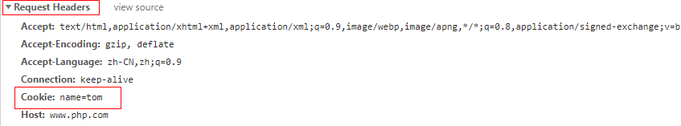

## 1.1  今日目标

1. 掌握cookie技术的实现方式；
2. 掌握cookie结束的应用场景；
3. 理解和控制cookie的生命周期；
4. 理解和控制cookie的作用范围；
5. 理解和控制cookie的跨域访问；


## 1.2  SQL封装

每个功能都要写SQL语句，我们可以封装一个万能的方法来操作所有的表

#### 1.2.1  生成insert语句

```php
<?php
$table='products';	//表名
//插入的数据
$data['proid']='111';
$data['proname']='钢笔';
$data['proprice']=120;
//第一步：拼接字段名
$keys=array_keys($data);		//获取所有的字段名
$keys=array_map(function($key){	//在所有的字段名上添加反引号
	return "`{$key}`";
},$keys);
$keys=implode(',',$keys);		//字段名用逗号连接起来

//第二步：拼接值
$values=array_values($data);	//获取所有的值
$values=array_map(function($value){	//所有的值上添加单引号
	return "'{$value}'";
},$values);
$values=implode(',',$values);	//值通过逗号连接起来

//第三步：拼接SQL语句

echo $sql="insert into `{$table}` ($keys) values ($values)";

```

小结：

1、array_keys：获取数组的键

2、array_values：获取数组的值

3、array_map()：数组中的每一个元素依次调用回调函数。


#### 1.2.2  生成更新语句

```php
<?php
$table='products';	//表名
$data['proname']='钢笔';
$data['proprice']=120;
$data['proID']='111';
//获取主键
function getPrimaryKey($table) {
	//连接数据库
	$link=mysqli_connect('localhost','root','root','data');
	mysqli_set_charset($link,'utf8');
	//查看表结构
	$rs=mysqli_query($link,"desc `{$table}`");
	//循环判断主键
	while($rows=mysqli_fetch_assoc($rs)){
		if($rows['Key']=='PRI')
			return $rows['Field'];
	}
}
//第一步：获取非主键
$keys=array_keys($data);	//获取所有键
$pk=getPrimaryKey($table);	//获取主键
$index=array_search($pk,$keys);	//返回主键在数组中的下标
unset($keys[$index]);		//删除主键
//第二步：拼接`键`='值'的形式
$keys=array_map(function($key) use ($data){
	return "`{$key}`='{$data[$key]}'";
},$keys);
$keys=implode(',',$keys);
//第三步：拼接SQL语句
echo $sql="update `{$table}` set $keys where $pk='{$data[$pk]}'";
```


#### 1.2.3  生成select语句

```php
<?php
/**
*$table string 表名
*$cond array 条件
*/
function select($table,$cond=array()) {
	$sql="select * from `{$table}` where 1";
	//拼接条件
	if(!empty($cond)){
		foreach($cond as $k=>$v){
			if(is_array($v)){	//条件的值是数组类型
				switch($v[0]){	//$v[0]保存的是符号，$v[1]是值
					case 'eq':		//等于  equal
						$op='=';
						break;
					case 'gt':		//大于  greater than
						$op='>';
						break;
					case 'lt':
						$op='<';
						break;
					case 'gte':
					case 'egt':
						$op='>=';
						break;
					case 'lte':
					case 'elt':
						$op='<=';
						break;
					case 'neq':
						$op='<>';
						break;
				}
				$sql.=" and `$k` $op '$v[1]'";
			}else{
				$sql.=" and `$k`='$v'";
			}
		}
	}

	return $sql;
}

//测试
$table='products';	//表名
$cond=array(
	'proname'	=>	'钢笔',
	'proprice'	=>	array('eq','12'),
	'aa'	=>	array('gt',10),
	'bb'	=>	array('lt',20),
);

echo select($table),'<br>';
echo select($table,$cond);
```


#### 1.2.4  获取表名

```php
<?php
namespace Core;
class Model {
	private $table;
	public function __construct($table='') {
		if($table!='')		//直接给基础模型传递表名
			$this->table=$table;
		else {				//实例化子类模型
			$this->table=substr(basename(get_class($this)),0,-5);
		}

		echo $this->table,'<br>';
	}
}

namespace Model;
class ProductsModel extends \Core\Model{
	
}
namespace Controller\Admin;

new \Core\Model('news');			//news
new \Model\ProductsModel();			//Products
```

小结：

1、get_class()：获取对象的类（包括命名空间）

2、substr()：截取字符串，-5表示字符串的最后5个字符忽略


#### 1.2.5  在项目中封装万能的增、删、改、查

由于封装的方法可以操作所有的表，可以这些方法封装在基础模型中

```php
<?php
namespace Core;
//基础模型
class Model {
    protected $mypdo;
    private $table; //表名
    private $pk;    //主键
    public function __construct($table='') {
        $this->initMyPDO();
        $this->initTable($table);
        $this->getPrimaryKey();
    }
    //连接数据库
    private function initMyPDO() {
        $this->mypdo= MyPDO::getInstance($GLOBALS['config']['database']);
    }
    //获取表名
    private function initTable($table){
        if($table!='')		//直接给基础模型传递表名
            $this->table=$table;
        else {				//实例化子类模型
            $this->table=substr(basename(get_class($this)),0,-5);
        }
    }
    //获取主键
    private function getPrimaryKey() {
	$rs=$this->mypdo->fetchAll("desc `{$this->table}`");
	foreach($rs as $rows){
            if($rows['Key']=='PRI'){
                $this->pk=$rows['Field'];
                break;
            }
	}
    }
    //万能的插入
    public function insert($data){
        $keys=array_keys($data);		//获取所有的字段名
        $keys=array_map(function($key){	//在所有的字段名上添加反引号
                return "`{$key}`";
        },$keys);
        $keys=implode(',',$keys);		//字段名用逗号连接起来
        $values=array_values($data);	//获取所有的值
        $values=array_map(function($value){	//所有的值上添加单引号
                return "'{$value}'";
        },$values);
        $values=implode(',',$values);	//值通过逗号连接起来
        $sql="insert into `{$this->table}` ($keys) values ($values)";
        return $this->mypdo->exec($sql);
    }
    //万能的更新
    public function update($data){
        $keys=array_keys($data);	//获取所有键
        $index=array_search($this->pk,$keys);	//返回主键在数组中的下标
        unset($keys[$index]);		//删除主键
        $keys=array_map(function($key) use ($data){
                return "`{$key}`='{$data[$key]}'";
        },$keys);
        $keys=implode(',',$keys);
        $sql="update `{$this->table}` set $keys where $this->pk='{$data[$this->pk]}'";
        return $this->mypdo->exec($sql);
    }
    //删除
    public function delete($id){
        $sql="delete from `{$this->table}` where `{$this->pk}`='$id'";
        return $this->mypdo->exec($sql);
    }
    //查询,返回二维数组
    public function select($cond=array()){
        $sql="select * from `{$this->table}` where 1";
	if(!empty($cond)){
            foreach($cond as $k=>$v){
                if(is_array($v)){	//条件的值是数组类型
                        switch($v[0]){	//$v[0]保存的是符号，$v[1]是值
                                case 'eq':		//等于  equal
                                        $op='=';
                                        break;
                                case 'gt':		//大于  greater than
                                        $op='>';
                                        break;
                                case 'lt':
                                        $op='<';
                                        break;
                                case 'gte':
                                case 'egt':
                                        $op='>=';
                                        break;
                                case 'lte':
                                case 'elt':
                                        $op='<=';
                                        break;
                                case 'neq':
                                        $op='<>';
                                        break;
                        }
                        $sql.=" and `$k` $op '$v[1]'";
                }else{
                        $sql.=" and `$k`='$v'";
                }
            }
	}
        return $this->mypdo->fetchAll($sql);
    }
    //查询，返回一维数组
    public function find($id){
        $sql="select * from `{$this->table}` where `{$this->pk}`='$id'";
        return $this->mypdo->fetchRow($sql);
    }
}
```


#### 1.2.6  更改项目

1、删除ProductsModel类中的方法

```php
<?php
namespace Model;
//products模型用来操作products表
class ProductsModel extends \Core\Model{
}
```

2、在控制器中直接调用基础模型的方法

```php
class ProductsController{
    use \Traits\Jump;
    //获取商品列表
    public function listAction() {
        //实例化模型
        $model=new \Model\ProductsModel();
        $list=$model->select();
        //加载视图
        require __VIEW__.'products_list.html';
    }
    //删除商品
    public function delAction() {
        $id=(int)$_GET['proid'];	//如果参数明确是整数，要强制转成整形
        $model=new \Model\ProductsModel();
        if($model->delete($id))
            $this->success('index.php?p=Admin&c=Products&a=list', '删除成功');
        else 
            $this->error('index.php?p=admin&c=Products&a=list', '删除失败');
    }
    ...
```


## 1.3  作业实现

#### 1.3.1  添加商品

步骤：

1、创建添加商品页面

2、实现添加逻辑

代码实现

1、入口（products_list.html）

```html
<a href="index.php?p=Admin&c=Products&a=add">添加商品</a>
```

2、控制器（ProductsController）

```php
public function addAction(){
    //执行添加逻辑
    if(!empty($_POST)){
        $model=new \Core\Model('products');
        if($model->insert($_POST))
            $this->success ('index.php?p=Admin&c=Products&a=list', '插入成功');
        else
            $this->error ('index.php?p=Admin&c=Products&a=add', '插入失败');
    }
    //显示添加页面
    require __VIEW__.'products_add.html';
}
```

3、模型

```
无
```

4、视图：在view\Admin目录下创建products_add.html页面

```html
<body>
<form method="post" action="">
	名称： <input type="text" name="proname"> <br />
	价格： <input type="text" name="proprice"> <br />
	<input type="submit" value="提交">
</form>
</body>
```


#### 1.3.2  修改商品

步骤：

1、显示修改的界面

2、执行修改逻辑

代码实现

1、入口（products_list.html）

```html
<a href="index.php?p=Admin&c=Products&a=edit&proid=<?=$rows['proID']?>">修改</a>
```

2、控制器（ProductsController）

```php
public function editAction(){
    $proid=$_GET['proid'];  //需要修改的商品id
    $model=new \Core\Model('products');
    //执行修改逻辑
    if(!empty($_POST)){
        $_POST['proID']=$proid;
        if($model->update($_POST))
            $this->success ('index.php?p=Admin&c=Products&a=list', '修改成功');
        else
            $this->error ('index.php?p=Admin&c=Products&a=edit&proid='.$proid, '修改失败');
    }
    //显示商品
    $info=$model->find($proid);
    require __VIEW__.'products_edit.html';
}
```

3、模型

```
无
```

4、视图：在view\admin目录下创建products_edit.html

```php+HTML
<body>
<form method="post" action="">
	名称： <input type="text" name="proname" value='<?=$info['proname']?>'> <br />
	价格： <input type="text" name="proprice" value='<?=$info['proprice']?>'> <br />
	<!--
	<input type="hidden" name="proID" value=<?=$info['proID']?>>
	-->
	<input type="submit" value="提交">
</form>
```


## 1.4 Cookie

思考：A页面中的变量如果提供给B页面访问

方法一：包含文件

方法二：get或post提交

方法三：cookie，cookie就是保存在客户端的信息文件


#### 1.4.1  原理

cookie是保存在客户端的信息包（一个文件）

  


通过header()、setcookie()操作响应头

语法格式：header(键:值)

```php
<?php
header('content-type:charset=gbk');
header('name:tom');
```

setcookie()作用：将值放到响应头中发送到客户端，并保存到客户端。


#### 1.4.2  设置cookie 

```php
<?php
setcookie('name','tom');	//将name=tom放到响应头中
```

在响应头中可以看到cookie的信息

  


客户端有cookei信息后，每次请求服务器，cookie的信息都会自动的放到请求头中带到服务器。

  


#### 1.4.3  获取cookie的值

```php
<?php
echo $_COOKIE['name'];	//从请求头中获取名字是name的cookie
```


注意：

1、关闭浏览器后，cookie消失。这种cookie称为临时性cookie

2、cookie的信息不可以在不同的浏览器中共享，不可以跨浏览器。

 

思考：如下代码为什么第一次执行报错，第二次执行正常

 ```php
<?php
setcookie('name','tom');
echo $_COOKIE['name'];  //在请求头中获取name的cookie
 ```

因为：第一次访问请求头中没有cookie的值所以获取不到，第二次访问由于第一次已经设置了将cookie设置到响应头中，第二次访问就会自动将cookie的信息放到请求头中，所以第二次访问就能获取cookie的值了


#### 1.4.4  永久性cookie

说明：关闭浏览器后cookie的值不消失

应用场景：

 


语法：给cookie添加过期时间就形成了永久性cookie，过期时间是时间类型是时间戳

```php
$time=time()+3600;
setcookie('name','tom',$time);	 //cookie的有效时间是3600秒
```


#### 1.4.5 cookie的有效目录

cookie默认在当前目录及子目录中有效

cookie一般要设置在整站有效

```php
setcookie('name','tom',0,'/');	 //   /表示根目录
```


#### 1.4.6  支持子域名

场景：每个域名代码一个网站，网站之间的cookie是不可以相互访问的。

问题：百度下有多个二级域名的网站，他们自己的cookie是要共享的，如何实现？

```php
<?php
setcookie('name','tom',0,'/','baidu.com');   //在baidu.com域名下都有效
?>
<a href="http://www.bb.baidu.com/bb.php">跳转</a>
```


#### 1.4.7  是否安全传输

安全传输就是https传输。

默认情况下https和http都可以传输cookie

```php
setcookie('name','tom',0,'/','',true);	 //   true表示只能是https传输
```


#### 1.4.8  是否安全访问

默认情况下，PHP和JS都可以访问cookie

安全访问：PHP可以访问，JS不可以  默认是false。

 php代码

```php
<?php
setcookie('name','tom',0,'/','',false,true);	
?>
<a href="/5-demo2.php">跳转</a>

```

html代码

```php+HTML
<?php
echo $_COOKIE['name'],'<br>';     //PHP获取cookie
?>

<script type="text/javascript">
	document.write(document.cookie);  //js获取cookie
</script>
```


#### 1.4.9  删除cookie

注意：cookie中只能保存数字和字符串。

```php
<?php
//setcookie('name',false);			//删除cookie方法一
//setcookie('name');				//删除cookie方法二
setcookie('name','tom',time()-1);	//删除cookie方法三
```


#### 1.4.10  cookie的缺点

1、因为在浏览器中可以看到cookie 的值，所以安全性低

2、因为只能保存字符串和数字，所以可控性差

3、因为数据放在请求头中传输，增加了请求时候的数据负载。

4、因为数据存储在浏览器中，但浏览器存储空间是有吸限制的，一般是4K。


