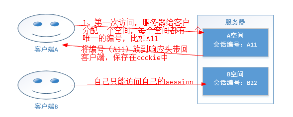
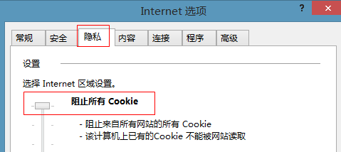
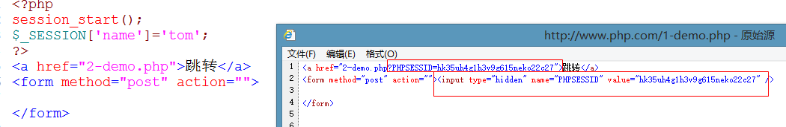
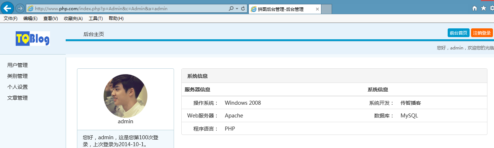
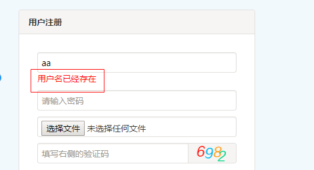
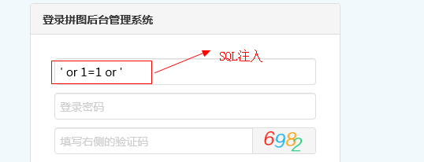
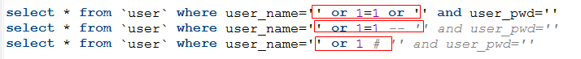
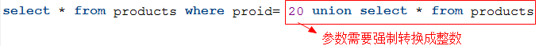
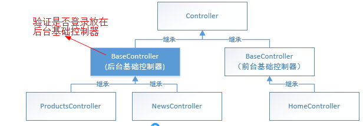

## 1.1  今日目标

1. 理解会话技术的概念；
2. 理解会话技术产生的原因和工作原理；
3. 理解session的工作原理；
4. 理解session与cookie的关系；
5. 掌握session与cookie的区别；
6. 了解session的配置与作用；
7. 理解session入库的作用；
8. 掌握session入库的原理；
9. 能够封装session入库的类；


## 1.2  Session（会话）

#### 1.2.1  原理

1、session是服务器端的技术

2、session是基于cookie技术的

  


#### 1.2.2  session操作

1、默认情况下，会话不会自动开启，通过session_start()开启会话

2、通过session_id()获取会话的编号

3、通过$_SESSION操作会话

4、会话可以保存除了资源以外的所有类型。

5、重复开启会话会报错，一般出现在包含文件中。

```php
<?php
session_start();		//开启会话
@session_start();      //重复开启会话会报错，可以通过错误抑制符来屏蔽错误
$_SESSION['name']='tom';	//保存会话
$_SESSION['age']=20;

echo $_SESSION['name'],'<br>';
echo $_SESSION['age'],'<br>';
echo '会话编号：'.session_id();   //获取会话编号
```

session_start()作用

```
1、没有会话空间就创建一个空间
2、有会话空间就打开空间
```


#### 1.2.3  与会话有关的配置

重要：

```
1、session.save_path="F:\wamp\tmp\"		session保存的地址
2、session.auto_start = 1				session自动开启，默认不自动开启
3、session.save_handler = files			会话以文件的形式保存
4、session.gc_maxlifetime = 1440			会话的生命周期是1440秒
```

了解：

```php
session.name = PHPSESSID
session.cookie_lifetime = 0				会话编号的过期时间
session.cookie_path = /					会话编号整站有效
session.cookie_domain =					会话编号在当前域名下有效
```


#### 1.2.4  销毁会话

通过session_destroy()销毁会话

销毁会话就是删除自己的会话文件。

```php
<?php
session_start();
session_destroy();	//销毁会话
```


#### 1.2.5  垃圾回收

1、会话文件超过了生命周期是垃圾文件。

2、PHP自动进行垃圾回收

3、垃圾回收的概率默认是1/1000

```php
session.gc_probability = 1
session.gc_divisor = 1000
```


#### 1.2.6  session和cookie的区别

|          | cookie   | session                |
| -------- | -------- | ---------------------- |
| 保存位置 | 客户端   | 服务器端               |
| 数据大小 | 小（4K） | 大                     |
| 数据类型 | 字符串   | 除了资源以外的所有类型 |
| 安全性   | 不安全   | 安全                   |


#### 1.2.7  禁用cookie对session的影响

session是基于cookie的，如果禁用cookie，session无法使用。

 


解决：

默认情况下，session只依赖于cookie,session的编号只能通过cookie传输

可以设置为session不仅仅依赖于cookie

```
session.use_only_cookies = 0    // session不仅仅依赖于cookie
session.use_trans_sid = 1		//允许通过其他方式传递session_id
```

 

设置后，php自动添加get和post传递session_id

 


## 1.3 session入库

session默认情况下存储到文件中，我们可以将session存储到数据库中


#### 1.3.1  创建sess表

```mysql
-- 如果用了text类型就不能使用memory引擎
drop table if exists sess;
create table sess(
       sess_id varchar(50) primary key comment '会话编号',
       sess_value text comment '会话值',
       sess_time int unsigned not null comment '会话产生时间'
)engine=innodb  charset=utf8 comment '会话表'

-- memory引擎数据存储在内存中
drop table if exists sess;
create table sess(
       sess_id varchar(50) primary key comment '会话编号',
       sess_value varchar(2000) comment '会话值',
       sess_time int unsigned not null comment '会话产生时间'
)engine=memory  charset=utf8 comment '会话表'
```

memory引擎的注意事项

1、memory引擎数据存储在内存中，速度快，但是重启服务后数据清空

2、memory引擎中的字段不可以是text类型


#### 1.3.2  更改会话存储（session入库）

1、知识点

```
a)通过session_set_save_handler()更改存储
b)session_set_save_handler()必须在session_start()之前
c)有6个回调函数，open,close,read,write,destroy,gc。
4）read必须返回字符串，其他函数返回bool值

6个回调函数执行的时间：
open()：开启会话执行
close()：关闭会话执行
read():打开会话后就执行
write()：更改会话会话的值和关闭会话之前执行,如果调用了session_destroy()就不会调用write()
destroy()：调用session_destroy()的时候自动执行
gc()：垃圾回收的时候自动执行。
```

2、代码实现

```php
<?php
//打开会话
function open() {
	global $link;
	$link=mysqli_connect('localhost','root','root','data');
	mysqli_set_charset($link,'utf8');
	return true;
}
//关闭会话
function close() {
	return true;
}
//读取会话
function read($sess_id) {
	global $link;
	$sql="select sess_value from sess where sess_id='$sess_id'";
	$rs=mysqli_query($link,$sql);
	$rows=mysqli_fetch_row($rs);
	return (string)$rows[0];
}
//写入会话
function write($sess_id,$sess_value) {
	global $link;
	$sql="insert into sess values ('$sess_id','$sess_value',unix_timestamp()) on duplicate key update sess_value='$sess_value',sess_time=unix_timestamp()";
	return mysqli_query($link,$sql);
}
//销毁会话
function destroy($sess_id) {
	global $link;
	$sql="delete from sess where sess_id='$sess_id'";
	return mysqli_query($link,$sql);
}
//垃圾回收
function gc($lifetime) {
	global $link;
	$expires=time()-$lifetime;	//过期时间点
	$sql="delete from sess where sess_time<$expires";
	return mysqli_query($link,$sql);
}
//更改会话存储
session_set_save_handler('open','close','read','write','destroy','gc');
//开启会话
session_start();
//session_destroy();
```


#### 1.3.3  项目封装

1、在Lib目录下创建Session.class.php页面

```php
<?php
namespace Lib;
class Session{
    private $mypdo;
    public function __construct() {
        session_set_save_handler(
            [$this,'open'],
            [$this,'close'],
            [$this,'read'],
            [$this,'write'],
            [$this,'destroy'],
            [$this,'gc']
        );
        session_start();
    }
    public function open() {
        $this->mypdo= \Core\MyPDO::getInstance($GLOBALS['config']['database']);
        return true;
    }
    //关闭会话
    public function close() {
        return true;
    }
    //读取会话
    public function read($sess_id) {
        $sql="select sess_value from sess where sess_id='$sess_id'";
        return (string)$this->mypdo->fetchColumn($sql);
    }
    //写入会话
    public function write($sess_id,$sess_value) {
        $sql="insert into sess values ('$sess_id','$sess_value',unix_timestamp()) on duplicate key update sess_value='$sess_value',sess_time=unix_timestamp()";
        return $this->mypdo->exec($sql)!==false;
    }
    //销毁会话
    public function destroy($sess_id) {
        $sql="delete from sess where sess_id='$sess_id'";
        return $this->mypdo->exec($sql)!==false;
    }
    //垃圾回收
    public function gc($lifetime) {
        $expires=time()-$lifetime;	//过期时间点
        $sql="delete from sess where sess_time<$expires";
        return $this->mypdo->exec($sql)!==false;
    }
}
```

2、由于需要启动项目的时候就开启会话存储，将session入库的调用放在基础控制器中。在Core目录下创建Controller.class.php（基础控制器）

```php
<?php
//基础控制器
namespace Core;
class Controller{
    public function __construct() {
        $this->initSession();
    }
    //初始化session
    private function initSession(){
        new \Lib\Session();
    }
}
```

3、所有的控制器都继承基础控制器

```php
<?php
namespace Controller\Admin;
//商品模块
class ProductsController extends \Core\Controller{
    ...
```

测试结果：只要访问控制器就会启动session入库。


## 1.4  登录模块

#### 1.4.1  创建用户表

```mysql
drop table if exists `user`;
create table `user`(
       user_id smallint unsigned auto_increment primary key comment '主键',
       user_name varchar(20) not null comment '用户名',
       user_pwd char(32) not null comment '密码',
       user_face varchar(50) comment '头像',
       user_login_ip int comment '最后登录的IP',
       user_login_time int unsigned comment '最后登录的时间',
       user_login_count smallint unsigned default 0 comment '登录次数',
       is_admin tinyint default 0 comment '超级管理员'
)engine=innodb charset=utf8 comment '用户表';
```


#### 1.4.2  显示界面

1、将HTML模板页面拷贝到View\Admin目录下

2、将images、css 拷贝到Public\Admin目录下

**显示登录、注册界面**

1、在Controller\Admin目录下创建LoginController.class.php

```php
<?php
namespace Controller\Admin;
use Core\Controller;    //引入基础控制器
class LoginController extends Controller{
    //登录
    public function loginAction(){
        require __VIEW__.'login.html';
    }
    //注册
    public function registerAction(){
        require __VIEW__.'register.html';
    }
}
```

2、更改login.html、register.html页面中的静态资源路径

```html
    <link rel="stylesheet" href="/Public/Admin/css/pintuer.css">
    <link rel="stylesheet" href="/Public/Admin/css/admin.css">
```

注意：在HTML中路径要使用绝对路径，从根目录开始匹配

​	在CSS页面图片的路径要使用相对路径，相对于当前页面本身。

3、将login.html、register.html页面联通起来

```html
-- login.html跳转到register.html
<input type="button" value="用户注册"  class="button button-block bg-main text-big" onClick="location.href='index.php?p=Admin&c=Login&a=register'" />

-- register.html跳转到login.html
<input type="button"  class="button button-block bg-main text-big" value="返回" onClick="location.href='index.php?p=Admin&c=Login&a=login'" />
```


**显示后台管理界面**

1、在Controller\Admin目录下创建AdminController.class.php

```php
<?php
namespace Controller\Admin;
class AdminController extends \Core\Controller{
    public function adminAction(){
        require __VIEW__.'admin.html';
    }
    public function topAction(){
        require __VIEW__.'top.html';
    }
    public function menuAction(){
        require __VIEW__.'menu.html';
    }
    public function mainAction(){
        require __VIEW__.'main.html';
    }
}
```

2、在admin.html中，更改框架集中的路径

```html
<frameset rows="95,*" cols="*" frameborder="no" border="0" framespacing="0">
  <frame src="index.php?p=Admin&c=Admin&a=top" name="topFrame" scrolling="no" noresize="noresize" id="topFrame" />
  <frameset rows="*" cols="180,*" framespacing="0" frameborder="no" border="0">
    <frame src="index.php?p=Admin&c=Admin&a=menu" name="leftFrame" scrolling="no" noresize="noresize" id="leftFrame" />
    <frame src="index.php?p=Admin&c=Admin&a=main" name="mainFrame" id="mainFrame" />
  </frameset>
</frameset>
```

3、更改top.html、menu.html、main.html的静态资源

 测试

 


#### 1.4.3  用户注册

配置文件

```php
'app'       =>array(
        'key'   =>  'itcast',       //加密秘钥
```

控制器（LoginController）

```php
public function registerAction(){
    //第二步：执行注册逻辑
    if(!empty($_POST)){
        $data['user_name']=$_POST['username'];
        $data['user_pwd']=md5(md5($_POST['password']).$GLOBALS['config']['app']['key']);
        $model=new \Core\Model('user');
        if($model->insert($data))
            $this->success ('index.php?p=Admin&c=Login&a=login', '注册成功，您可以去登陆了');
        else
            $this->error ('index.php?p=Admin&c=Login&a=register', '注册失败，请重新注册');
    }     
    //第一步：显示注册界面
    require __VIEW__.'register.html';
}
```

模型

```
无
```

视图

```
无
```

多学一招：md5的单向加密，md5解密使用的是数据字典实现。


#### 1.4.4  完善注册功能

用户名是不能重复的，但输入用户名以后，通过异步判断一下此用户名是否存在。

1、ajax代码

```html
<script>
window.onload=function(){
    var req=new XMLHttpRequest();   //创建ajax对象
    document.getElementById('username').onblur=function(){
        document.getElementById('msg').innerHTML='';
        req.open('get','/index.php?p=admin&c=Login&a=checkUser&username='+this.value);
        req.onreadystatechange=function(){
            if(req.readyState==4 && req.status==200){
                if(req.responseText=='1'){
                    document.getElementById('msg').innerHTML='用户名已经存在';
               }
            }
        }
        req.send();
        
    }
}
</script>

...
<div class="field field-icon-right">
<input type="text" class="input" name="username" placeholder="请输入用户名" id='username' />
<span id='msg'></span>
 </div>
```

2、控制器（LoginController）

```php
public function checkUserAction(){
    $model=new \Model\UserModel();
    echo $model->isExists($_GET['username']);
}
```

3、模型（UserModel）

```php
<?php
namespace Model;
class UserModel extends \Core\Model{
    //用户存在返回1，否则返回0
    public function isExists($name){
        $info=$this->select(['user_name'=>$name]);
        return empty($info)?0:1;
    }
}
```

 


#### 1.4.5  用户登陆

原理：通过用户名和密码找到对应的用户就是登陆成功

控制器(LoginController)

```php
namespace Controller\Admin;
use Core\Controller;    //引入基础控制器
class LoginController extends Controller{
    //登录
    public function loginAction(){
        //第二步：执行登陆逻辑
        if(!empty($_POST)){
            $model=new \Model\UserModel();
           if($info=$model->getUserByNameAndPwd($_POST['username'], $_POST['password'])){
                $this->success('index.php?p=Admin&c=Admin&a=admin', '登陆成功');
            }else{
                $this->error('index.php?p=Admin&c=Login&a=login', '登陆失败，请重新登陆');
            }
        }        
        //第一步：显示登陆界面
        require __VIEW__.'login.html';
    }
    ...
```


模型（UserModel）

```php
//通过用户名和密码获取用户的信息
public function getUserByNameAndPwd($name,$pwd){
    //条件数组
    $cond=array(
        'user_name'  =>  $name,
        'user_pwd'   => md5(md5($pwd).$GLOBALS['config']['app']['key'])
    );
    //通过条件数组查询用户
    $info=$this->select($cond);
    if(!empty($info))
        return $info[0];    //返回用户信息
    return array();
}
```

视图（login.html）


#### 1.4.6  防止SQL注入

通过输入的字符串和SQL语句拼接成具有其他含义的语句，以达到攻击的目的

 


原理

 


防范措施：

1、给特殊字符添加转义

2、将单引号替换为空

```php
//单引号添加转义字符
echo addslashes("aa'bb'"),'<br>';	//aa\'bb\'
//字符串替换
echo str_replace("'",'',"aa'bb'");	//aabb
```

3、md5加密

4、预处理

5、如果确定传递的参数是整数，就需要进行强制类型转换。

 


#### 1.4.7  防止翻墙

翻墙：通过直接在地址栏输入URL地址进入模板页面

解决：用户登录成功以后，给用户一个令牌（session），在整个访问的过程中，令牌不消失。

 

代码实现：

1、登录成功以后，将用户信息保存到会话中

```php
public function loginAction(){
    //第二步：执行登陆逻辑
    if(!empty($_POST)){
        $model=new \Model\UserModel();
        if($info=$model->getUserByNameAndPwd($_POST['username'], $_POST['password'])){
            $_SESSION['user']=$info;    //将用户信息保存到会话中
            $this->success('index.php?p=Admin&c=Admin&a=admin', '登陆成功');
            ....
```

2、在Controller\Admin目录下创建后台基础控制器（BaseController）

```php
<?php
//后台基础控制器
namespace Controller\Admin;
class BaseController extends \Core\Controller{
    public function __construct() {
        parent::__construct();
        $this->checkLogin();
    }
    //验证是否登录
    private function checkLogin(){
        if(CONTROLLER_NAME=='Login')    //登录控制器不需要验证
            return;
        if(empty($_SESSION['user'])){
            $this->error('index.php?p=Admin&c=Login&a=login', '您没有登录');
        }
    }
}
```

3、所有的后台控制器都继承后台基础控制器

```php
namespace Controller\Admin;
class AdminController extends BaseController{
    ....
其他控制器也要继承BaseController
```


#### 1.4.8  更新登陆信息

登陆成功后，更新登陆信息

代码实现：

控制器

```php
public function loginAction(){
    //第二步：执行登陆逻辑
    if(!empty($_POST)){
        $model=new \Model\UserModel();
        if($info=$model->getUserByNameAndPwd($_POST['username'], $_POST['password'])){
            $_SESSION['user']=$info;    //将用户信息保存到会话中
            $model->updateLoginInfo();   //更新登陆信息
            ...
```

模型（UserModel）

```php
//更新登陆信息
public function updateLoginInfo(){
    //更新的信息
    $_SESSION['user']['user_login_ip']= ip2long($_SERVER['REMOTE_ADDR']);
    $_SESSION['user']['user_login_time']=time();
    $_SESSION['user']['user_login_count']=++$_SESSION['user']['user_login_count'] ;
    //实例化模型
    $model=new \Core\Model('user');
    //更新
    return (bool)$model->update($_SESSION['user']);
}
```

视图

```
无
```

小结：

1、ip2long：IP转换成整数

2、long2ip：整数转换成IP

3、addslashes：添加转义字符

4、$_SERVER['REMOTE_ADDR']：获取客户端地址


