## 1.1  今日目标

1. 理解PHP扩展的加载；
2. 了解GD库能做什么；
3. 掌握GD库实现验证码功能；
4. 掌握GD库实现缩略图功能；
5. 掌握GD库实现水印图功能；
6. 掌握验证码的验证原理；


## 1.2  开启GD扩展

GD库是用来处理图片的。使用GD库，首先在php.ini中开启gd扩展

```
extension=php_gd2.dll
```

开启以后就可以使用image开头的函数了。

 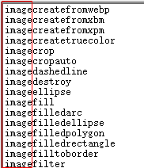


## 1.3  创建最简单的图片

步骤

1、创建画布

2、给画布填充颜色（给画布分配的第一个颜色自动填充成背景色）

3、显示图片

```php
<?php
$img=imagecreate(200,100);	//创建图片
//var_dump($img);		//resource(2) of type (gd) 
imagecolorallocate($img,255,0,0);	//给图片分配第一个颜色,默认是背景色
//操作一：显示图片
/*
//告知浏览器用jpg格式显示
header('content-type:image/jpeg');
//显示图片
imagejpeg($img);	//用jpg格式显示图片
*/

//操作二：保存图片（不需要设置header头）
imagejpeg($img,'./tu.jpg');
```

多学一招

```php
imagepng()：将图片输出为png格式
imagegif()：将图片输出为gif格式
```

小结：

1、第一个分配的颜色是背景色

2、要在浏览器显示画布，需要设置header()头

3、保存画布，不需要设置header()头


## 1.4  填充颜色

给图片分配的第一个颜色自动填充成背景色，如果要更换背景色需要手动的填充颜色。

```php
<?php
$img=imagecreate(200,100);	//创建图片资源
$color=imagecolorallocate($img,200,200,200);
//更改背景色
switch(rand(1,100)%3) {
	case 0:
		$color=imagecolorallocate($img,255,0,0);	//颜色的索引编号
		break;
	case 1:
		$color=imagecolorallocate($img,0,255,0);
		break;
	default:
		$color=imagecolorallocate($img,0,0,255);
}
//填充颜色
imagefill($img,0,0,$color);	
//显示图片
header('content-type:image/png');
imagepng($img);
```


## 1.5  验证码

#### 1.5.1  验证码的作用

防止暴力破解

 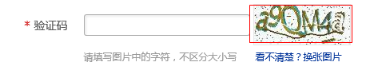


#### 1.5.2  原理

创建一个图片，在图片上写上一串随机字符串

实现步骤：

第一步：生成随机字符串

第二步：创建画布

第三步：将字符串写到画布上

```
imagestring(图片资源,内置字体,起始点x,起始点y,字符串,颜色编号)
```

难点：字符串居中

  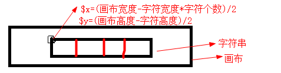

#### 1.5.3  代码实现

```php
<?php
//第一步：创建随机字符串
//1.1  创建字符数组
$all_array=array_merge(range('a','z'),range('A','Z'),range(0,9));	//所有字符数组
$div_array=['1','l','0','o','O','I'];	//去除容易混淆的字符
$array=array_diff($all_array,$div_array);	//剩余的字符数组
unset($all_array,$div_array);		//销毁不需要使用的数组
//1.2	随机获取4个字符
$index=array_rand($array,4);	//随机取4个字符,返回字符下标，按先后顺序排列
shuffle($index);	//打乱字符
//1.3	通过下标拼接字符串
$code='';
foreach($index as $i){
	$code.=$array[$i];
}
//第二步：创建画布
$img=imagecreate(150,30);
imagecolorallocate($img,255,0,0);			//分配背景色
$color=imagecolorallocate($img,255,255,255);	//分配前景色
//第三步：将字符串写到画布上
$font=5;		//内置5号字体
$x=(imagesx($img)-imagefontwidth($font)*strlen($code))/2;
$y=(imagesy($img)-imagefontheight($font))/2;
imagestring($img,$font,$x,$y,$code,$color);
//显示验证码
header('content-type:image/gif');
imagegif($img);
```

小结

1. range()：生成指定范围的数组
2. array_merge()：合并数组
3. array_diff()：计算数组的差集
4. array_rand()：随机获取数组元素
5. shuffle()：打乱数组
6. 去除容易混淆的字符
7. 数组要打乱
8. 起始点x=(图片宽度-字符串宽度)/2        字符串宽度=字符的宽度*字符的个数
9. 起始点y=(图片高度-字符高度)/2


运行结果

  


## 1.6  打开图片创建验证码

步骤：

1、生成随机字符串

2、打开图片

3、将字符串写到图片上

代码实现

```php
<?php
//第一步：生成随机字符串
$codeSet='2345678abcdefhijkmnpqrstuvwxyzABCDEFGHJKLMNPQRTUVWXY';
$code='';
$max=strlen($codeSet);
for($i=1;$i<=4;$i++){
	$index=rand(0,$max-1);
	$code.=$codeSet[$index];
}
//第二步：打开图片
$path='./captcha/captcha_bg'.rand(1,5).'.jpg';
$img=imagecreatefromjpeg($path);
//第三步：将字符串写到图片上
$font=5;		//内置5号字体
$x=(imagesx($img)-imagefontwidth($font)*strlen($code))/2;
$y=(imagesy($img)-imagefontheight($font))/2;
//随机前景色
$color=imagecolorallocate($img,255,255,255);	//设置背景色
if(rand(1,100)%2)
	$color=imagecolorallocate($img,255,0,0);	//设置背景色	

imagestring($img,$font,$x,$y,$code,$color);
//显示验证码
header('content-type:image/gif');
imagegif($img);
```

运行结果

 


多学一招：captcha

 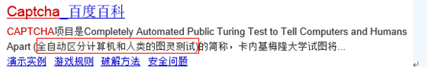


## 1.7  中文验证码

#### 1.7.1  步骤与思考

思考

1、中文验证码需要引入字体文件，内置字体不支持中文

2、使用`imagettftext(图片资源,字号大小,角度,起始x坐标,起始y坐标,颜色,字体文件地址,字符串)`写入中文

3、字体保存在`C:\Windows\Fonts`目录下

4、用`imagettfbbox()`测定中文字符串的宽高，此函数返回8个值，4个角的坐标

  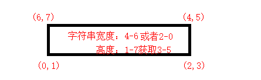

步骤

1、生成随机字符串

2、创建画布

3、将字符串写到画布上

#### 1.7.2  代码实现

将黑体拷贝到站点的ttf目录下

 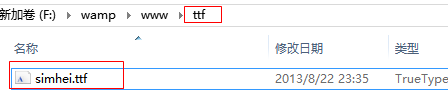

代码实现

```php
<?php
//第一步：生成随机字符串
$codeSet='们以我到他会作时要动国产的一是工就年阶义发成部民可出能方进在了不和有大这主中人上为来';
$max=mb_strlen($codeSet)-1;	//中文字符的最大索引号
$code='';
for($i=0; $i<4; $i++) {
	$start=rand(0,$max);
	$code.=mb_substr($codeSet,$start,1);
}
//第二步：创建画布
$img=imagecreate(150,40);
imagecolorallocate($img,255,0,0);
//第三步：将字符串写到画布上
//3.1  指定字符串的参数
$color=imagecolorallocate($img,255,255,255);
$size=15;	//字号
$angle=0;	//角度
$fontfile='./ttf/simhei.ttf';	//字体路径
//3.2 测定字符串的范围
$info=imagettfbbox($size,$angle,$fontfile,$code);
$code_w=$info[4]-$info[6];	//字符串的宽度
$code_h=$info[1]-$info[7];	//字符串的高度

$x=(imagesx($img)-$code_w)/2;	//起始点的$x
$y=(imagesy($img)+$code_h)/2;	//起始点的$y
//3.3  将中文字符串写到画布上
imagettftext($img,$size,$angle,$x,$y,$color,$fontfile,$code);	//将文字写到画布上
//显示验证码
header('content-type:image/jpeg');
imagejpeg($img);
```

小结

1、中文处理需要使用多字节处理

2、使用多字节处理函数需要开启相应的扩展

```
extension=php_mbstring.dll
```

3、使用`imagettfbbox` 测定中文字符串的范围

4、使用`imagettftext`将中文写到画布上


## 1.8  水印

  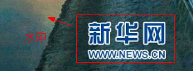

####  1.8.1  文字水印

1. 在图片上添加文字或图片，目的：宣传，防止盗图
2. 水印有文字水印和图片水印.
3. 文字水印实现原理和中文验证码是一样的

 步骤

1、打开图片

2、将文字写到图片上

3、输出图片（另存图片）

实现

```php
<?php
//第一步：打开图片
$img=imagecreatefromjpeg('./face.jpg');
//第二步：将文字写到图片上
$color=imagecolorallocate($img,255,0,0);
$size=35;	//字号
$angle=0;	//角度
$fontfile='./ttf/simhei.ttf';	//字体路径
$code='传智播客黑马程序员';

$info=imagettfbbox($size,$angle,$fontfile,$code);
$code_w=$info[4]-$info[6];	//字符串的宽度
$code_h=$info[1]-$info[7];	//字符串的高度

$x=imagesx($img)-$code_w;	//起始点的$x
$y=imagesy($img)-$code_h;	//起始点的$y
//将中文字符串写到画布上
imagettftext($img,$size,$angle,$x,$y,$color,$fontfile,$code);	//将文字写到画布上
//第三步：保存图片
imagejpeg($img,'./face.jpg');
```

实现效果

  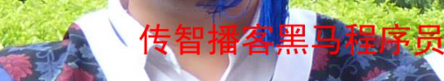


#### 1.8.2  图片水印

原理：将水印图片拷贝复制到目标图片上。

步骤：

1、打开源图

2、打开目标图

3、复制源图拷贝到目标图上

实现

```php
<?php
//第一步：打开源图
$src_img=imagecreatefromjpeg('./water.jpg');
//第二步：打开目标图
$dst_img=imagecreatefromjpeg('./face.jpg');
//第三步：将源图复制到目标图上
$dst_x=imagesx($dst_img)-imagesx($src_img);   //开始粘贴的x
$dst_y=imagesy($dst_img)-imagesy($src_img);	  //开始粘贴的y
$src_w=imagesx($src_img);
$src_h=imagesy($src_img);
imagecopy($dst_img,$src_img,$dst_x,$dst_y,0,0,$src_w,$src_h);
//显示水印图
header('content-type:image/jpeg');
imagejpeg($dst_img);
```

运行结果

  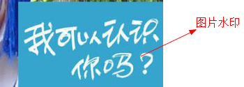


## 1.9  缩略图

上传图片后，将图片变成统一的大小的缩略图。

原理：将源图复制拷贝到目标图上，并缩放大小。

步骤

1、创建目标图

2、打开源图

3、复制源图，拷贝到目标图上

代码实现

```php
<?php
//第一步：创建目标图
$dst_img=imagecreatetruecolor(200,200);
//第二步：打开源图
$src_img=imagecreatefromjpeg('./face.jpg');
//第三步：复制源图拷贝到目标图上，并缩放大小
$src_w=imagesx($src_img);
$src_h=imagesy($src_img);
imagecopyresampled($dst_img,$src_img,0,0,0,0,200,200,$src_w,$src_h);
//第四步：保存缩略图
//header('content-type:image/jpeg');
imagejpeg($dst_img,'./face1.jpg');
```

注意：`imagecreate()`和`imagecreatetruecolor()`的区别

```
imagecreate()：创建支持256种颜色的画布
imagecreatetruecolor()：创建真彩色画布，支持256*256*256种颜色
```


## 1.10 验证码改错

验证码错误不会报具体的错误信息

 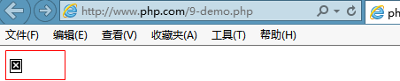

第一招：注释header

 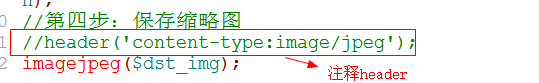

注释掉header后，错误信息就出来了

 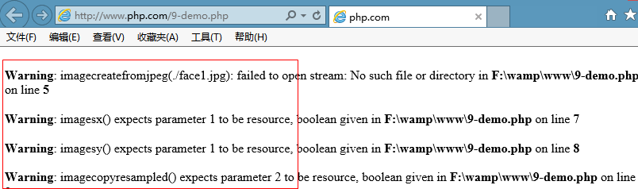


第二招：如果没有报错，就留心一下图片代码前有无字符串输出，图片前面是不允许有任何字符串输出的

 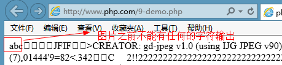


第三招：查看源码，图片代码前是否有空白字符

 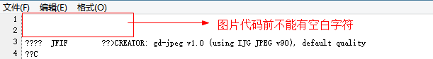


第四招：如果上面的三招无效，在header()前添加ob_clean();

 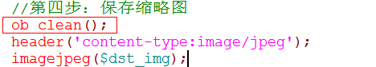


## 1.11 在项目中实现验证码

#### 1.11.1  封装验证码类

1、验证码封装Lib类库中

2、在Lib目录下创建Captcha.class.php页面

```php
<?php
namespace Lib;
class Captcha{
    private $width;
    private $height;
    public function __construct($width=80,$height=32) {
        $this->width=$width;
        $this->height=$height;
    }
    //生成随机字符串
    private function generalCode(){
        $all_array=array_merge(range('a','z'),range('A','Z'),range(0,9));	//所有字符数组
        $div_array=['1','l','0','o','O','I'];	//去除容易混淆的字符
        $array=array_diff($all_array,$div_array);	//剩余的字符数组
        unset($all_array,$div_array);		//销毁不需要使用的数组
        $index=array_rand($array,4);	//随机取4个字符,返回字符下标，按先后顺序排列
        shuffle($index);	//打乱字符
        $code='';
        foreach($index as $i)
            $code.=$array[$i];
        $_SESSION['code']=$code;        //保存到会话中
        return $code;
    }
    //创建验证码
    public function entry(){
        $code=$this->generalCode();
        $img=imagecreate($this->width, $this->height);
        imagecolorallocate($img,255,0,0);			//分配背景色
        $color=imagecolorallocate($img,255,255,255);	//分配前景色
        $font=5;		//内置5号字体
        $x=(imagesx($img)-imagefontwidth($font)*strlen($code))/2;
        $y=(imagesy($img)-imagefontheight($font))/2;
        imagestring($img,$font,$x,$y,$code,$color);
        //显示验证码
        header('content-type:image/gif');
        imagegif($img);
    }
    //验证码比较
    public function check($code){
        return strtoupper($code)== strtoupper($_SESSION['code']);
    }
}
```

#### 1.11.2  使用验证码

1、在控制器中调用验证码类（LoginController）

```php
public function verifyAction(){
    $captcha=new \Lib\Captcha();
    $captcha->entry();
}
```

2、在视图页面显示验证码

```html

```

添加随机数的原因是为了让URL地址变得唯一，防止浏览器缓存。

3、校验输入的验证码

```php
public function loginAction(){
    //第二步：执行登陆逻辑
    if(!empty($_POST)){
        //校验验证码
        $captcha=new \Lib\Captcha();
        if(!$captcha->check($_POST['passcode']))
            $this->error ('index.php?p=Admin&c=Login&a=login', '验证码错误');
        ...
```

运行结果

 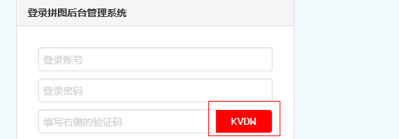


## 1.12 使用的函数

```php
imagecreate()：创建画布
imagecreatetruecolor()：创建支持真彩色的画布
imagecolorallocate（）:给画布分配颜色
imagejpeg()：将图片以jpeg格式输出
imagegif()：将图片以gif格式输出
imagepng()：将图片以png格式输出
imagefill()：填充颜色
imagesx():获取图片宽度
imagesy()：获取图片高度
imagefontwidth()：获取内置字体宽度
imagefontheight()：获取内置字体高度
imagestring()：将字符串写到图片上
imagecreatefromjpeg()：打开jpg创建图片资源
imagecreatefrompng()：打开png创建图片资源
imagecreatefromgif()：打开gif创建图片资源
imagettfbbox()：测定中文字体的范围
imagettftext（）:将中文字体写到图片上
imagecopy()：图片拷贝
imagedestroy（）:销毁图片资源
imagecopyresampled（）:拷贝图片并缩放大小
```

