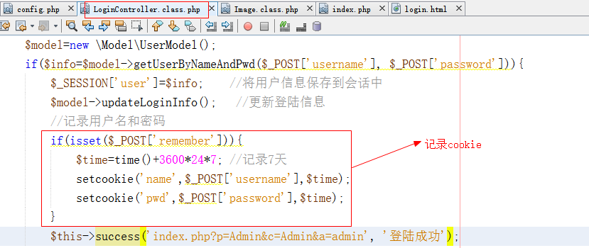
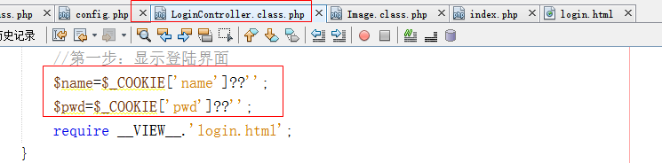
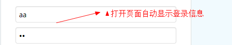
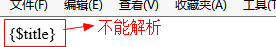
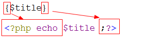
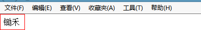
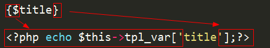
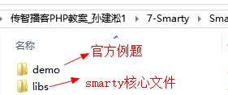
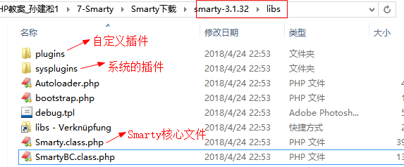

## 1.1  今日目标

1. 更好的理解类的封装特性；
2. 理解代码根据业务和功能的分类管理思想；
3. 理解公共控制器的作用，掌握公共控制器的封装；
4. 掌握PHP面向对象中继承的核心应用；
5. 掌握插件的具体应用场景；
6. 了解模板技术概念；
7. 理解模板技术的原理；


## 1.2  文件上传

#### 1.2.1  封装文件上传类

1、在Lib目录下创建Upload.class.php

```php
<?php
namespace Lib;
class Upload{
    private $path;  //上传的路径
    private $size;  //上传的大小
    private $type;  //允许上传的类型
    private $error; //保存错误信息
    
    public function __construct($path,$size,$type) {
        $this->path=$path;
        $this->size=$size;
        $this->type=$type;
    }
    //返回错误信息
    public function getError(){
        return $this->error;
    }
    /*
     * 文件上传
     * @param $files array $_FILES[]
     * @return bool|string 成功返回文件路径，失败返回false
     */
    public function uploadOne($files){
        if($this->checkError($files)){  //没有错误就上传
            $foldername=date('Y-m-d');		//文件夹名称
            $folderpath= $this->path.$foldername;	//文件夹路径
            if(!is_dir($folderpath))
                mkdir($folderpath);
            $filename=uniqid('',true).strrchr($files['name'],'.');//文件名
            $filepath="$folderpath/$filename";	//文件路径
            if(move_uploaded_file($files['tmp_name'],$filepath))
                return "{$foldername}/{$filename}";
            else{
                $this->error='上传失败<br>';
                return false;
            }
        }
        return false;
    }
    //验证上传是否有误
    private function checkError($files){
        //1、验证错误号
        if($files['error']!=0){
            switch($files['error']) {
                case 1:
                    $this->error='文件大小超过了php.ini中允许的最大值,最大值是：'.ini_get('upload_max_filesize');
                    return false;
                case 2:
                    $this->error='文件大小超过了表单允许的最大值';
                    return false;
                case 3:
                    $this->error='只有部分文件上传';
                    return false;
                case 4:
                    $this->error='没有文件上传';
                    return false;
                case 6:
                    $this->error='找不到临时文件';
                    return false;
                case 7:
                   $this->error='文件写入失败';
                    return false;
                default:
                   $this->error= '未知错误';
                    return false;
            }
        }
        //2、验证格式
	$info=finfo_open(FILEINFO_MIME_TYPE);
	$mime=finfo_file($info,$files['tmp_name']);
	if(!in_array($mime, $this->type)){
            $this->error='只能上传'.implode(',', $this->type).'格式';
            return false;
	}
	//3、验证大小
	if($files['size']> $this->size){
            $this->error='文件大小不能超过'.number_format($this->size/1024,1).'K';
            return false;
	}
	//4、验证是否是http上传
	if(!is_uploaded_file($files['tmp_name'])){
            $this->error='文件不是HTTP POST上传的<br>';
            return false;
        }
        return true;
    }
}
```


#### 1.2.2  封装缩略图类

在Lib目录下创建Image.class.php

```php
<?php
namespace Lib;
class Image{
    /*
     * 制作缩略图
     * @param $src_path 源图的路径
     */
    public function thumb($src_path,$prefix='small_',$w=200,$h=200){
        $dst_img=imagecreatetruecolor($w,$h);   //目标图
        $src_img=imagecreatefromjpeg($src_path);    //源图
        $src_w=imagesx($src_img);
        $src_h=imagesy($src_img);
        imagecopyresampled($dst_img,$src_img,0,0,0,0,$w,$h,$src_w,$src_h);
        $filename=basename($src_path);  //文件名
        $foldername=substr(dirname($src_path),-10); //目录名
        $save_path= dirname($src_path).'/'.$prefix.$filename;
        imagejpeg($dst_img,$save_path);
        return "{$foldername}/{$prefix}{$filename}";
    }
}
```


### 1.2.3  实现文件上传

1、register.html

```html
 <form action="" method="post" enctype="multipart/form-data">
     ...
```

2、更改注册控制器

```php
public function registerAction(){
    //第二步：执行注册逻辑
    if(!empty($_POST)){
        //文件上传
        $path=$GLOBALS['config']['app']['path'];
        $size=$GLOBALS['config']['app']['size'];
        $type=$GLOBALS['config']['app']['type'];
        $upload=new \Lib\Upload($path, $size, $type);
        if($filepath=$upload->uploadOne($_FILES['face'])){
            //生成缩略图
            $image=new \Lib\Image();
            $data['user_face']=$image->thumb($path.$filepath,'s1_');
        }else{
            $this->error('index.php?p=Admin&c=Login&a=register', $upload->getError());
        }
        //文件上传结束
        ...
```

3、配置文件

```php
 'app'       =>array(
        'path'  =>  './Public/Uploads/',
        'size'  =>  1234567,
        'type'  =>  ['image/png','image/jpeg','image/gif'],
```


## 1.3  登录模块

#### 1.3.1  记住密码

登录成功后，如果需要记录用户名和密码，则将用户名和密码记录在cookie中

  


打开登录页面的时候，获取cookie的值

 

在视图页面（login.html）页面显示cookie的信息

```php+HTML
<input type="text" class="input" name="username" placeholder="登录账号" value="<?=$name?>"  />
...
<input type="password" class="input" name="password" placeholder="登录密码" value="<?=$pwd?>" />
```

运行结果

 


#### 1.3.2  安全退出

退出：退出的时候不销毁令牌
安全退出：退出的时候销毁了令牌

top.html

```html
<a class="button button-little bg-yellow" href="index.php?p=Admin&c=Login&a=logout" target="_top">安全退出</a>

_top：表示在最顶端的窗口中打开
```

控制器（LoginController）

```php
public function logoutAction(){
    session_destroy();
    header('location:index.php?p=Admin&c=Login&a=login');
}
```


## 1.4  Smarty简介

#### 1.4.1  Smarty的引入

1、为了分工合作，模板页面中最好不要出现PHP的代码。

2、需要将表现和内容相分离

#### 1.2.2  Smarty介绍

 


## 1.5  自定义Smarty

#### 1.3.1  演化一:（smarty生成混编文件）

在模板中不能出现PHP定界符，标准写法如下：

1、html代码

```html
<body>
{$title}
</body>
```

2、PHP代码

```php
<?php
	$title='锄禾';
	require './1-demo.html';
```

运行结果

  

不能解析的原因是：PHP不能识别 { 和 } 

解决：

将大括号替换成PHP的定界符

  


代码实现

```php
<?php
$title='锄禾';
$str=file_get_contents('./index.html');
$str=str_replace('{','<?php echo ',$str);	//替换左大括号
$str=str_replace('}',';?>',$str);			//替换右大括号
file_put_contents('./index.html.php', $str);	//写入混编文件
require './index.html.php';	//包含混编文件
```

运行

 


#### 1.3.2  演化二：（smarty封装）

由于每个页面都要替换定界符，所以需要将替换定界符的代码封装起来

由于封装在类中，所有访问的方法需要通过面向对象的方式来访问

 


1、创建Smarty.class.php

```php
<?php
class Smarty{
	private $tpl_var=array();
	//赋值
	public function assign($k,$v){
		$this->tpl_var[$k]=$v;
	}
	/*
	*作用：编译模板
	*@param $tpl string 模板的路径
	*/
	public function compile($tpl){
		$com_file=$tpl.'.php';		//混编文件地址
		$str=file_get_contents($tpl);
		$str=str_replace('{$','<?php echo $this->tpl_var[\'',$str);	//替换左大括号
		$str=str_replace('}','\'];?>',$str);			//替换右大括号
		file_put_contents($com_file, $str);	//写入混编文件
		require $com_file;	//包含混编文件
	}
}
```

2、在index.php

```php
<?php
require './Smarty.class.php';
$smarty=new Smarty();
$smarty->assign('title','锄禾');
$smarty->compile('./index.html');
```

 小结：

1、需要将外部的变量赋值到对象的内部

2、要通过面向对象的方式访问


#### 1.3.3  演化三：（有条件的生成混编文件）

混编文件存在并且是最新的就直接包含，否则就重新生成

模板文件修改时间<混编文件修改时间   =>  混编文件是最新的

 Smarty类中的代码编译代码如下

```php
<?php
class Smarty{
	private $tpl_var=array();
	//赋值
	public function assign($k,$v){
		$this->tpl_var[$k]=$v;
	}
	/*
	*作用：编译模板
	*@param $tpl string 模板的路径
	*/
	public function compile($tpl){
		$com_file=$tpl.'.php';		//混编文件地址
		//文件存在，并且模板文件修改时间<混编文件修改时间
		if(file_exists($com_file) && filemtime($tpl)<filemtime($com_file))
			require $com_file;
		else{
			$str=file_get_contents($tpl);
			$str=str_replace('{$','<?php echo $this->tpl_var[\'',$str);	//替换左大括号
			$str=str_replace('}','\'];?>',$str);			//替换右大括号
			file_put_contents($com_file, $str);	//写入混编文件
			require $com_file;	//包含混编文件
		}
	}
}
```

小结：

生成混编文件的条件

1、混编不存在

2、模板修改了，   模板文件修改时间>混编文件修改时间，说明模板修改过了。


#### 1.3.4  演化四：文件分类存放

1. 模板文件：view

2. 混编文件：viewc

3. Smarty文件：smarty.class.php

Smarty.class.php代码如下：

 ```php
<?php
class Smarty{
	public $template_dir='./templates/';	//默认模板目录
	public $templatec_dir='./templates_c/';	//默认混编目录

	private $tpl_var=array();
	//赋值
	public function assign($k,$v){
		$this->tpl_var[$k]=$v;
	}
	/*
	*作用：编译模板
	*@param $tpl string 模板的名字
	*/
	public function compile($tpl){
		$tpl_file=$this->template_dir.$tpl;	//拼接模板地址
		$com_file=$this->templatec_dir.$tpl.'.php';		//混编文件地址
		//文件存在，并且模板文件修改时间<混编文件修改时间
		if(file_exists($com_file) && filemtime($tpl_file)<filemtime($com_file))
			require $com_file;
		else{
			$str=file_get_contents($tpl_file);
			$str=str_replace('{$','<?php echo $this->tpl_var[\'',$str);	//替换左大括号
			$str=str_replace('}','\'];?>',$str);			//替换右大括号
			file_put_contents($com_file, $str);	//写入混编文件
			require $com_file;	//包含混编文件
		}
	}
}
 ```

index.php代码如下

```php
<?php
require './Smarty/Smarty.class.php';
$smarty=new Smarty();
$smarty->template_dir='./view/';	//更改模板目录
$smarty->templatec_dir='./viewc/';	//更改混编目录
$smarty->assign('title','锄禾');
$smarty->compile('index.html');
```


#### 1.3.5 演化五：封装编译方法

编译的方法是smarty的核心方法，核心方法一般是不可以直接调用，需要进行二次封装

smarty.class.php

```php
<?php
class Smarty{
	...
	public function display($tpl){
		require $this->compile($tpl);
	}
	/*
	*作用：编译模板
	*@param $tpl string 模板的名字
	*/
	private function compile($tpl){
		..
		//文件存在，并且模板文件修改时间<混编文件修改时间
		if(file_exists($com_file) && filemtime($tpl_file)<filemtime($com_file))
			return $com_file;    //返回混编地址
		else{
			$str=file_get_contents($tpl_file);
			$str=str_replace('{$','<?php echo $this->tpl_var[\'',$str);	//替换左大括号
			$str=str_replace('}','\'];?>',$str);			//替换右大括号
			file_put_contents($com_file, $str);	//写入混编文件
			return $com_file;	//返回混编地址
		}
	}
}
```

index.php

```php
<?php
...
$smarty->assign('title','锄禾');
$smarty->display('index.html');	//传递文件名
```


## 1.6  官方Smarty介绍

#### 1.6.1 smarty目录结构

到`www.smarty.net`网站下载最新的smarty版本

 

解压

 


libs目录结构

  


需要掌握的smarty的属性和方法

```php
public $left_delimiter = "{";		//左界定
public $right_delimiter = "}";		//右界定
protected $template_dir = array('./templates/');	//默认模板目录
protected $compile_dir = './templates_c/';			//默认混编目录
protected $config_dir = array('./configs/');		//默认配置目录
protected $cache_dir = './cache/';					//默认缓存目录


public function setTemplateDir(){}					//设置模板文件夹
public function setConfigDir(){}					//设置配置文件夹
public function setCompileDir(){}					//设置混编文件夹
public function setCacheDir(){}						//设置缓存文件夹
```

练习：

```
以下关于Smarty配置描述正确的是（ABCD）
	A： 使用left_delimiter属性可以修改Smarty左定界符；	 
	B： 使用right_delimiter属性可以修改Smarty右定界符；	 
	C： 使用setTemplateDir()方法可以重新指定默认模板工作目录；	 
	D： 使用setCompileDir()方法可以重新指定默认编译文件工作目录。	 
```


#### 1.6.2  smarty简单的操作

1、将libs目录拷贝到站点下，改名为smarty

2、创建模板目录templates

3、创建混编目录templates_c

4、在站点下创建1-demo.php

```php
<?php
require './Smarty/Smarty.class.php';
$smarty=new Smarty();
$smarty->assign('title','锄禾');
$smarty->left_delimiter='{{';		//更改左界定
$smarty->right_delimiter='}}';		//更改右界定
$smarty->setTemplateDir('./view/');	//设置模板目录
$smarty->setCompileDir('./viewc/');	//设置混编目录
$smarty->display('1-demo.html');
```

在templates下创建demo1.html

```html
<body>
	{{$title}}
</body>
```


#### 1.6.3  注释

语法：{*   *}

  


注意：smarty注释在源码中看不见。

思考：已知smarty的定界符是{* 和 *}，那么它的注释是什么?

答：{**    **}


