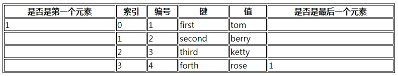

## 1.1  今日目标

1. 掌握Smarty模板技术的实际运用；
2. 掌握Smarty模板技术的基础配置；
3. 掌握常用的smarty内置函数应用；
4. 掌握模板变量的使用以及常见的保留变量的使用；
5. 了解smarty配置文件的使用规范；
6. 掌握Smarty中内置函数：if分支、foreach和section循环的使用
7. 掌握Smarty在类中引入实现子类便捷使用的方式


## 1.2  变量

smarty中变量有3中，普通变量、配置变量、保留变量

##### **1、普通变量**

普通变量就是我们自己定义的变量

方法一：在PHP中定义

```php
$smarty->assign('name','tom');
```

方法二：可以在模板定义

```html
语法：{assign var='变量名' value='值'}

例如：{assign var='sex' value='男'}
```

简化写法：

```php
{$sex='男'}
```

例题：

php代码

```php
<?php
require './Smarty/smarty.class.php';
$smarty=new Smarty();
$smarty->assign('name','tom');		//给变量赋值
$smarty->display('1-demo.html');
```

HTML代码

```html
<body>
	姓名：{$name}  <br>

	{assign var='age' value=20}
	年龄：{$age}<br>

	{$add='北京'}
	地址：{$add}
</body>
```

运行结果

   


##### **2、保留变量**

Smarty中有一个特殊的保留变量（内置变量），类似于PHP中的所有的超全局变量、常量、时间等信息


|             表达式             |            描述             |
| :----------------------------: | :-------------------------: |
|       {$smarty.get.name}       |    获取get提交的name的值    |
|      {$smarty.post.name}       |   获取post提交的name的值    |
|     {$smarty.request.name}     | 获取get和post提交的name的值 |
|     {$smarty.cookies.name}     |   获取cookie中的name的值    |
|     {$smarty.session.name}     |   获取session中的name的值   |
|      {$smarty.const.name}      |        获取常量name         |
| {$smarty.server.DOCUMENT_ROOT} |  获取服务器的虚拟目录地址   |
|     {$smarty.config.name}      |     获取配置文件中的值      |
|         {$smarty.now}          |           时间戳            |
|        {$smarty.ldelim}        |         获取左界定          |
|        {$smarty.rdelim}        |         获取右界定          |

例题

PHP代码

```php
<?php
require './Smarty/smarty.class.php';
$smarty=new Smarty();
define('name', '常量name');
setcookie('name','cookie的值');
$_SESSION['name']='session的值';
$smarty->display('1-demo.html');
```

HTML代码

```html
<body>
get提交：{$smarty.get.name}<br>
post提交：{$smarty.post.name}<br>
request提交：{$smarty.request.name}<br>
常量：{$smarty.const.name}<br>
cookie的值：{$smarty.cookies.name}<br>
session：{$smarty.session.name}<br>
时间戳：{$smarty.now}<br>
版本号：{$smarty.version}<br>
根目录：{$smarty.server.DOCUMENT_ROOT}<br>
左界定：{$smarty.ldelim}<br>
右界定：{$smarty.rdelim}
</body>
```

运行结果

 


##### **3、配置变量**

从配置文件中获取变量值，配置文件默认的文件夹是`configs`

1、在站点下创建配置文件夹`configs`

2、在`configs`目录下创建smarty.conf文件

```php
color='#FF0000';
size='15px';
```

3、PHP页面

```php
<?php
require './Smarty/smarty.class.php';
$smarty=new Smarty();
$smarty->display('1-demo.html');
```

4、HTML页面

```html
{config_load file='smarty.conf'}   <!--引入配置文件-->
<style>
body{
	color:{#color#};
	font-size: {$smarty.config.size}
}
</style>
```

小结：

1、要使用配置文件中的值，首先必须引入配置文件，通过{config_load}标签引入

2、获取配置文件中的值的方法有两种

​	第一：{#变量名#}

​	第二：{$smarty.config.变量名}


多学一招：配置文件中的节 

在配置文件中，‘[ ]’表示配置文件的段落

例题：

配置文件

```php
color=#FF0000
size=30px
    
[spring]	# 配置文件中的段落
color=#009900;
size=20px;

[winter]
color=#000000;
size=5px;
```

注意：

1、全局的一定要写在节的前面

2、配置文件中[]表示节

3、配置文件中的注释是 # 

HTML页面

```php+HTML
{config_load file='smarty.conf' section='winter'}   -- 通过section引入配置文件中的段落
<style>
body{
	color:{#color#};
	font-size: {$smarty.config.size}
}
</style>
```


## 1.3  运算符

smary中的运算符是PHP是一样的。除此以外，smarty还支持如下的运算符。

|      运算符      |                             描述                             |
| :--------------: | :----------------------------------------------------------: |
|        eq        |                    equal			相等                     |
|       neq        |                   not equal		不等于                    |
|        gt        |                 greater than	       大于                  |
|        lt        |                    less than		小于                     |
|       lte        |              less than or equal		小于等于              |
|       gte        |             great than or equal		大于等于              |
|     is even      |                            是偶数                            |
|      is odd      |                            是奇数                            |
|   is not even    |                           不是偶数                           |
|    is not odd    |                           不是奇数                           |
|       not        |                              非                              |
|       mod        |                           求模取余                           |
|      div by      |                            被整除                            |
| is [not] div by  | 能否被某数整除，例如：{if $smarty.get.age is div by 3}...{/if} |
| is [not] even by |                      商的结果是否为偶数                      |
| is [not] odd by  |                      商的结果是否为奇数                      |


## 1.4  判断

语法：

```html
{if 条件}

{elseif 条件}

{else}

{/if}
```

例题：

php代码

```php
<?php
require './Smarty/smarty.class.php';
$smarty=new Smarty();
$smarty->display('1-demo.html');
```

html代码

```php+HTML
<body>
{if is_numeric($smarty.get.score)}    {#判断是否是数字#}
	{if $smarty.get.score gte 90}
		A
	{elseif $smarty.get.score gte 80}
		B
	{else}
		C
	{/if}
{else}
	不是数字
{/if}

<hr>
{if $smarty.get.score is even}
	是偶数
{elseif $smarty.get.score is odd}
	是奇数
{/if}
</body>
```

运行结果

  


小结：在判断中是可以使用PHP的函数的


## 1.5 数组

smarty中访问数组的方式有两种

```
数组[下标]
数组.下标
```

PHP代码

```php
<?php
require './Smarty/smarty.class.php';
$smarty=new Smarty();
$stu=array('tom','berry');		//索引数组
$emp=array('name'=>'rose','sex'=>'女');	//关联数组
$goods=array(
	array('name'=>'手机','price'=>22),
	array('name'=>'钢笔','price'=>10)
);
$smarty->assign('stu',$stu);
$smarty->assign('emp',$emp);
$smarty->assign('goods',$goods);
$smarty->display('2-demo.html');
```

HTML代码

```html
<body>
学生：{$stu[0]}-{$stu.1}  <br>
雇员：{$emp['name']}-{$emp.sex}<br>
商品：
<ul>
	<li>{$goods[0]['name']}</li>
	<li>{$goods[0].price}</li>
	<li>{$goods.1['name']}</li>
	<li>{$goods.1.price}</li>
</ul>
</body>
```

运行结果

 


## 1.6  循环

smarty中支持的循环有：{for}、{while}、{foreach}、{section}。对于开发来说用的最多就是{foreach}循环

#### 1.6.1  for

语法：

```php
{for 初始值 to 结束值 [step 步长]}

{/for}
 默认步长是1
```

例题

```html
<body>
{for $i=1 to 5}
	{$i}：锄禾日当午<br>
{/for}
<hr>
{for $i=1 to 5 step 2}
	{$i}：锄禾日当午<br>
{/for}
</body>
```

运行结果

 


#### 1.6.2 while

语法

```php
{while 条件}

{/while}
```

例题（输出5句）：

```php+HTML
<body>
{$i=1}
{while $i<=5}
	{$i++}：锄禾日当午<br>
{/while}
</body>
```

#### 1.6.3  foreach

既能遍历关联数组也能遍历索引数组

语法：

```
{foreach 数组 as $k=>$v}

{foreachelse}
	没有数组输出
{/foreach}
```

foreach的属性

```
@index:从0开始的索引
@iteration：从1开始的编号
@first：是否是第一个元素
@last：是否是最后一个元素
```

PHP代码

```php
<?php
require './Smarty/smarty.class.php';
$smarty=new Smarty();
$smarty->assign('stu',array('first'=>'tom','second'=>'berry','third'=>'ketty','forth'=>'rose'));
$smarty->display('3-demo.html');
```

html代码

```php+HTML
<table border='1' bordercolor='#000' width='780'>
	<tr>
		<th>是否是第一个元素</th>
		<th>索引</th>
		<th>编号</th>
		<th>键</th>
		<th>值</th>
		<th>是否是最后一个元素</th>
	</tr>
	{foreach $stu as $k=>$v}
	<tr>
		<td>{$v@first}</td>
		<td>{$v@index}</td>
		<td>{$v@iteration}</td>
		<td>{$k}</td>
		<td>{$v}</td>
		<td>{$v@last}</td>
	</tr>
	{foreachelse}
		没有输出
	{/foreach}
</table>
```

运行结果

  


#### 1.6.4  section

section不支持关联数组，只能遍历索引数组

语法：

```html
{section name=自定义名字 loop=数组}
{/section}
```

例题：

php

```php
<?php
require './Smarty/smarty.class.php';
$smarty=new Smarty();
$smarty->assign('stu',array('tom','berry'));
$smarty->display('4-demo.html');
```

html代码

```html
<table border='1' bordercolor='#000' width='780'>
<tr>
	<th>是否是第一个元素</th>
	<th>索引</th>
	<th>编号</th>
	<th>值</th>
	<th>是否是最后一个元素</th>
</tr>
{section name=s loop=$stu}
<tr>
	<td>{$smarty.section.s.first}</td>
	<td>{$smarty.section.s.index}</td>
	<td>{$smarty.section.s.iteration}</td>
	<td>{$stu[s]}</td>
	<td>{$smarty.section.s.last}</td>
</tr>
{sectionelse}
	没有输出
{/section}
</table>
```

 


## 1.7 函数

函数有两种，自定义函数和内置函数

smarty的内置函数就是封装的PHP的关键字

  


## 1.8 变量修饰器

#### 1.8.1  变量修饰器

变量修饰器的本质就是PHP函数，用来转换数据

php代码

```php
<?php
require './Smarty/smarty.class.php';
$smarty=new Smarty();
$smarty->display('5-demo.html');
```

html代码

```html
<body>
转成大写：{'abc'|upper} <br>
转成小写：{'ABC'|lower} <br>
默认值：{$add|default:'地址不详'}<br>
去除标签：{'<b>你好吗</b>'|strip_tags}<br>
实体转换：{'<b>你好吗</b>'|escape}<br>
日期：{$smarty.now|date_format:'%Y-%m-%d %H:%M:%S'}
多个管道连续使用：{'<b>boy</b>'|strip_tags|upper}<br>
</body>
```

运行结果

 


注意：

1、将PHP的关键字或函数封装成标签称为函数，将PHP关键字封装成smarty关键字称为修饰器。内部的本质都是、PHP函数或PHP关键字。

2、`|`称为管道运算符，将前面的参数传递后后面的修饰器使用


#### 1.8.2  自定义变量修饰器

变量修饰器存放在plugins目录中

规则：

1. 文件的命名规则：modifier.变量修饰器名称.php
2. 文件内方法命名规则：smarty_modifier_变量修饰器名称(形参...){}

例题

1、在plugins目录中创建modifier.cal.php页面

```php
<?php
function smarty_modifier_cal($num1,$num2,$num3){
	return $num1+$num2+$num3;
}
```

2、在模板中调用

```php
{10|cal:20:30}

10作为第一个参数传递
参数之间用冒号分隔
```

 

## 1.9  避免Smarty解析

smarty的定界符和css、js中的大括号产生冲突的时候，css、js中的大括号不要被smarty解析

方法一：更换定界符

方法二：左大括号后面添加空白字符


方法三：{literal} {/literal}

smarty不解析{literal} {/literal}中的内容

```html
<style>
{literal}
body{color: #FF0000;}
{/literal}
</style>
```


## 1.10  缓存

缓存：页面缓存、空间缓存、数据缓存。smarty中的缓存就是页面缓存

smarty的缓存是页面缓存。

#### 1.10. 1  开启缓存

```
$smarty->caching=true|1;		//开启缓存
```

#### 1.10.2  缓存的更新

方法一：删除缓存，系统会重新生成新的缓存文件

方法二：更新了模板文件，配置文件，缓存自动更新

方法三：过了缓存的生命周期，默认是3600秒

方法四：强制更新

PHP代码

```php
<?php
require './Smarty/smarty.class.php';
$smarty=new Smarty();
$smarty->caching=true;		//开启缓存
if(date('H')>=9)
	$smarty->force_cache=true;	//强制更新缓存
$smarty->display('6-demo.html');
```


#### 1.10.3  缓存的生命周期

```
$smarty->cache_lifetime=-1 | 0 | N
-1:永远不过期
0:立即过期
N:有效期是N秒，默认是3600秒
```

PHP代码

```php
$smarty->cache_lifetime=3;	//缓存的生命周期
```


#### 1.10.4 局部不缓存

局部不缓存有两种方法

```
1、变量不缓存    {$变量名  nocache}
2、整个块不缓存   {nocache}   {/nocache}
```

 代码

```html
不缓存：{$smarty.now nocache}  <br>
不缓存：{nocache}
	{$smarty.now}<br>
{/nocache}
```


#### 1.10.5 缓存分页

通过$smarty->display(模板,识别id)。通过识别id来缓存分页、集合

PHP页面

```php
<?php
require './Smarty/smarty.class.php';
$smarty=new Smarty();
$smarty->caching=1;
$smarty->display('7-demo.html',$_GET['pageno']);
```

html页面

```html
<body>
	这是第{$smarty.get.pageno}页
</body>
```

运行结果

 


#### 1.10.6  缓存集合

  

每个组合都会产生缓存

PHP代码

```php
<?php
require './Smarty/smarty.class.php';
$smarty=new Smarty();
$smarty->caching=1;
$color=$_GET['color'];
$size=$_GET['size'];
$smarty->display('7-demo.html',"$color|$size");
```

HTML代码

```html
<body>
	颜色：{$smarty.get.color}<br>
	大小：{$smarty.get.size}
</body>
```

运行结果

 

 

 


#### 1.10.7  清除缓存

```
$smarty->clearCache(模板,[识别id])
$smarty->clearAllCache();   //清除所有缓存
```

代码

```php
<?php
require './Smarty/smarty.class.php';
$smarty=new Smarty();
//$smarty->clearCache('7-demo.html',1);
//$smarty->clearCache('7-demo.html','red|10');
//$smarty->clearCache('7-demo.html');
$smarty->clearAllCache();	//清除所有缓存
```


## 1.11  将smarty集成到项目中

1、将smarty拷贝到Lib目录下

  

2、实现smarty类的自动加载

```php
 private static function initAutoLoad(){
        spl_autoload_register(function($class_name){
            //Smarty类存储不规则，所以将类名和地址做一个映射
            $map=array(
                'Smarty'    =>  LIB_PATH.'Smarty'.DS.'Smarty.class.php'
            );
            
           ...
            elseif(isset($map[$class_name]))
                $path=$map[$class_name];
            else   //控制器
                $path=__URL__.$class_name.'.class.php'; 
            if(file_exists($path) && is_file($path))
                require $path;
        });
    }
```

3、创建混编目录，并且定义混编目录地址

 

```php
private static function initRoutes(){
  ...
    define('__VIEW__',VIEW_PATH.$p.DS);     //当前视图的目录地址
    define('__VIEWC__', APP_PATH.'Viewc'.DS.$p.DS); //混编目录
}
```


4、由于前后台都要启动模板，所以应该在基础控制器中实例化smarty

```php
<?php
//基础控制器
namespace Core;
class Controller{
    protected $smarty;
    use \Traits\Jump;
    
    public function __construct() {
        $this->initSession();
        $this->initSmarty();
    }
    //初始化session
    private function initSession(){
        new \Lib\Session();
    }
    //初始化Smarty
    private function initSmarty(){
        $this->smarty=new \Smarty();
        $this->smarty->setTemplateDir(__VIEW__);   //设置模板目录
        $this->smarty->setCompileDir(__VIEWC__);	//设置混编目录
    }
}
```

5、在控制器中使用smarty

```php
class ProductsController extends BaseController{
    //获取商品列表
    public function listAction() {
        //实例化模型
        $model=new \Model\ProductsModel();
        $list=$model->select();
        //加载视图
        //require __VIEW__.'products_list.html';
        $this->smarty->assign('list',$list);
        $this->smarty->display('products_list.html');
    }
```

6、在模板中更改如下：

```html
{foreach $list as $rows}
<tr>
        <td>{$rows['proID']}</td>
        <td>{$rows['proname']}</td>
        <td>{$rows['proprice']}</td>
        <td><a href="index.php?p=Admin&c=Products&a=edit&proid={$rows['proID']}">修改</a></td>
        <td><a href="javascript:void(0)" onclick="if(confirm('确定要删除吗')){ location.href='index.php?p=Admin&c=Products&a=del&proid={$rows['proID']}'}">删除</a></td>
</tr>
{/foreach}
```


练习

```
46.【多选题】反馈
以下关于Smarty描述正确的是
	A： Smarty是用PHP编写的优秀的模板引擎；	 
	B： Smarty可以实现前端开发人员和后台程序员分离；	 
	C： 采用Smarty编写的程序可以获得最大速度的提高；	 
	D： 需要实时更新的内容和小项目不适合使用Smarty。	 


```

