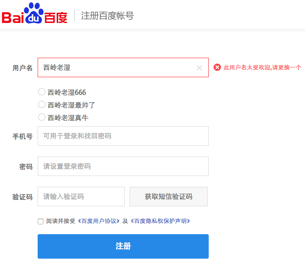
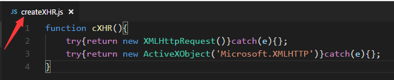
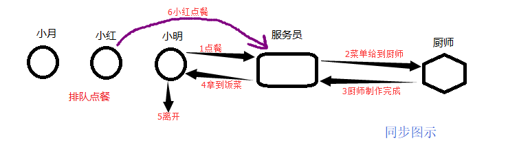
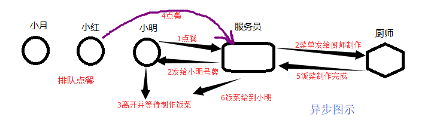
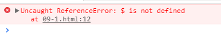
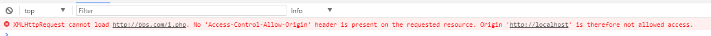

# Ajax 技术

> 作者：西岭老湿 

----

## 第1章 认识Ajax 

### 1.1 初识 ajax 

我们平常上网，不管是注册账号，还是浏览网页，其本质就是通过客户端向服务器发送请求，服务器接到请求后返回处理后的数据给客户端；
在我们之前学习代码中，向服务器提交数据典型的应用是就是 form 表单，其中的 action 就是我们提交数据的服务器端地址；

完成一个 form 表单；
当我们点击提交按钮时，页面就会跳转到服务器页面；

但是，我本不想让页面跳转，数据也能被发送到服务器端，同时，还可以接受服务器返回的数据；


当我注册一个网站的账号时，填写完用户名并没有点击提交，但是，用户名如果有重复，文本框的傍边便会提示我更换用户名；



类似的功能还有 验证短信的发送、百度搜索的关键字推举、无刷新的分页等等……

想要完成这些类似的功能实现，我们今天所要学习的ajax技术，就是核心技术；

ajax 也是技术名词的缩写：
Asynchronous `[ə'sɪŋkrənəs; eɪ-]` ：异步的；
JavaScript ：JavaScript语言
And ：和、与
XML ：数据传输格式

1998年微软公司（Microsoft）的Outlook Web Access第一次使用了ajax技术，允许客户端脚本发送HTTP请求，并随后集成在IE4.0中应用（XMLHTTP），到2005年，谷歌（Google）把Ajax成功应用于自家的多款Web系统中（Gmail邮箱、Google Map、Google 搜索建议），

从此Ajax被越来越多的人所接受…

**客户端通过HTTP向服务器发送请求**


### 1.2 快速入门

```html
<body>
    <form action="1-1-1.php" method="get">
        <input type="text" name="names" value=""><br>
        <input type="button" value="提交">
    </form>
</body>
<script>
    //获取DOM对象
    var inp = document.getElementsByTagName('input');
    //绑定点击事件
    inp[1].onclick = function(){
        //获取文本值
        var v = inp[0].value;
        //获取ajax对象
        var xhr = new XMLHttpRequest();
        //监听状态变化
        xhr.onreadystatechange = function(){
            //判断状态值
            if(xhr.readyState == 4){
                //获取服务器返回信息
                alert(xhr.responseText);
            }
        }
        //打开链接
        xhr.open('get','/test');
        //发送连接
        xhr.send();
    }
</script>
```

http.js

```php
var fs = require('fs');
// 服务器模块
var http = require('http');
var server = http.createServer();

server.listen(8080,function(){
    console.log('服务器启动成功,请访问：http://127.0.0.1:8080')
})

server.on('request',function(req,res){
    var method = req.method;
    var urls = require('url').parse(req.url);
    if(method == 'GET'){
        if(urls.pathname.indexOf('.html')>=0){
            fs.readFile('.'+urls.pathname,function(err,data){
                res.end(data);
            })
        }else if(urls.pathname == '/test'){
            res.end('123')
        }
        // console.log(urls.pathname);
    }else if(method == 'POST'){
        
    }else{
        res.end('err_method')
    }
})
```


## 第2章 Ajax对象 

### 2.1 获取对象

通过上一节我们发现，想要使用 ajax 的一系列功能，我们就必须先得到 ajax 对象

基于 W3C标准 浏览器：

```js 
var xhr = new XMLHttpRequest();
```

基于IE内核的浏览器:

```js 
var xhr = new ActiveXObject('Microsoft.XMLHTTP');
```


```html
<script>
    var btu = document.getElementById('btu');
    btu.onclick = function(){
        //基于 W3C标准 浏览器
        var xhr = new XMLHttpRequest();
        alert(xhr);

        //基于IE内核的浏览器， W3C标准浏览器中报错
        var xhr = new ActiveXObject('Microsoft.XMLHTTP');
        alert(xhr);
    }
</script>
```


浏览器标准不一样，得到的对象也不一样，我们也不知道客户使用什么样的浏览器，因此，我们需要解决兼容性问题；

修改上述代码并测试，**具有兼容性**：

```html
<script>
var btu = document.getElementById('btu');
btu.onclick = function(){
	try{
		var xhr =  new XMLHttpRequest()
	}catch(e){};

	try{
		var xhr = new ActiveXObject('Microsoft.XMLHTTP')
	}catch(e){};

	alert(xhr);
}
</script>
```

再次对代码进行修改 **兼容代码封装进函数调用**

```html
<script>
    var btu = document.getElementById('btu');
    btu.onclick = function(){
        //封装进函数供其他程序调用
        function cXHR(){
            try{return new XMLHttpRequest()}catch(e){};
            try{return new ActiveXObject('Microsoft.XMLHTTP')}catch(e){};
        }
        alert(cXHR());
    }
</script>
```

将函数写入单独的文件，共其他地方引入调用

**创建createXHR.js** 
将函数复制到文件 createXHR.js 内并保存, **如图：**



**使用：**

```html
//文件引入
<script src="createXHR.js"></script>
<script>
    var btu = document.getElementById('btu');
    btu.onclick = function(){
		//函数调用
        alert(cXHR());
    }
</script>
```

顺便封装一个方法：
使用id属性获取DOM对象，方便后面使用

```js
function gid(id){
    return document.getElementById(id);
}
```

### 2.2 ajax对象的属性、方法 *

火狐开发者文档：
https://developer.mozilla.org/zh-CN/docs/Web/API/XMLHttpRequest 

#### 2.2.1 属性

- **readyState： Ajax状态码 * **
	0：表示对象已建立，但未初始化，只是 new 成功获取了对象，但是未调用open方法
	1：表示对象已初始化，但未发送，调用了open方法，但是未调用send方法
	2：已调用send方法进行请求
	3：正在接收数据（接收到一部分），客户端已经接收到了一部分返回的数据
	**4：接收完成，客户端已经接收到了所有数据 * **

- status ：http响应状态码
	200代表成功获取服务器端数据
	404未找到页面等等……

- statusText ：http响应状态文本

- **responseText：如果服务器端返回字符串，使用responseText进行接收**

- responseXML ：如果服务器端返回XML数据，使用responseXML进行接收

- **onreadystatechange：当 readyState 状态码发生改变时所触发的回调函数**

#### 2.2.2 方法

- **open(method,url,[aycs])：初始化Ajax对象 (打开)**
  method:http请求方式，get/post
  url:请求的服务器地址
  aycs:同步与异步 


- **setRequestHeader(header,value)：设置请求头信息**
  header ：请求头名称
  value ：请求头的值


- xhr.getAllResponseHeaders() 获取全部响应头信息

- xhr.getResponseHeader('key') 获取指定头信息


- **send([content]) ：发送Ajax请求**
  content ：	如果是get请求时，此参数为null;

  如果是post请求时，此参数就是要传递的数据

  

  **注意: 所有相关的事件绑定必须在调用send()方法之前进行.**

  


#### 2.2.3 同步与异步

例如，小明去餐馆排队点餐，前台服务员将小明的菜单告诉厨师进行制作，此时小明后面排队的人就一直等着，
直到厨师制作完成，把饭菜送到小明手里后离开，后面的人才能继续点餐；这就是同步处理

但是，如果前台服务员将小明的菜单告诉厨师后，服务员发给小明一个好牌去旁边等待，后面的人继续点餐，
厨师将小明的饭菜做好后，随时呼唤小明就餐；这就是异步处理

服务器的不同做法，就代表着 Ajax 的同步或异步处理；
小明就是客户端；
厨师就是后台服务器；

图示：






前台代码：

```html
<script src="createXHR.js"></script>
    <script>
        function t1(){
            var xhr = cXHR();
            xhr.onreadystatechange = function(){
                if(this.readyState == 4){
                    alert(this.responseText);
                }
            }
            //false同步
            //true 异步
            xhr.open('get','/test',false); 
            xhr.send(null);
        }
        function t2(){
            alert('t2');
        }
        t1();
        t2();
    </script>
```

## 第3章 判断用户名是否可用--案例

 百度注册效果

**用户名被占用：**


**用户名没有没占用：**


前台代码

```html
<body>
    <input type="text" value="" id="names">
    <span id="tip"></span>
</body>
<script>
    var inp = document.getElementById('names');
    inp.onblur = function () {
        var xhr = new XMLHttpRequest();
        xhr.onreadystatechange = function () {
            if (xhr.readyState == 4) {
                // alert(xhr.responseText);
                if (xhr.responseText == 1) {
                    var h = '<font color="red">用户名已经被占用</font>';
                    document.getElementById('tip').innerHTML = h;
                } else {
                    var h = '<font color="green">用户名可用</font>';
                    document.getElementById('tip').innerHTML = h;
                }
            }
        }
        xhr.open('get', '/baidu?names=' + inp.value);
        xhr.send();
    }
</script>
```


http.js

```php
else if(urls.pathname == '/test'){
    res.end('123')
}else if(urls.pathname == '/baidu'){
    if(urls.query.names == 'admin'){
        res.end('1')
    }else{
        res.end('0')
    }
}
```


## 第4章 缓存问题

### 4.1 缓存的产生

以上一节的案例为模板，使用IE9以下版本浏览器测试，有缓存问题；


原因：
在Ajax的get请求中，如果运行在IE内核的浏览器下，
其如果**向同一个url发送多次请求**时，就会产生所谓的缓存问题。
缓存问题最早设计初衷是为了加快应用程序的访问速度，
但是其会影响Ajax实时的获取服务器端的数据。

### 4.2 客户端解决缓存问题
产生缓存的问题就是 我们的客户端向同一个 url 发送了多次请求；
如果我们每次请求的url不同，那么，缓存问题就不会存在了；

我们可以在请求地址的后面加上一个无意义的参数，参数值使用随机数即可，
那么每次请求都会产生随机数，URL就会不同，缓存问题就被解决了；

**Math.random()**：返回 0--1 之间的随机数，包括 0 但不包括 1；

修改代码如下：

```js
var url = '03-1.php?names='+inp.value+'&_='+Math.random();
xhr.open('get',url);

```

但是，随机数虽然解决了问题，但是，我们不能保证每次生成的随机数都不一样；
也就是说，使用随机数存在一定的隐患；


**new Date().getTime()** ： 获取当前时间的毫秒时间戳
修改代码如下：

```js
var url = '03-1.php?names='+inp.value+'&_='+new Date().getTime();
xhr.open('get',url);

```

### 4.3 设置响应头禁用客户端缓存
服务器端在相应客户端请求时，可以设置相应头详细，如：
header(‘Content-type:text/html; charset=utf-8’) ：告诉客户端浏览器，使用utf-8的编码格式解析html页面信息。

设置不缓存的响应头标识即可：

```php
//告诉客户端浏览器不要缓存数据
res.setHeader('Cache-Control','no-cache');
```


## 第5章 Ajax发送POST请求

### 5.1 post请求

复制第3章案例代码，将 get 请求修改为 post 请求；

```js
//请求地址
var url = 'baidu';
//open参数为post
xhr.open('post',url);
//设置请求头 ***
xhr.setRequestHeader('Content-type','application/x-www-form-urlencoded');
//设置post请求参数值
xhr.send('names='+inp.value);

```


### 5.2 无刷新修改信息

将海贼王项目修改用户信息操作，改为ajax方式；


## 第6章 Ajax框架的封装

如果一个页面中有十几个地方用到Ajax，那么我们需要写十几次open()、十几次send()、十几次获取xhr对象；
代码重复相当多，而凡是有代码重复的地方，就有封装的可能；

创建新文件： ajax.js 

### 6.1 餐前甜点

之前我们为了方便使用，封装过使用指定 id 获取DOM对象及获取xhr对象；
我们对之前的代码进行一次修改，使其更加优雅；

**定义一个自调用匿名函数**

```js
(function(){
	//code……
})();
```

为什么 定义一个自调用匿名函数？
在实际项目开发中，如果一个项目同时引入了多个javascript框架，可能会产生命名的冲突问题，
如果使用自调用匿名函数来封装javascript框架，所有变量处于封闭状态，就可以避免这个问题。

**封装一个$函数，用于获取指定id的dom对象**

```js
(function(){
	//封装$函数，获取指定 id 的DOM对象并返回给调用者
    var $ = function(id){
        return document.getElementById(id);
    }
})();
```

我们在前台代码中引入并使用ajax.js 

```html
<body>
   <div id="d">div</div>
</body>
<script src="ajax.js"></script>
<script>
    alert($('d'));
</script>
```



报错原因： 函数 $ 为局部变量；

**让 $ 局部变量全局化**

```js
(function(){
    //封装$函数，获取指定 id 的DOM对象并返回给调用者
    var $ = function(id){
        return document.getElementById(id);
    }
    //将局部变量 $ 复制给顶层window对象，使其成为全局变量
    window.$ = $;
})();
```

### 6.2 封装get方法

ajax代码我们都会写，问题是：
如何把代码放进匿名函数中并且外部可以调用？

```js
(function(){
    //封装$函数，获取指定 id 的DOM对象并返回给调用者
    var $ = function(id){
        return document.getElementById(id);
    }
    //将局部变量 $ 复制给顶层window对象，使其成为全局变量
    window.$ = $;

    //声明gets方法
    var gets = function(url){
        var xhr = new XMLHttpRequest();
        xhr.onreadystatechange = function(){
            if(xhr.readyState == 4){
                alert(xhr.responseText);
            }
        }
        xhr.open('get',url);
        xhr.send();
    }
    //将局部变量 gets 复制给顶层window对象，使其成为全局变量
    window.ajax_get = gets;
})();
```

这样写并没有语法错误，也可以正常调用，但是，随着功能的不断增加，
我们的window对象也会被赋予各种各样的值，最终还是会导致混乱；

**在JavaScript中一切都是对象**

$ 也可以被当作对象，我们就可以将ajax函数赋值给 $ ；

```js
(function(){
    //封装$函数，获取指定 id 的DOM对象并返回给调用者
    var $ = function(id){
        return document.getElementById(id);
    }

    //声明ajax函数，并复制给$;
    $.get = function(url){
        var xhr = new XMLHttpRequest();
        xhr.onreadystatechange = function(){
            if(xhr.readyState == 4){
                alert(xhr.responseText);
            }
        }
        xhr.open('get',url);
        xhr.send();
    }
    window.$ = $;
})();
```

前台调用

```html
<script>
    $.get('/test');
</script>
```


### 6.3 解决获取Ajax对象的兼容性

修改上节代码：

```js
//获取Ajax对象
$.init = function(){
    try{return new XMLHttpRequest()}catch(e){};
    try{return new ActiveXObject('Microsoft.XMLHTTP')}catch(e){};
}

//声明ajax函数，并复制给$;
$.get = function(url){
    var xhr = $.init(); //调用init,获取ajax对象
    xhr.onreadystatechange = function(){
        if(xhr.readyState == 4){
            alert(xhr.responseText);
        }
    }
    xhr.open('get',url);
    xhr.send();
}
```

### 6.4 获取Ajax的返回值

前台调用：

```html
<script>
    var cb = function(msg){
        $('d').innerHTML = msg;
    }
    $.get('/test',cb);
</script>

```

修改 ajax.js

```js
$.get = function(url,callback){
    var xhr = $.init(); //调用init,获取ajax对象
    xhr.onreadystatechange = function(){
        if(xhr.readyState == 4){
            callback(xhr.responseText);
        }
    }
    xhr.open('get',url);
    xhr.send();
}
```

前台调用修改：

```html
<script>
    // var cb = function(msg){
    //     $('d').innerHTML = msg;
    // }
    $.get('09-1.php',function(msg){
        $('d').innerHTML = msg;
    });
</script>
```

### 6.5 配合后台获取不同的返回值类型

修改 ajax.js

```js
//声明ajax函数，并复制给$;
$.get = function(url,callback,type=null){
    var xhr = $.init(); //调用init,获取ajax对象
    xhr.onreadystatechange = function(){
        if(xhr.readyState == 4){
            if(type==null){
                callback(xhr.responseText);
            }
            if(type=='json'){
                var t = JSON.parse(xhr.responseText);
                callback(t);
            }
        }
    }
    xhr.open('get',url);
    xhr.send();
}
```

前台调用，代码修改：

```html
<script>
    $.get('/test',function(msg){
        console.log(msg);
    },'json');
</script>
```

### 6.6 作业

**封装 POST 方法到 ajax.js**


## 第10章 跨域问题的解决方案

### 10.1 认识jsonp

```html
<script src="ajax.js"> </script>
<script>
    $.get('http://127.0.0.1:9000',function(){});
</script>
```

ajax 请求的URL地址，不在当前域名下，就会出现一下错误：




**同源策略，也叫跨域禁止策略；**
阻止从一个域上加载的脚本，获取或操作另一个域上的资源；

但是，公司内部系统的数据交互就无法进行：
公司OA系统 ：http://oa.itcast.cn 
公司ERP系统 ：http://erp.itcast.cn 
公司ESM系统 ：http://esm.itcast.cn 

而Web页面上调用js文件时则不受是否跨域的影响
（不仅如此，我们还发现凡是拥有"src"这个属性的标签都拥有跨域的能力，比如script、img、iframe）；
src 的能力就是把远程的数据资源加载到本地(图片、JS代码等);

前台代码：

```html
<script src="ajax.js"> </script>
<script>
    //提前写好函数，调用函数需要传参
    function cb(msg){
        console.log(msg);
    }
</script>
<!--src加载进来的代码就是一个JS的函数调用,cb函数调用  -->
<script src="http://bbs.com/1.php"></script>
```

后台PHP代码：

```php
$arr = ['a'=>1,'b'=>'san','c'=>'wu','d'=>4];
$str = json_encode($arr);
//返回字符串，JS代码的函数调用
//要返回的数据作为函数传参传递
echo "cb(".$str.")";
```

**修改前后台代码，增加灵活性；**

前台代码：

```html
<script src="ajax.js"> </script>
<script>
    //提前写好函数，调用函数需要传参
    function callback(msg){
        console.log(msg);
    }
</script>
<!--src加载进来的代码就是一个JS的函数调用,cb函数调用  -->
<!--地址get传参，告知后台函数调用名称 -->
<script src="http://bbs.com/1.php?cb=callback"></script>
```

后台PHP代码：

```php
$arr = ['a'=>1,'b'=>'san','c'=>'wu','d'=>4];
$str = json_encode($arr);
//返回字符串，JS代码的函数调用
//要返回的数据作为函数传参传递
//接受参数拼接，作为函数调用名称
echo $_GET['cb']."($str)";
```

### 10.2 如何使用JSONP

```html
<body>
   <input type="button" id="btu" value="点击">
</body>
<script src="ajax.js"> </script>
<script>
    //提前写好函数，调用函数需要传参
    function callback(msg){
        console.log(msg);
    }
    //动态添加script标签及src属性
    $('btu').onclick = function(){
        var sc = document.createElement('script');
        sc.src = "http://bbs.com/2.php?cb=callback";
        document.getElementsByTagName('head')[0].appendChild(sc);
    }
</script>
```

就是在远程服务器上设法动态的把数据装进js格式的文本代码段中，供客户端调用和进一步处理；
在前台通过动态添加script标签及src属性，表面看上去与ajax极为相似，但是，这和ajax并没有任何关系；
为了便于使用及交流，逐渐形成了一种 **非正式传输协议**，人们把它称作 **JSONP** ；

该协议的一个要点就是允许用户传递一个callback参数给服务端，
然后服务端返回数据时会将这个callback参数作为函数名来包裹住JSON数据，
这样客户端就可以随意定制自己的函数来自动处理返回数据了。


### 10.3 跨域资源共享（ CORS）机制

https://developer.mozilla.org/zh-CN/docs/Web/HTTP/Access_control_CORS

php代码中添加一下header头声明:

 Access-Control-Allow-Origin:* //域名，* 允许所有 

php:(服务端代码) 

```php
<?php
header('Access-Control-Allow-Origin:http://localhost'); 
echo 1 

```


