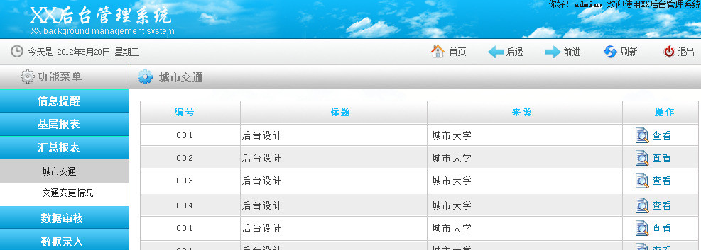
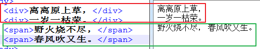
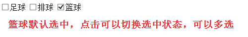
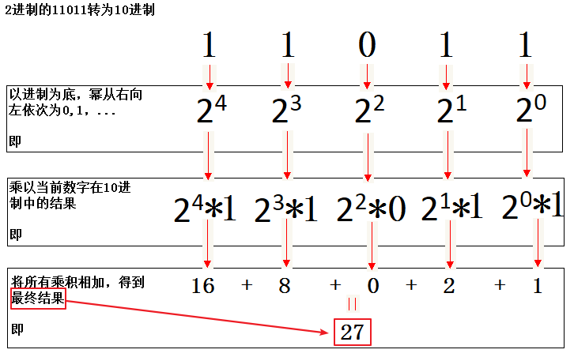
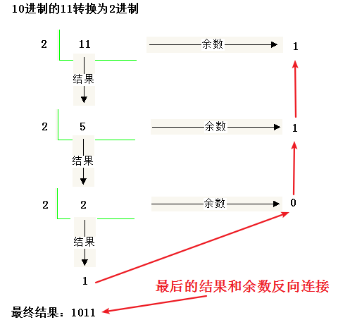

今日目标

· 能够使用div,span标签

· 能够理解文档声明(!Doctype)的含义

· 能够理解并使用meta标签

· 能够理解字符集和字符编码的含义

· 能够理解实体的作用并使用

· 能够写出表格标签的基本形式和表格属性

· 能够写出常用表单标签的基本形式

· 能够理解表单中提交按钮和重置按钮的作用

· 能够掌握input,select,textarea等表单元素的用法

· 能够说出input标签的多个type属性及其含义

## <!DOCTYPE>标签（了解）

**声名文档类型html，告知浏览器以html的规范解析当前文档**

### 1.含义

文档声名，用来声明文档遵循的规范，告知浏览器通过此规范来解析此页面中的代码

| 示例图                                  |
| --------------------------------------- |
|  |

脚下留心：

​	<!DOCTYPE>必须放在页面最顶部

​	<!DOCTYPE>不是标签，只是用来声明文档类型，并告知浏览器通过此规范来解析本页面中的代码

详细资料：http://www.w3school.com.cn/tags/tag_doctype.asp

### 2.html5的doctype声明

```html
<!DOCTYPE html>
```

### 3.XHTML 1.0 的严格型doctype声明：Strict

```html
<!DOCTYPE html PUBLIC "-//W3C//DTD XHTML 1.0 Strict//EN" 
"http://www.w3.org/TR/xhtml1/DTD/xhtml1-strict.dtd">
```

该 DTD 包含所有 HTML 元素和属性，但不包括展示性的和弃用的元素（比如 font）。不允许框架集（Framesets）。

### 4.XHTML 1.0 的过渡型doctype声明：Transitional

```html
<!DOCTYPE html PUBLIC "-//W3C//DTD XHTML 1.0 Transitional//EN" "
http://www.w3.org/TR/xhtml1/DTD/xhtml1-transitional.dtd">
```

注意：使用最多的是html5的声名和过渡型的声名

### 5.XHTML 和 HTML的区别

XHTML是满足W3C的HTML

XHTML = 规范 + HTML

了解：W3C----万维网联盟（World Wide Web Consortium），我们网页的规范就是这个机构制定的

### 6.在DW中更改文档规范

ctrl + u 打开首选参数

| 示例图                                  |
| :-------------------------------------- |
|  |

## 实体

导入：有一个需求，要做一个html的教材，例：p标签的语法是<p></p>，这样在页面中是看不到的，浏览器把这个标签解析了，现在是不需要的，需要将尖括号替换成浏览器不能解析的字符，且在浏览器中需要看到尖括号的形式，这个特殊字符就是实体

实体：替换特殊字符的代码，比如说<

空格：`&nbsp;`

`<`：`&lt;`

`>`：`&gt;`

```html
HTML教材：
p标签的语法：&lt;p&gt;&lt;/p&gt;
```


| 效果图                                  |
| --------------------------------------- |
|  |

多学一招：在DW里面按&符号会有提示很多实体

| 实体示意图                              |
| --------------------------------------- |
|  |

## 表格

导入：我们在博学谷上面可以看到各自班级的课程表

| 表格图示1                               |
| --------------------------------------- |
|  |

 

| 表格图示2                               |
| --------------------------------------- |
|  |

 

| 表格图示3                               |
| --------------------------------------- |
|  |

这样的页面就会用到表格。表格在网站中应用常用场景通常是金融类的网站，数据做统计，后台管理系统等

### 1.相关标签

画图说明，table是一个表格的模块，里面有行，光有行不行，里面要有列，在html中不叫列，叫单元格，再有很多行，就组成了表格-------》table标签包含行tr---》再包含单元格td

表格：`<table></table>`

行：`<tr></tr>`

单元格：`<td></td>`

每列的标题：`<th></th>`

表格标题：`<caption></caption>`

小案例：

| 小案例图示                              |
| --------------------------------------- |
|  |

 

```html
<!-- 表格的区域,border属性代表边框的意思 -->
<table border="1">
	<!-- 行 -->
	<tr>
    	<!-- 单元格 -->
        <td>姓名</td>
        <td>性别</td>
        <td>年龄</td>
    </tr>
    <tr>
    	<!-- 单元格 -->
        <td>令狐冲</td>
        <td>男</td>
        <td>22</td>
    </tr>
    <tr>
    	<!-- 单元格 -->
        <td>任盈盈</td>
        <td>女</td>
        <td>18</td>
    </tr>
    <tr>
    	<!-- 单元格 -->
        <td>任我行</td>
        <td>男</td>
        <td>55</td>
    </tr>
    <tr>
    	<!-- 单元格 -->
        <td>岳不群</td>
        <td>男</td>
        <td>50</td>
    </tr>
</table>
```

表格的边框  语法

```html
<table border=1>
  
</table>
```

注意：border这个属性一定加在table标签上，加在td上不生效

### 2.对齐方式

a) 水平对齐

语法：`align="center/left/right"`

| 示意图                                  |
| --------------------------------------- |
|  |

b) 垂直对齐

语法：`valign="top/middle/bottom"`

| 示意图                                  |
| --------------------------------------- |
|  |

### 3.单元格间距和填充

单元格间距（cellspacing）：单元格和单元格距离，默认是2像素

单元格填充（cellpadding）：单元格和内容的距离，默认是1像素

| 示意图                                  |
| --------------------------------------- |
|  |

### 4.合并单元格

| 图示                                    |
| --------------------------------------- |
|  |

导入：最后两行的最后两个单元格为照片，需要合并起来，这种合并是上下合并，所以合并的是行。如果是左右合并，那就是合并的列

合并行(rowspan)：把不同的行合并起来，写在上面的单元格上面

合并列(colspan)：把不同列合并起来，写在左边的单元格上面

取值是数值，需要合并几个单元格就写数字几就行，一旦合并了单元格，就需要将多余的单元格删掉

代码

```html
<table cellspacing="0" cellpading="30" border="1" width="300" height="200">
	<caption><h3>学生证</h3></caption>
    <tr>
    	<th align="center" colspan="4">深圳传值黑马程序员</th>
    </tr>
    <tr align="center">
    	<td>姓名</td>
    	<td>班级</td>
    	<td>学号</td>
    	<td rowspan="2">照片</td>
    </tr>
    <tr align="center">
    	<td>曾真光</td>
        <td>php14期</td>
        <td>007</td>
    </tr>
</table>

```

注意：合并以后一定要把多余的单元格td删掉

## 两个排版标签

这两个标签没有语义

div标签：一般用于存放图片、文字、视屏等网页内容----存放一切内容------用作盒子

span标签：一般只用于存放文字--------存放文字

他们的显示方式不同

```html
<div>离离原上草，</div>
<div>一岁一枯荣。</div>
<span>野火烧不尽，</span>
<span>春风吹又生。</span>
```


| 排版标签示意图                          |
| --------------------------------------- |
|  |

多学一招：这两个标签理解成放不同内容的容器，没有任何语义

## 标签的通用属性

### 1.id属性

id属性是标签的唯一标识，一个页面中可以有很多id属性，但是每个标签的id属性的值必须是唯一的

多学一招：通常用在写动态效果-----javascript

### 2.class属性----类

通常用来使用class属性值给标签设置样式，样式一样的标签可以设置同样的class

### 3.name属性

设置标签的名字，可以有同样的名字

多学一招：通常用在表单中

### 4.style属性

设置标签样式

## 表单

| 表单图示                                |
| --------------------------------------- |
|  |

表单的作用就是用来收集用户输入的信息

表单的组成：表单域，表单元素

表单域标签：`<form></form>`，放置所有的表单元素

### 表单元素：

#### 1.文本框

可输入明文内容的输入框----用户名

`<input type="text" maxlength="6">`

| 图示                                    |
| :-------------------------------------- |
|  |

多学一招：maxlength属性可以限制最大输入长度，为了让服务器端接收到输入的数据，表单元素都需要加name属性

#### 2.密码框

输入密文的输入框----密码

`<input type="password">`

| 图示                                    |
| :-------------------------------------- |
|  |

密码框的属性和使用和文本框一样

#### 3.单选框

只能选择一项的表单----性别选择

`<input type="radio" value="0">`

| 图示                                    |
| --------------------------------------- |
|  |

注意：要想单选框的单选功能生效，<font color="red">必须添加name属性，并且name属性的值必须一样</font>，这种无法输入的表单元素必须赋值：value="值"，默认选中项使用checked="checked"属性

代码

```html
<input type="radio" name="sex" value="0">男
<input type="radio" name="sex" value="1" checked>女
```


| 示意图                                  |
| --------------------------------------- |
|  |

#### 4.复选框

可以选择多项的表单----爱好选择

`<input type="checkbox" value="0">`

使用方式和属性与单选框一样

示例代码

```html
<input type="checkbox" />足球
<input type="checkbox" />排球
<input type="checkbox" checked />篮球
```


| 效果图                                  |
| --------------------------------------- |
|  |

#### 5.文件上传

`<input type="file">`

| 图示                                    |
| --------------------------------------- |
|  |

#### 6.下拉菜单

通常用于选择籍贯或收货地址中的省市区

```html
<select>
	<option>江苏</option>
    <option>浙江</option>
    <option>安徽</option>
</select>
```

默认选中项使用selected="selected"

| 图示                                    |
| --------------------------------------- |
|  |

多学一招：下拉菜单可以分组展示

代码

```html
<select>
		<optgroup label="省份">
			<option value="1">山东省</option>
			<option value="2">河北省</option>
			<option value="3" selected>河南省</option>
		</optgroup>
		<optgroup label="行业">
			<option value="1">IT互联网</option>
			<option value="2">制造业</option>
			<option value="3" selected>零售业</option>
		</optgroup>
		<optgroup label="薪资范围">
			<option value="1">1000~3000元/月</option>
			<option value="2">3000~5000元/月</option>
			<option value="3" selected>5000~8000月</option>
		</optgroup>
	</select>
```


| 图示                                    |
| --------------------------------------- |
|  |

#### 7.文本域

可以输入很多的内容----qq的留言输入框

`<textarea></textarea>`

代码

```html
<textarea></textarea>
```


| 效果                                    |
| --------------------------------------- |
|  |

多学一招：文本域可以通过两个属性来设置大小，宽度使用cols属性，高度使用rows属性

| 示意图                                  |
| --------------------------------------- |
|  |

#### 8.普通按钮

点击不会有任何效果

`<input type="button" value="普通按钮">`

| 示意图                                  |
| --------------------------------------- |
|  |

#### 9.提交按钮

用于提交表单的按钮

`<input type="submit">`

| 示意图                                  |
| --------------------------------------- |
|  |

多学一招：该按钮点击后默认会将表单的数据提交

#### 10.重置按钮

将表单的输入状态还原的按钮

`<input type="reset">`

| 示意图                                  |
| --------------------------------------- |
|  |

多学一招：该按钮点击后会将表单的输入状态还原到最初

### 表单域

标签：`<form></form>`

作用：将表单元素的值收集起来，发送给服务器，form标签的action属性的值就是数据提交的地址

第一次提交，没有数据，因为很多表单元素都没有name属性，服务器接收数据靠的就是表单的name属性

注意：form是一个双标签，里面包含所有需要一次性提交给服务器的表单元素

代码

```html
<form>
    用户名：<input type="text" name="username" />
    密码：<input type="password" name="password" />
    <input type="submit" />
</form>
```

## 框架

| 框架示意图                              |
| --------------------------------------- |
|  |

在同一个浏览器上显示多个多个框架。在每一个框架中放了一个页面。

### 1.使用的标签

`<frameset>`：框架集，rows属性设置框架分几行显示，cols属性用来设置框架分几列显示，rows和cols尽量不要同时设置（因为不能及时辨别每个位置的页面）

`<frame>`：框架，src属性用来引入要显示的页面

注意：框架页面中不能有body标签，可以将body标签`<noframes></noframes>`标签中。noframes标签是当浏览器不支持框架的时候显示其中的内容。

案例1：

| 案例1图示                               |
| --------------------------------------- |
|  |

 案例2：

| 案例2图示                               |
| --------------------------------------- |
|  |

### 2.框架嵌套

| 框架嵌套示意图                          |
| --------------------------------------- |
|  |

### 3.框架中跳转

| 框架中跳转示意图                                             |
| ------------------------------------------------------------ |
|  |

### 4.内嵌框架

就是在页面中嵌套的框架

```html
<iframe src="http://www.baidu.com" width="500" height="200" marginwidth="0" marginheight="0" frameborder="0"></iframe>
```


| 内嵌框架示意图                          |
| --------------------------------------- |
|  |

多学一招：

1. src：内嵌框架中存放的页面
2. width和height：内嵌框架的宽度和高度
3. marginwidth：内嵌框架中的页面距离内嵌框架的宽度
4. marginheight：内嵌框架中的页面距离内嵌框架的高度
5. frameborder：内嵌框架边框

| 内嵌框架属性示意图                      |
| --------------------------------------- |
|  |

## html的发展史（了解）

PC   personal computer

 

 

## html5的新特点

### 1.语法更简单

a) 头部声明

`<!doctype html>`

b) 简化了字符集声明

`<meta charset="utf-8">`

### 2.语法更宽松

a) 可以省略结束符的标签

li、dt、dd、p、optgroup、option、tr、td、th

b) 可以完全省略的标签

html、head、body

### 3.标签语义化

增加了很多标签，在作页面的时候更加具有语义（定义了一些原本没有语义的div模块为有鲜明结构的语义模块）

a) `<header> `标记定义一个页面或一个区域的头部

b) `<nav>`标记定义导航链接

c) `<article>`标记定义一篇文章内容

d) `<section>`标记定义网页中一块区域

e) `<aside>`标记定义页面内容部分的侧边栏

f) `<footer>`标记定义一个页面或一个区域的底部

| 语义化标签图示                          |
| --------------------------------------- |
|  |

### 4.表单新增常用属性------要求掌握

required：必填

placeholder：输入内容提示

autofocus：自动获取焦点-----自动帮我们将光标点进去

```html
<form method="post" action="http://www.baidu.com">
<!-- required 必填，必须的 -->
<!-- 自动获取焦点----自动将光标定位到表单中 -->
	<input type="text" placeholder="请输入用户名" autofocus="autofocus" required="required" />
    <input type="submit" />
</form>
```


| 效果图                                  |
| :-------------------------------------- |
|  |

### 5.input新增type属性值

a) type="email"，文本框中只能输入email地址

| 示意图                                  |
| --------------------------------------- |
|  |

b) type="date"，日期控件

| 示意图                                  |
| --------------------------------------- |
|  |

c) type="time"

| 示意图                                  |
| --------------------------------------- |
|  |

d) type="month"

| 示意图                                  |
| --------------------------------------- |
|  |

e) type="week"

| 示意图                                  |
| --------------------------------------- |
|  |

f) type="number"，唤醒数字键盘

| 示意图                                  |
| --------------------------------------- |
|  |

g) type="range"，滑块

| 示意图                                  |
| --------------------------------------- |
|  |

h) type="color"

| 示意图                                  |
| --------------------------------------- |
|  |

## 多媒体标签

### 1.embed标签

不是h5独有，h4就有，用来播放音频和视屏

```html
<embed src="邓紫棋-喜欢你.mp3"></embed>
<embed src="邓紫棋_喜欢你.webm"></embed>
```

说明：embed可以用来插入各种多媒体，格式可以是 Midi、Wav、flac、AIFF、AU、MP3、MP4等等，Netscape及新版的IE 都支持。

| 效果图                                  |
| --------------------------------------- |
|  |

多学一招：embed标签有属性可以控制播放状态

autostart=true/false  --用来控制音频或视频文件是否在下载完之后就自动播放（IE可用）

loop=正整数/true/false --用来控制音频或视屏文件在播放结束之后是否循环播放或循环播放的次数

hidden=true/no --用来设置多媒体的控制面板是否隐藏

参考：https://www.cnblogs.com/lgx5/p/5714494.html

### 2.audio标签

h5专门用来播放音频的，支持的格式有MP3、OGG、WAV

```html
<audio src="邓紫棋-喜欢你.mp3" controls autoplay="autoplay"></audio>
```


| 效果图                                  |
| --------------------------------------- |
|  |

controls="controls"用来显示控制面板

autoplay="autoplay"用来控制自动播放

loop="loop"用来设置循环播放

多学一招：为了兼容，通常会写多个资源，第一个不能播放就播放第二个，原因是不同的浏览器支持的格式不一样，所以出现了一种兼容写法（前提是准备三种格式的视频文件）

```html
<audio controls autoplay>
	<source src="music/music.mp3">
    <source src="music/music.ogg">
</audio>
```

浏览器会从上到下依次去读，在这个过程中，只要读到自己识别的视频文件就直接播放这个视频文件，并且不会再往后继续读取

参考：https://www.cnblogs.com/linn/p/3408515.html

### 3.video标签

h5专门用来播放视屏的，可以写单个，也可以写多个，支持格式有MP4、WebM、OGG

```html
<video controls autoplay loop>
    <source src="邓紫棋_喜欢你.mkv">
    <source src="邓紫棋_喜欢你.webm">
</video>
```

参考：https://blog.csdn.net/keji_123/article/details/77717849

| 效果图                                  |
| --------------------------------------- |
|  |

## 计算机的进制

计算机内部的电子元器件只有两种状态，就是通电和断点，用1和0来表示，所以计算机内部只能传输1和0，也就是所谓的二进制。

我们原来学习的是十进制，逢十进一，十进制中有十个数字。我们以此类推，二进制就是逢二进一，二进制就两个数字，0和1。

八进制、十六进制也是同样的道理。

在计算机中，我们需要用到的进制有，二进制，八进制，十进制，十六进制。

| 进制     | 包含数字                        |
| -------- | ------------------------------- |
| 二进制   | 0,1                             |
| 八进制   | 0,1,2,3,4,5,6,7                 |
| 十进制   | 0,1,2,3,4,5,6,7,8,9             |
| 十六进制 | 0,1,2,3,4,5,6,7,8,9,A,B,C,D,E,F |

转成10进制：以进制为底，幂从右往左依次为0次方，1次方，2次方…，乘以当前当前数字在10进制中的结果，所有乘积相加

例：

1.16进制的FF转为10进制：

| 示意图                                  |
| --------------------------------------- |
|  |

2.2进制的11011转为10进制

| 示意图                                  |
| --------------------------------------- |
|  |

3.10进制的11转2进制-----反向取余数

| 示意图                                  |
| --------------------------------------- |
|  |

## 网页中的颜色

### 1.英文单词

color:red

### 2.rgb三原色

color:rgb(255,0,0)

### 3.16进制颜色值

其实就是将三原色转换为16进制表示

255----》FF

color:#FF0000;

| 示意图                     |
| -------------------------- |
|  |

## meta标签

### 1.编码

| 示意图                     |
| -------------------------- |
|  |

这种情况就是乱码，是因为我们输入的中文，往计算机中保存的时候，最终都要转成2进制的数据形式，也就是说有一个编码的过程，在保存文件的时候默认使用的是ANSI编码格式，浏览器显示文件中内容的时候，还需要将2进制的数据转换成文字形式显示出来，也就是说还有解码的过程，浏览器被指定为utf-8格式来解码，也就是说编码和解码不一致所造成的乱码

| 解决乱码示意图             |
| -------------------------- |
|  |


| 保存编码图示               |
| -------------------------- |
|  |

我们加上meta标签反而会乱码的原因，是因为meta标签可以指定浏览器解析文件的编码格式，不加meta标签反而会正常，是因为我们不指定解码格式，浏览器会自动检测编码格式，再以对应的解码方式进行解码。

字符集的核心点就是如果设置了以什么字符集进行读取，那么在保存的时候也需要设置成对应的字符集

```
<meta charset="utf-8">  <!--告知浏览器使用utf-8的编码格式来解析页面-->
```

知识小百科：

**字符集**

ansi：不同的国家和地区制定了不同的标准，由此产生了 GB2312、GBK、Big5、Shift_JIS 等各自的编码标准。这些使用 1 至 4 个字节来代表一个字符的各种汉字延伸编码方式，称为 ANSI 编码。在简体中文Windows操作系统中，ANSI 编码代表 GBK 编码；在日文Windows操作系统中，ANSI 编码代表 Shift_JIS 编码。 不同 ANSI 编码之间互不兼容，当信息在国际间交流时，无法将属于两种语言的文字，存储在同一段 ANSI 编码的文本中。

unicode：Unicode（[统一码](https://baike.baidu.com/item/%E7%BB%9F%E4%B8%80%E7%A0%81)、万国码、单一码）是计算机科学领域里的一项业界标准，包括字符集、编码方案等。Unicode 是为了解决传统的字符编码方案的局限而产生的，它为每种语言中的每个字符设定了统一并且唯一的[二进制](https://baike.baidu.com/item/%E4%BA%8C%E8%BF%9B%E5%88%B6)编码，以满足跨语言、跨平台进行文本转换、处理的要求。

**字符编码**

UTF-8（8-bit Unicode Transformation Format）是一种针对Unicode的可变长度字符编码，又称万国码，用在网页上可以统一页面显示中文简体繁体及其它语言（如英文，日文，韩文）。

GB2312是一个简体中文字符集，由6763个常用汉字和682个全角的非汉字字符组成。其中汉字根据使用的频率分为两级。一级汉字3755个，二级汉字3008个。

GBK即汉字内码扩展规范，K为扩展的汉语拼音中“扩”字的声母。英文全称Chinese Internal Code Specification。GBK编码标准兼容GB2312，共收录汉字21003个、符号883个，并提供1894个造字码位，简、繁体字融于一库。

Big5 **又称为**大五码**或**五大码**，是使用[繁体中文](https://baike.baidu.com/item/%E7%B9%81%E4%BD%93%E4%B8%AD%E6%96%87)（正体中文）社区中最常用的电脑[汉字](https://baike.baidu.com/item/%E6%B1%89%E5%AD%97)[字符集](https://baike.baidu.com/item/%E5%AD%97%E7%AC%A6%E9%9B%86)标准，共收录13,060个汉字。虽普及于[台湾](https://baike.baidu.com/item/%E5%8F%B0%E6%B9%BE)、[香港](https://baike.baidu.com/item/%E9%A6%99%E6%B8%AF)与[澳门](https://baike.baidu.com/item/%E6%BE%B3%E9%97%A8)等繁体中文通行区

### 2.给搜索引擎用

| 示意图                     |
| -------------------------- |
|  |

多学一招：搜索引擎上的描述，可能是`<meta>`标签中的description部分，也可能是页面中的一段话

## 其他（了解）

### 1.文字滚动

```html
<html>
<head>
	<title>我的第一个页面</title>
</head>
<body>
	<marquee behavior="scroll" direction="up" height="30" style="overflow:hidden;" scrollamount="1" width="300" onMouseOver="stop()" onMouseOut="start()">
		雷电黄色预警！<br />
		大雨黄色预警！<br />
	</marquee>
</body>
</html>
```

direction：方向

​	up:上   down：下   left：左    right：右

scrollamount:滚动速度-----------------scroll：滚动   amount：数值

width：宽度   height：高度

onmouseover：当鼠标移上去

onmouseout：当鼠标离开

stop()：停止

start()：开始

behavior：

​	scroll  循环滚动

​	alternate  来回滚动

​	slide  滚动一次停止

### 2.object标签

```html
<object type="application/x-shockwave-flash" data="line.swf" width="500" height="500"></object>
```


| 效果图                                  |
| --------------------------------------- |
|  |

## DW设计器的使用

### 1.热点

热点就是带有超链接的区域

点解3中模式中的设计模式，选择图片

| 示意图                                                       |
| ------------------------------------------------------------ |
|  |

### 2.插入图片

方法1：

| 示意图                     |
| -------------------------- |
|  |

方法2：

| 示意图                     |
| -------------------------- |
|  |

### 3.插入换行

回车：换段

shift+回车：换行

### 4.添加超链接

| 示意图                     |
| -------------------------- |
|  |

### 5.插入表格

| 示意图                     |
| -------------------------- |
|  |

### 6.合并单元格

| 示意图                     |
| -------------------------- |
|  |

sub标签和sup标签


