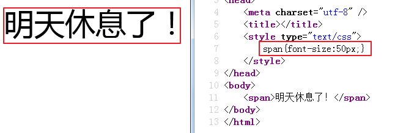
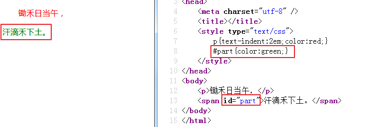

今日目标：

能够说出html5里面的一些新标签和新属性

能够说出html5中input标签的几个新增type属性

能够写出img,embed等多媒体标签

能够理解css的基本概念和作用

能够理解css的语法基本规则

能够使用css的注释

能够理解并使用标签的4个通用属性

能够写出4个基本选择器的语法

能够熟练写出几个关系选择器

能够熟练写出组合(并集)选择器

## 一、css介绍

引子：html是网页的结构，css是网页的化妆师，让网页更美观。

传智官网删除css后会变得横七竖八，加上后又变美观了，这就是css样式的魔力。css就是给网页设置一些样式，让网页变的漂亮，更具有可读性。

css全称为Cascading  Style  Sheets 翻译过来叫层叠样式表

作用：设置网页的文字（大小，颜色，字体风格，对齐方式等）图片和排版等，简单点说就是给网页化妆

感知css

```html
<!DOCTYPE html>
<html>
<head>
	<meta charset="utf-8" />
	<title></title>
	<style type="text/css">
		div{
			width:200px;
			height:200px;
			background:red;
			transition:all 2s ease;
		}
		div:hover{
			transform:rotate(720deg) scale(0.2);
			background:green;
		}
	</style>
</head>
<body>
	<div>盒子</div>
</body>
</html>
```


语法

1.构建css的运行环境：在头部加入style标签

```html
<!DOCTYPE html>
<html>
<head>
	<meta charset="utf-8" />
	<title></title>
	<style type="text/css">
		
	</style>
</head>
<body>
<div>这是一个盒子</div>
</body>
</html>
```

2.选择对应的目标元素，使用大括号

```html
<style type="text/css">
		div{}
	</style>
```

3.语法：`属性：值;`   键值对

```html
<head>
	<meta charset="utf-8" />
	<title></title>
	<style type="text/css">
		div{color:red;}
	</style>
</head>
<body>
<div>这是一个盒子</div>
</body>
```

## 二、css字体、文本属性

css学前小知识：

一张图片的打印出来的实际尺寸是由电子图片的像素和分辨率共同决定的，像素(Pixel)是指构成图片的小色点，分辨率(单位DPI)是指每英寸(Inch)上的像素数量，可以看做是这些小色点的分布密度；像素相同时，分辨率越高则像素密度越大，实际打印尺寸越小，图像也越清晰。

实际尺寸(英寸)=像素/分辨率; **1英寸=2.54厘米**; 如一张图片宽为600像素，分辨率为300，那么实际打印宽度为：600/300=2英寸，约为5厘米。

### 1.字体属性

a) font-size  设置字体的大小

取值方式：数字 + 像素单位px（像素就是一个长度单位）

| 示意图                                  |
| --------------------------------------- |
|  |

多学一招：（1）取值用偶数（2）默认是16px大小（3）字体有多大，看字体的高度

b) font-weight  设置字体的粗细

取值：normal 正常的（400）、bold加粗（700）、bolder(900) 、 100 - 900（字体的粗细没有那么精细，所以很少使用数字）

| 示意图                                  |
| --------------------------------------- |
|  |

 在实际工作中 用的最多的就是normal （不加粗）和bold（加粗）

c) font-style 设置字体的风格

取值：normal 默认 显示标准的字体样式	italic 字体倾斜

| 示意图                                  |
| --------------------------------------- |
|  |

d) font-family 设置不同的字体

取值：	宋体、微软雅黑、黑体、。。。等等  

| 示意图                                  |
| --------------------------------------- |
|  |

多学一招：

1.不推荐使用一些冷门字体，因为一些冷门字体很多电脑里面默认没有安装，这个时候就会显示不出来。所以实际工作中，默认都是一些主流字体 如宋体 微软雅黑 等。。。

2.字体可以写多组，中间用逗号隔开，显示不了第一个，就找第二个显示

3.字体名称中如果有空格 # $ 这种特殊字符的时候需要添加上引号 中文字体也需要添加引号


### 2.文本属性

a) 文本修饰

语法：`text-decoration:值`

取值：

​	（1）underline下划线

​	（2）overline上划线

​	（3）line-through删除线

​	（4）none没有修饰-----------一般用在a标签上

| 示意图                                  |
| --------------------------------------- |
|  |

b) 文本转换

语法：`text-transform:值`

取值：

​	（1）uppercase转换成大写

​	（2）lowercase转换成小写

​	（3）capitalize首字母大写

| 示意图                                  |
| --------------------------------------- |
|  |

c) 文本对齐方式

语法：`text-align:值`

取值：

​	（1）left左对齐---------------------默认

​	（2）center居中对齐

​	（3）right右对齐

| 示意图                                  |
| --------------------------------------- |
|  |

d) 首行缩进

语法：`text-indent:值`

取值：可以是像素，但是当文字大小发生改变后，也需要重新改变，可以使用em代替，代表字符，会随着文字大小的改变而自动调整

| 示意图                                  |
| --------------------------------------- |
|  |

多学一招：默认的文字大小是16px

### 3.字体颜色

语法：`color:"颜色值"`

| 字体颜色示意图                           |
| ---------------------------------------- |
|  |

## 三、css注释

语法：`/*注释的内容*/`

## 四、css基本选择器

### 1.标签选择器

通过标签来选择元素，标签{css样式}

| 示意图                                  |
| --------------------------------------- |
|  |

### 2.id选择器

通过id属性来选择元素，#id名{css样式}

| 示意图                                  |
| --------------------------------------- |
|  |

注意：id选择要保证页面中的唯一性，这是语义

### 3.class类选择器

通过class属性选择元素，.类名{css样式}

| 示意图                                  |
| --------------------------------------- |
|  |

Google小案例：

| 案例图示                                |
| --------------------------------------- |
|  |

代码

```html
<!DOCTYPE html>
<html>
<head>
	<meta charset="utf-8">
	<title></title>
	<style type="text/css">
		span{font-size:180px;}
		.blue{color:blue;}
		.red{color:red;}
		.orange{color:yellow;}
		.green{color:green;}
	</style>
</head>
<body>

<span class="blue">G</span>
<span class="red">o</span>
<span class="orange">o</span>
<span class="blue">g</span>
<span class="green">l</span>
<span class="red">e</span>

</body>
</html>
```

 

多学一招：一个元素可以有多个类名

小案例：

| 小案例效果图                            |
| --------------------------------------- |
|  |

代码

```html
<!DOCTYPE html>
<html>
<head>
	<meta charset="utf-8">
	<title></title>
	<style type="text/css">
		.fz-30{font-size:30px;}
		.red{color:red;}
		.green{color:green}
	</style>
</head>
<body>

<div class="fz-30 red">这是一个盒子</div>
<span class="fz-30">我是文本</span>
<p class="fz-30 green">段落部分</p>
<a class="fz-30" href="">我是超链接</a>

</body>
</html>
```

### 4.复合选择器

a) 标签选择器和类选择器一起使用

需求：给下面的类名叫box的p标签设置字体颜色为绿色

```html
<p class="box">
    我是一个段落
</p>
<div class="box">
    我是一个盒子
</div>
<p>
    俺也是一个段落！！！
</p>
```

| 效果图                                  |
| --------------------------------------- |
|  |

b) 用多个类名选择一个元素

| 示意图                                  |
| --------------------------------------- |
|  |

c) 给多个元素设置同一种样式，每个元素中间用 `，` 隔开:元素1，元素2{css样式}

| 示意图                                  |
| --------------------------------------- |
|  |

## 五、常用选择器

### 1.通配选择器（了解）

给所有标签添加样式，*{css样式}

| 示意图                                  |
| --------------------------------------- |
|  |

多学一招：通常只是用来去掉所有代码的边距，因为每个浏览器的边距不同，有的8个像素，有的7个像素，所以干脆会全部去掉，重新设置，保证浏览器的每个边距都一致

### 2.后代选择器（掌握）

选择元素里面的元素，外层元素和内层元素中间用空格隔开：外层 内层{css样式}

| 示意图                                  |
| --------------------------------------- |
|  |

### 3.子元素选择器（掌握）

选择元素的直接子元素，父和子之间用 `>` 隔开：父元素>子元素{css样式}

| 示意图                                  |
| --------------------------------------- |
|  |

案例题：

```html
<div class="nav">    <!-- 主导航栏 -->
  <ul>
    <li><a href="#">公司首页</a></li>
	<li><a href="#">公司简介</a></li>
	<li><a href="#">公司产品</a></li>
	<li>
         <a href="#">联系我们</a>
		 <ul>
		    <li><a href="#">公司邮箱</a></li>
		    <li><a href="#">公司电话</a></li>
		 </ul>
	</li>
  </ul>
</div>
<div class="sitenav">    <!-- 侧导航栏 -->
  <div class="site-l">左侧侧导航栏</div>
  <div class="site-r"><a href="#">登录</a></div>
</div>	
```

在不修改以上代码的前提下，完成以下任务：

1. 链接 登录 的颜色为红色,同时主导航栏里面的所有的链接改为黄绿色     (简单)
2. 主导航栏和侧导航栏里面文字都是14像素并且是微软雅黑。（中等)
3. 主导航栏里面的一级菜单链接文字颜色为绿色。（难)

### 4.相邻元素选择器（了解）

选择相邻的元素，两个元素中间用 `+` 隔开：元素1 + 元素2{css样式}

| 示意图                                  |
| --------------------------------------- |
|  |

### 5.伪类

元素:link        正常连接时候的状态

元素:visited   点击以后的状态

元素:hover     当鼠标移动上去的状态-------重点、常用

元素:active     当鼠标按下去时候的状态


注意：不是所有元素都支持这4种写法，超链接支持4种，工作中用的hover比较多，别的可以做个了解

## 六、伪类选择器和类选择器一起使用

| 示意图                                  |
| --------------------------------------- |
|  |

## 七、伪对象选择器（了解）

first-letter：选择第一个字符

语法：`元素:first-letter`

| 示意图                                  |
| --------------------------------------- |
|  |

first-line：选择第一行

语法：`元素:first-line`

| 示意图                                  |
| --------------------------------------- |
|  |

## 八、属性选择器

### 1.[属性名]

选择具有该属性的元素

| 示意图                                  |
| --------------------------------------- |
|  |

### 2.[属性=值]（重点）

选择具有该属性且等于该值的元素

| 示意图                                  |
| --------------------------------------- |
|  |

### 3.[属性~=值]（了解）

选择具有该属性，且值中包含该值的元素

| 示意图                                  |
| --------------------------------------- |
|  |

多学一招：元素属性的值可以有多个

注意：这种场景适用于一个属性名对应多个属性的值

### 4.[属性|=字符]（了解）

选择由连字符连接多个单词组成的属性值中的第一个单词

| 示意图                                  |
| --------------------------------------- |
|  |

注意：这种场景适用于一个属性的值由连字符连接多个单词组成，且选择的是第一个

### 5.[属性*=值]（了解）

选择属性的值中包含当前的值的元素

| 示意图                                  |
| --------------------------------------- |
|  |

## 九、css尺寸、行高属性

### 1.尺寸属性

a) 宽度

语法：`width:值`

取值：数字 + px/百分比/em      -------------------------px代表像素，百分比代表浏览器宽度的百分比，em代表字符数

| 示意图                                  |
| --------------------------------------- |
|  |

注意：1.div设置宽度为100%，其实和没设一样2.span标签设置宽度无效

b) 高度

语法：`height:值`

用法和宽度一样


注意：div不设高度，默认是0

### 2.行高

行高控制的是文字与文字之间的上下距离 （行距）

语法：`line-height:值`

| 示意图                                  |
| --------------------------------------- |
|  |

多学一招：如果将标签的高度和行高设置成一样，那么这个标签里面的文字可以在这个标签里面垂直居中，两者结合使用可以让单行文字在标签内部水平垂直居中，工作中经常用于让文字垂直居中（将行高设为盒子的高度）

###**font简写**

font: font-style  font-weight  font-size/line-height  font-family
不建议修改顺序  并且不需要设置的属性可以不写  但是font-size和font-family必须指定，否则将不起作用

```html
<style type="text/css">
		div{
			height:100px;
			border:1px solid #000;
			font:italic bolder 30px/100px "微软雅黑";
		}
	</style>
</head>
<body>
	<div>今天明天和后天</div>
</body>
```


| 效果图                                  |
| --------------------------------------- |
|  |


