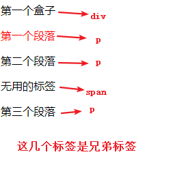
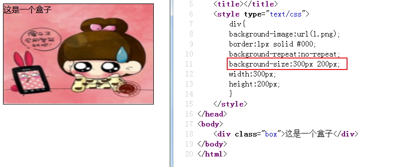

今日目标

· 能够写出链接的4个伪类选择器的语法

· 能够写出几个属性选择器的语法

· 能理解并使用几个伪元素选择器

· 能够理解并使用常用的选择器组合形式

· 能够理解并使用的几个字体属性

· 能够理解并使用的几个文本属性

## 通配选择器

语法：

```css
<style>
	*{}
</style>
```

将页面中所有标签都选中

使用场景：通常设置`*{padding:0;margin:0;}`

## 伪类选择器

​	元素:link        正常的链接的状态

​	元素:visited   点击以后的状态

​	元素:hover     当鼠标移动上去的状态-------**重点、常用**

​	元素:active     当鼠标按下去时候的状态

总结：

​	1.伪类是选择器，不是css的属性，不能写在{}中

​	2.visited和link不能适用于普通标签，只有a标签才有

​	3.hover和active是任何标签都可以有的

## 伪对象选择器

语法：

```css
元素:first-letter   选择第一个字符
元素:first-line       选择第一行
```

总结：

​	1.这是选择器，不是css属性，不能写在{}中

​	2.所谓的元素，可以是标签名，还可以是类名`.class名:first-letter/line{}`

## 相邻元素选择器

```css
哥哥+弟弟{}  /*通过哥哥选择到弟弟 */
```

例：

```html
<style>
	div+p{/* 兄弟选择器，哥哥标签+弟弟标签，，，，修饰的是弟弟 */
		color:red;	
	}
</style>
<div>第一个盒子</div>
<p>第一个段落</p>
<p>第二个段落</p>
<span>无用的标签</span>
<p>第三个段落</p>
```


| 效果图                                  |
| --------------------------------------- |
|  |

总结：

​	1.哥哥和弟弟中间用的符号：`+`

​	2.修饰的是弟弟标签

​	3.不能通过弟弟选哥哥

关系选择器：后代(空格)，子元素(大于号)，兄弟(加号)

## 属性选择器

​	**[属性名]**

语法：

```css
[属性名]{}
```

​	**[属性名=属性值]**

语法：

```css
[属性名=属性值]{}
```

​	[属性名~=属性值]（选择多个值中的一个）

语法：

```css
[属性名~=属性值]{}
```

​	[属性名|=属性值]（选择连字符值中的第一个单词）

语法：

```css
[属性名|=属性值]{}
```

​	[属性名*=属性值]（选择包含当前值的元素）

语法：

```css
[属性名*=属性值]{}
```

总结：

​	重点`[属性名]` 和`[属性名=属性值]`

## 行高属性

语法：

```css
line-height:数字px;
```

代表的一行的高度，放在段落中，可以理解为是行距

总结：

​	1.文字在行高中是垂直居中的

​	2.行高通常用于让文字在盒子中垂直居中

## 背景属性

### a) 背景颜色

语法：`background-color:颜色值`

| 示意图                                  |
| --------------------------------------- |
|  |

### b) 背景图片  

语法：`background-image:url(图片路径)`

| 示意图                                  |
| --------------------------------------- |
|  |

### c) 设置背景图片是否平铺

语法：`background-repeat:值`

取值：no-repeat不平铺，repeat-x横向平铺，repeat-y纵向平铺，repeat横向纵向都平铺------默认

| 示意图                                  |
| --------------------------------------- |
|  |

### d) 设置背景图片位置

语法：`background-position:水平位置，垂直位置`

位置的取值可以为像素（相对左上角定点的位置），也可以为关键字：top left bottom right center

| 示意图                                  |
| --------------------------------------- |
|  |

多学一招：

1.还可以使用百分比，不太常用：位置的固定规则为盒子自身的宽高百分比减去图片的宽高百分比，如下图：

| 示意图                        |
| ----------------------------- |
|  |

2.在使用位置关键字的时候，关键字的前后顺序对结果不产生影响

3.可以只有一个值，代表水平方向和垂直方向都是这个值 ----此规则适用于关键字center,和百分比以及具体的像素

4.当只有一个值，且值为上下左右关键字时，上下左右只能代表x轴或y轴之一，另一个方向默认为center

### e) 设置背景图片大小

语法：`background-size:宽度 高度`

宽高取值可以是像素也可以是百分比

| 示意图                                  |
| --------------------------------------- |
|  |

### f) 综合使用

语法：`background:颜色 url(图片路径) 平铺类型 位置/大小` 

| 示意图                                  |
| --------------------------------------- |
|  |

多学一招：属性中的每个值顺序可以调整，且background可以为单独其中之一设置

### g) 设置背景是否受滚动条的影响

语法：`background-attachment:值`

取值：

​	（1）scroll会受滚动条的影响，当内容滚动到下方，图片会消失----默认

​	（2）fixed不会受滚动条影响，一直保持在视线范围内

| 示意图                                  |
| --------------------------------------- |
|  |

**背景可以设置为透明**

```html
background:rgba();  /* a代表透明度，取值为0-1 */
```

背景和图片标签都可以让页面中显示图片，那有什么区别？

img和背景图片的区别：
img不需要专门写宽高就能够显示在页面上
而背景图片默认是撑不开容器的 需要专门写宽高
一般产品插入图都推荐使用img  而一些小的icon 或者很少更新的图片 再或者超大的图片推荐使用背景图
而且背景图可以让内部的文字盖在上面，但是img不行（除非后期用定位）

### h) 背景颜色渐变

#### 	①线性渐变

语法：

```css
<linear-gradient>：linear-gradient([ <point>,]? <color-stop>[, <color-stop>]+);
<point>：[ left | right ]? [ top | bottom ]? || <angle>?
<color-stop>：<color> [ <length> | <percentage> ]?
```

取值：

```shell
<point>
    left： 设置左边为渐变起点的横坐标值。 
    right： 设置右边为渐变起点的横坐标值。 
    top： 设置顶部为渐变起点的纵坐标值。 
    bottom： 设置底部为渐变起点的纵坐标值。 
	<angle>： 用角度值指定渐变的方向（或角度）,单位deg。 
<color-stop>： 指定渐变的起止颜色。 <color-stop>
    <color>： 指定颜色。请参阅颜色值 
    <length>： 用长度值指定起止色位置。不允许负值 
    <percentage>： 用百分比指定起止色位置。 
```

##### 写法一：

代码：

```html
<div></div>
<style type="text/css">
    div{
        width:300px;
        height:200px;
        background:linear-gradient(red,black); 
        /* 表示颜色从上往下，从红色到绿色转换，各占50%(默认) */
    }
</style>
```


| 效果图                                  |
| --------------------------------------- |
|  |

##### 写法二：

代码

```html
<div></div>
<style type="text/css">
    div{
        width:300px;
        height:200px;
        background:linear-gradient(to right,red,black); 
        /* 表示颜色的渐变方向(也是九宫格) */
    }
</style>
```


| 效果图                                  |
| --------------------------------------- |
|  |

##### 写法三：

代码

```html
<div></div>
<style type="text/css">
    div{
        width:300px;
        height:200px;
        background:linear-gradient(45deg,red,black); 
        /* 表示中间的水平线顺时针旋转10度开始渐变 */
    }
</style>
```


| 效果图                                  |
| --------------------------------------- |
|  |


| 角度示意图                              |
| --------------------------------------- |
|  |


##### 写法四：

代码

```html
<style type="text/css">
	div{
		width:300px;
		height:200px;
		background:linear-gradient(red 20%,black 50%,pink); 
		/* 表示颜色渐变所占的百分比 */
	}
</style>
```


| 效果图                                  |
| --------------------------------------- |
|  |

##### 写法五：

代码

```html
<style type="text/css">
	div{
		width:300px;
		height:200px;
		background:linear-gradient(to top right,red 20%,black 30%,pink); 
		/* 复合写法，表示颜色从左下角往右上角，从红色开始渐变到20%，再由黑色从20%渐变到30%，剩下的都是粉色 */
	}
</style>
```

 

| 效果图                                  |
| --------------------------------------- |
|  |

**颜色渐变方向有**：to bottom、to top、to left、to right、to top right、to top left、to bottom left、to bottom right【其实就是一个四边形的四条边与四个角】

#### ②径向渐变

语法：

```css
<radial-gradient>：radial-gradient([ <position>,]? [ [ <shape> || <size> ] | <shape-size>{2},]? <color-stop>[, <color-stop>]+);
<position>：[ <length>① | <percentage>① | left | center① | right ]? [ <length>② | <percentage>② | top | center② | bottom ]?
<shape>：circle | ellipse
<size>：closest-side | closest-corner | farthest-side | farthest-corner | contain | cover
<shape-size>：<length> | <percentage> 
<color-stop>：<color> [ <length> | <percentage> ]?
```

取值：

```shell
<position>
	<percentage>①： 用百分比指定径向渐变圆心的横坐标值。可以为负值。 
	<length>①： 用长度值指定径向渐变圆心的横坐标值。可以为负值。 
    left： 设置左边为径向渐变圆心的横坐标值。 
    center①： 设置中间为径向渐变圆心的横坐标值。 
    right： 设置右边为径向渐变圆心的横坐标值。 
    <percentage>②： 用百分比指定径向渐变圆心的纵坐标值。可以为负值。 
    <length>②： 用长度值指定径向渐变圆心的纵坐标值。可以为负值。 
    top： 设置顶部为径向渐变圆心的纵坐标值。 
    center②： 设置中间为径向渐变圆心的纵坐标值。 
    bottom： 设置底部为径向渐变圆心的纵坐标值。 
<color-stop>： 指定渐变的起止颜色。 
<shape>
    circle： 指定圆形的径向渐变 
    ellipse： 指定椭圆形的径向渐变。写本文档时Chrome,Safari尚不支持该参数值 <size>
    closest-side： 指定径向渐变的半径长度为从圆心到离圆心最近的边 
    closest-corner： 指定径向渐变的半径长度为从圆心到离圆心最近的角 
    farthest-side： 指定径向渐变的半径长度为从圆心到离圆心最远的边 
    farthest-corner： 指定径向渐变的半径长度为从圆心到离圆心最远的角 
    contain： 包含，指定径向渐变的半径长度为从圆心到离圆心最近的点。类同于closest-side 
    cover： 覆盖，指定径向渐变的半径长度为从圆心到离圆心最远的点。类同于farthest-corner <shape-size>
    写本文档时Firefox尚不支持<shape-size> <percentage>： 用百分比指定径向渐变的横向或纵向直径长度，并根据横向和纵向的直径来确定是圆或椭圆。不允许负值。 
    <length>： 用长度值指定径向渐变的横向或纵向直径长度，并根据横向和纵向的直径来确定是圆或椭圆。不允许负值。 <color-stop>
    <color>： 指定颜色。请参阅颜色值 
    <length>： 用长度值指定起止色位置。不允许负值 
    <percentage>： 用百分比指定起止色位置。
```

##### 写法一：

代码

```html
<div></div>
<style type="text/css">
	div{
		width:300px;
		height:200px;
		background:radial-gradient(orange,black);
		/* 从中心点向四周扩散渐变 */
	}
</style>
```


| 效果图                                  |
| --------------------------------------- |
|  |

多学一招：div如果是正方形，扩散的形状会是圆形

```html
<div></div>
<style type="text/css">
	div{
		width:200px;
		height:200px;
		background:radial-gradient(orange,black);
	}
</style>
```


| 效果图                                  |
| --------------------------------------- |
|  |

##### 写法二：

代码

```html
<div></div>
<style type="text/css">
	div{
		width:200px;
		height:200px;
		background:radial-gradient(orange 20%,black 30%,red 70%);
        /* 代表颜色扩散到哪个位置停止渐变 */
	}
</style>
```


| 效果图                                  |
| --------------------------------------- |
|  |

多学一招：除了使用百分比还可以使用具体像素设置停止渐变的位置

```html
<div></div>
<style type="text/css">
	div{
		width:200px;
		height:200px;
		background:radial-gradient(orange 50px,black 30%,red 70%);
		/* 橘色区域半径50px */
	}
</style>

```


| 效果图                                  |
| --------------------------------------- |
|  |

因为50像素已经超过30%，所以橘色部分没有渐变（试试橘色和黑色都是30%）

##### 写法三：

代码：

```html
<div></div>
<style type="text/css">
	div{
		width:300px;
		height:200px;
		background:radial-gradient(circle,orange 10%,black 50%);
		/* 指定渐变的形状 */
	}
</style>
```


| 效果图                                  |
| --------------------------------------- |
|  |

注意：指定形状的时候可以是circle圆形，也可以是ellipse椭圆

##### 写法四：

代码：

```html
<div></div>
<style type="text/css">
	div{
		width:300px;
		height:200px;
		background:radial-gradient(circle 100px,orange 10%,black 50%);
		/* 指定渐变的区域大小，因为是圆形，所以代表宽100px高也是100px */
	}
</style>
```


| 效果图                                  |
| --------------------------------------- |
|  |

注意：如果指定的**<font color="red">形状</font>**是**圆形**，那么指定区域大小的时候只需要一个值就好，可要是**椭圆形**的时候需要两个值，因为椭圆的宽和高不一样，否则直接不能显示页面

```html
<style type="text/css">
	div{
		width:300px;
		height:200px;
		background:radial-gradient(ellipse 200px 100px,orange 10%,black 50%);
		/* 指定椭圆形的区域大小需要两个值一个宽一个高 */
	}
</style>

```


| 效果图                                  |
| --------------------------------------- |
|  |

##### 写法五：

代码：

```html
<div></div>
<style type="text/css">
	div{
		width:300px;
		height:200px;
		background:radial-gradient(ellipse 200px 100px at right bottom,orange 10%,black 50%);
		/* 指定径向渐变的圆心 */
	}
</style>
```


| 效果图                                  |
| --------------------------------------- |
|  |

多学一招：圆心默认在中心，或者使用关键字center

#### 	③重复线性渐变

语法：

```css
repeating-linear-gradient(方向,颜色 结束百分比,...);
```

例：

```html
<div></div>
<style type="text/css">
	div{
		width:300px;
		height:200px;
		background:repeating-linear-gradient(to right bottom,red 10%,green 20%);
		/* 渐变方向为右下角，指定每种颜色的结束位置，重复渐变 */
	}
</style>
```


| 效果图                                  |
| --------------------------------------- |
|  |

#### 	④重复径向渐变

语法：

```css
repeating-radial-gradient(形状 方向,颜色 结束百分比,...;
```

例：

```html
<div></div>
<style type="text/css">
	div{
		width:300px;
		height:200px;
		background:repeating-radial-gradient(ellipse at center,red 10%,green 20%);
		/* 渐变形状为椭圆，渐变中心为中心，指定每种颜色的结束位置，重复渐变 */
	}
</style>
```


| 效果图                                  |
| --------------------------------------- |
|  |

注意：未指定颜色值的结束位置时，颜色是平均分配的

## 列表属性

### 1.list-style-type

设置列表前缀样式，通常设置为none，去掉前缀

语法：`list-style-type:none`

| 示意图                                  |
| --------------------------------------- |
|  |

### 2.list-style-image

将列表前缀设置为自定义图片

语法：`list-style-image:url(图片路径)`

| 示意图                                  |
| --------------------------------------- |
|  |

应用场景：通常在网页中，使用的列表都是要去除前面的符号，并且去除左边和上边的空间，所以，样式如下：

```css
ul{
    list-style:none;
    padding:0;
    margin:0;
}
```


## 内容溢出

语法：`overflow:值`

取值：auto当内容溢出时，生成滚动条------默认，hidden内容溢出时超出部分隐藏

| 示意图                                  |
| --------------------------------------- |
|  |

总结：

​	overflow取值：

​		auto----自动生成滚动条（右边）

​		**hidden----超出部分隐藏**

​		scroll----右边和下边都有滚动条	

设置水平方向溢出可以使用overflow-x，纵向溢出使用overflow-y，取值和overflow一样

<font color="red">重点：overflow:hidden;超出部分隐藏</font>

## 网页调试（重点）

开发者工具对于开发者来说特别重要，只要你开发你就离不开它。一定要学会使用

作用：调试代码 检测代码的！！

在网页中点击右键，选择（审查元素/查看元素/检查）或者按F12，在右侧或下面会打开一个窗口，窗口最左边是查看html的结构，network是查看网页的http请求加载，console是控制台，查看网页中打印的信息，也可以自己写调试代码，source中是网页的所有资源。

在结构中点击标签，会在右侧显示对应的css。如果写错了，可以看到css样式中有一条横线，表明样式未生效。

netwrok中会看到http请求的次数，以及加载的资源。

主要掌握elements这个面板  右侧的style就是当前标签对应的css样式  我们可以通过这个来检查代码错误和调试代码！！

## css样式的分类

### 1.内部样式----内联样式

使用的是style标签

```html
<style type="text/css">
/* 样式 */
</style>
```

多学一招：把页面的公共样式（不多的情况下）写在style标签中

### 2.行内样式

直接写在标签上的style属性中

```html
<div style="color:red;">
    我是盒子
</div>
```

多学一招：通常是后台程序员进行修改页面的时候使用

### 3.外部样式

新建一个css文件，然后和html页面关联起来

a) 使用标签关联

```html
<!-- 在html的head标签中 -->
<link rel="stylesheet" type="text/css" href="css文件路径">
```

b) 使用指令关联

```html
<style type="text/css">
/* 在style标签中 */
    @import url("css文件路径")
</style>
```

多学一招：做项目最常用的是外部样式，link标签

**三种样式表总结**

| 样式表     | 优点                     | 缺点                     | 使用情况       | 控制范围           |
| ---------- | ------------------------ | ------------------------ | -------------- | ------------------ |
| 行内样式表 | 书写方便，权重高         | 没有实现样式和结构相分离 | 较少           | 控制一个标签（少） |
| 内部样式表 | 部分结构和样式相分离     | 没有彻底分离             | 较多           | 控制一个页面（中） |
| 外部样式表 | 完全实现结构和样式相分离 | 需要引入                 | 最多，强烈推荐 | 控制整个站点（多） |

## 样式的继承和覆盖（重点）

当父标签设置了样式，子标签都会具有父标签的样式

| 示意图                                  |
| --------------------------------------- |
|  |

总结：

1.能继承的css属性：font系列，text系列，color，line-height

2.div可以继承父亲的宽度，高度不能继承


当子标签和父标签设置了同样属性的css，子标签会覆盖父标签的设置

| 示意图                                  |
| --------------------------------------- |
|  |

总结：

​	继承：父元素设置了样式，子元素也具有了

​	覆盖：父元素和子元素有同样的样式，生效的是子元素，子元素覆盖了父元素的样式

## 样式的优先级（了解）

### 1.强制优先级（important）

语法：`样式属性:值 !important;`

| 示意图                                  |
| --------------------------------------- |
|  |

注意：只针对当前这一条css属性

### 2.选择器优先级

伪对象选择器>!important>行内样式>id选择器>class选择器>标签选择器>通配选择器>继承

| 示意图                                  |
| --------------------------------------- |
|  |

### 3.伪对象选择器的优先级（了解）

首字符>首行

| 示意图                                  |
| --------------------------------------- |
|  |

### 4.样式分类优先级

行内样式>内部样式/外部样式

| 示意图1                                 |
| --------------------------------------- |
|  |

 

| 示意图2                                 |
| --------------------------------------- |
|  |


总结：

​	1.样式分类中：行内样式>内部/外部，内部样式和外部样式没有权重之分，关键是看他们的加载顺序，后面的会覆盖前面的

​	2.伪类首字>伪类首行>!important>id名>类名/属性>标签名>通配

​	3.容易被覆盖的选择器，应该写在前面，以便于后面的选择器覆盖它

### 5.样式叠加（权重）

!important(无穷大)   行内样式(1000)  id(100)   class(10)   标签(1)

| 示意图                                  |
| --------------------------------------- |
|  |

总结：掌握一个点：人多力量大   .class<.class标签

继承来的样式不计算权重，也就是说**关键看是不是直接修饰的目标标签**

**权重累计到10，不会往前进一位**

| 选择器                   | 权重    |
| ------------------------ | ------- |
| 继承或者* 的贡献值       | 0,0,0,0 |
| 每个元素（标签）贡献值为 | 0,0,0,1 |
| 每个类，伪类贡献值为     | 0,0,1,0 |
| 每个ID贡献值为           | 0,1,0,0 |
| 每个行内样式贡献值       | 1,0,0,0 |
| 每个!important贡献值     | 无穷大  |

总结：

​	1.比较权重的前提是准确选择到元素，而不是继承来的样式

​	2.每一级满10也不会往前进1，等级是非常森严的


## 标签的显示模式（重点）

div和span标签

​	1.样式完全相同，标签不同，显示的结果完全不同

​	2.每个div会独占一行，多个span会并列一排

### 1.块元素

特点：宽度默认是100%，高度默认是0，可以设置宽度和高度，会继承父级的宽度，换行显示---div  ul  li  p  h1

| 示意图                                  |
| --------------------------------------- |
|  |

总结：块元素可以添加宽高的属性，独占一行

### 2.行元素

特点：宽高默认都是0，不能设置宽和高，一行显示----span  b  i  u  a

| 示意图                                  |
| --------------------------------------- |
|  |

总结：对宽高不敏感，不能独占一行

### 3.行内的块元素

特点：只能设置宽和高，不能换行显示---img  input

| 示意图                                  |
| --------------------------------------- |
|  |

多学一招：从大的方面来说，其实行内的块元素也属于行内元素，对行内元素的某些操作，同样可以操作行内的块元素，例：text-align:center;line-height:1000px;

### 4.模式转换

语法：`display:值`

取值：block转成块元素，inline转成行元素，inline-block转成行内的块元素，none隐藏元素


多学一招：使用该属性隐藏元素后，在页面中将不占据空间


小案例：简易导航的制作

| 案例示意图                              |
| --------------------------------------- |
|  |

  代码

```html
<!DOCTYPE html>
<html>
<head>
	<meta charset="utf-8">
	<title></title>
	<style type="text/css">
		a{
            display:inline-block;
            width:100px;
            height:50px;
            background:#f00;
            text-align:center;
            text-decoration:none;
            color:#fff;
            line-height:50px;
        }
		body{text-align:center;}
	</style>
</head>
<body>

<a href="">导航</a>
<a href="">导航</a>
<a href="">导航</a>
<a href="">导航</a>
<a href="">导航</a>
<a href="">导航</a>

</body>
</html>
```


