今日目标

· 能够给标签设置边框属性

· 能够理解并使用背景高级特性

· 能够实现盒子的线性渐变背景

· 能够实现盒子的径向渐变背景

· 能够掌握去除链接标签下划线的方法

· 能够阐述CSS的优先性算法并计算优先级

· 能够阐述盒子模型的4个组成部分

· 能够理解盒子模型实际宽高对父元素的影响

· 能够盒子模型外边距塌陷的解决方法

· 能理解并使用元素的三种常用显示模式

· 能够使用元素的可见性属性visibility

## 盒子模型

我们说div就是一个块，它就是一个盒子。其实我们做网页的过程就是摆放盒子的过程

小米官网：www.mi.com

| 图示                                    |
| --------------------------------------- |
|  |

盒子模型的组成

| 示意图                                  |
| --------------------------------------- |
| 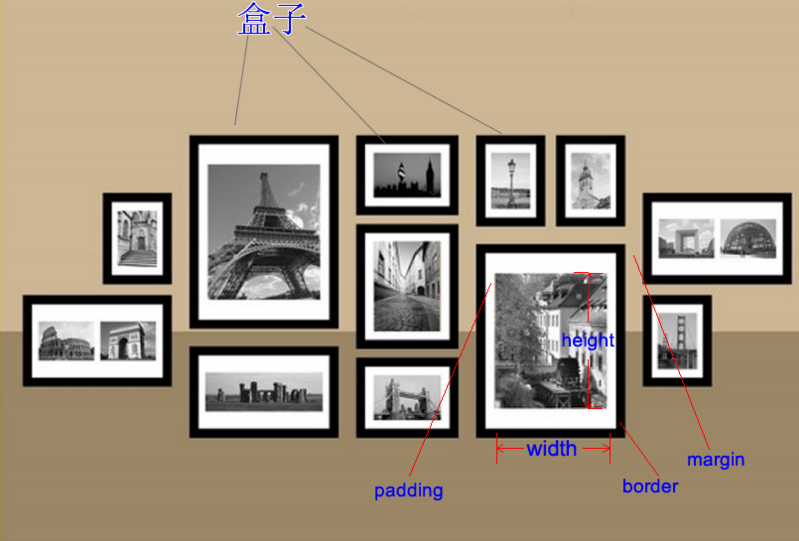 |

## 盒子模型特性

4个组成部分：宽高、内间距、边框、外间距

### 1.内边距padding

| 示意图                                  |
| --------------------------------------- |
| 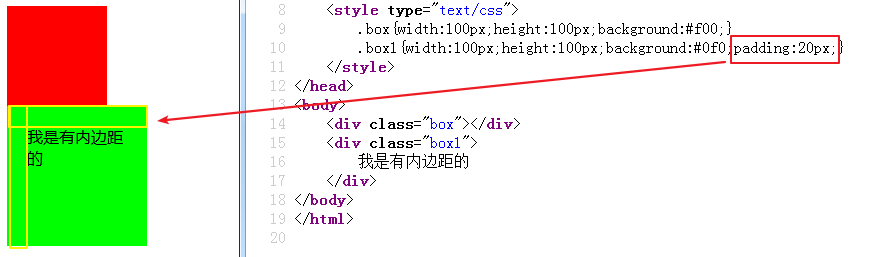 |

注意：

1. 添加了padding属性的元素，会加大盒子的宽或高，需要减去padding的大小
2. 如果这个块级盒子没有width属性（从父级继承宽度）的时候，添加padding和border不会撑大盒子（盒子内容部分会自动压缩）

### 2.外边距margin

| 示意图                                  |
| --------------------------------------- |
| 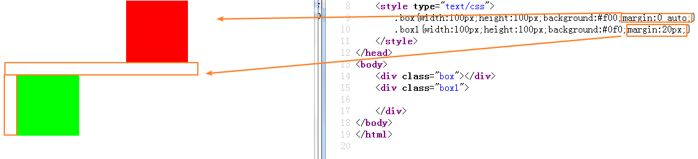 |

多学一招：margin:0 auto;可以让盒子在其父元素中居中

**margin:0 auto;和text-align:center;的区别**

|            | margin:0 auto；         | text-align:center; |
| ---------- | ----------------------- | ------------------ |
| 针对的对象 | 盒子---块元素(标签本身) | 标签内部的行元素   |
| 居中的范围 | 在父盒子中居中          | 自己内部           |

### 3.边框属性

边框有3要素：边框类型、边框颜色、边框厚度

a) 边框类型

语法：`border-style:值`

取值：

​	（1）solid实线

​	（2）dashed虚线

​	（3）dotted点线

​	（4）double双线

| 示意图                                  |
| --------------------------------------- |
| 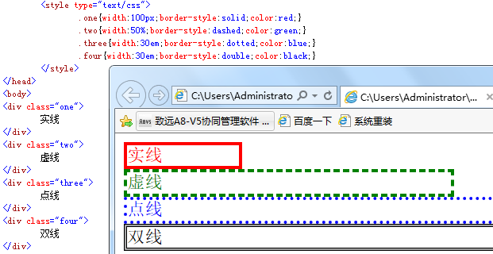 |

b) 边框颜色

语法：`border-color:颜色值`

| 示意图                                  |
| --------------------------------------- |
| 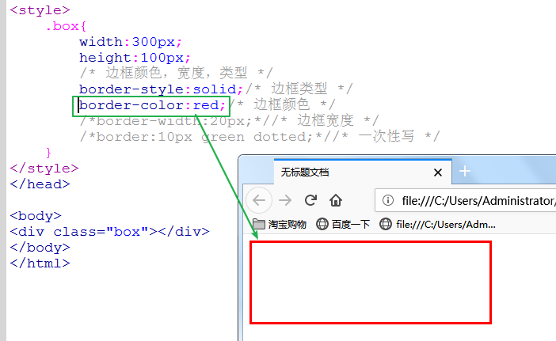 |

c) 边框厚度

语法：`border-width:尺寸值`

| 示意图                                  |
| --------------------------------------- |
| 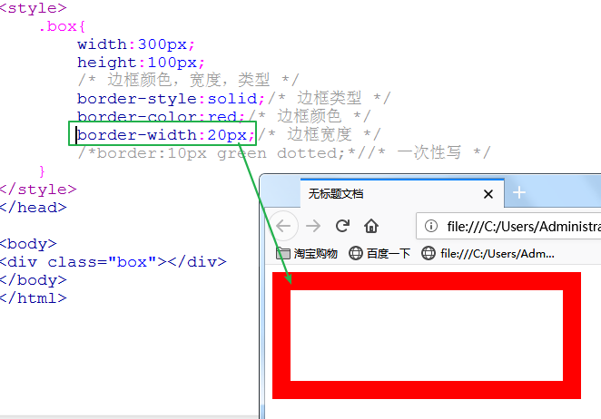 |

d) 一次性写好

语法：`border:类型 颜色 宽度`

| 示意图                                  |
| --------------------------------------- |
| 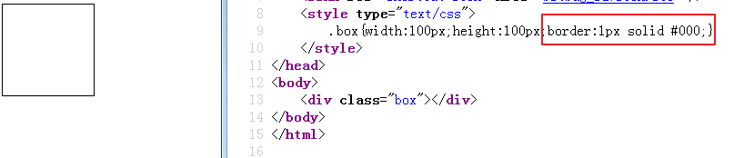 |

e) 单独方向的边框设置

语法：

​	（1）上边框：border-top:三要素

​	（2）左边框：border-left:三要素

​	（3）下边框：border-bottom:三要素

​	（4）有边框：border-right：三要素

| 示意图                                  |
| --------------------------------------- |
| 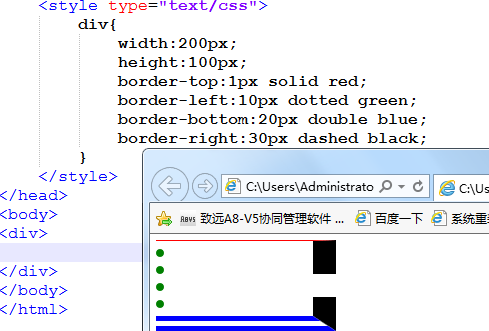 |

多学一招：可以设置none

| 示意图                                  |
| --------------------------------------- |
| 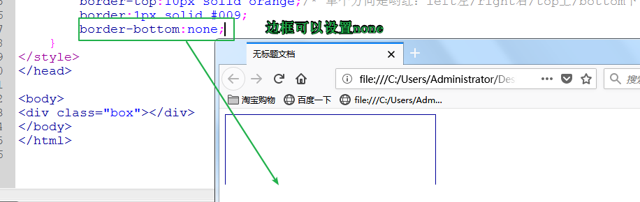 |

f) 边框圆角

语法：`border-radius:值`

取值：可以是像素，也可以是百分比

| 示意图                                  |
| --------------------------------------- |
| 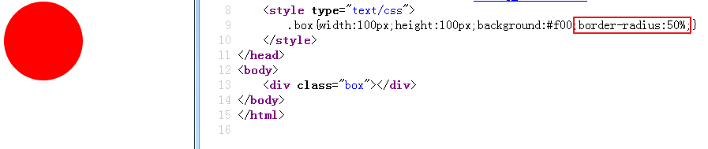 |

多学一招：当盒子是正方形，圆角的值是边的一半或者百分比是50%的时候，是圆（ie8以下不支持），圆角和边框没关系

总结：元素加边框后，元素会变大

### 4.盒子模型的bug：

a) 盒子上下摆放，上盒子有下外边距，下盒子有上外边距，两个边距会重合，以大的边距为准

| bug1图示                                |
| --------------------------------------- |
|  |

| bug1效果图                              |
| --------------------------------------- |
| 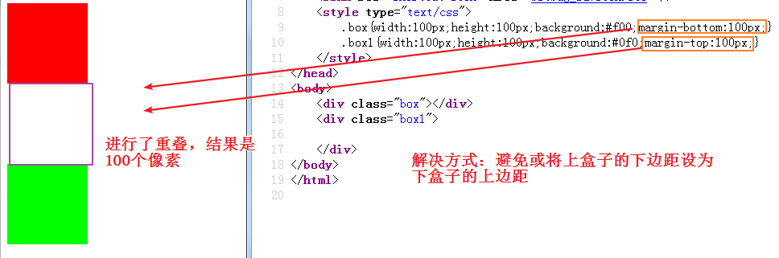 |

解决：避免或将这个间距都给到一个元素上面

b) 两个盒子嵌套关系，两个盒子对于上外边距会重合，以大的边距为准

| bug2图示                                |
| --------------------------------------- |
| 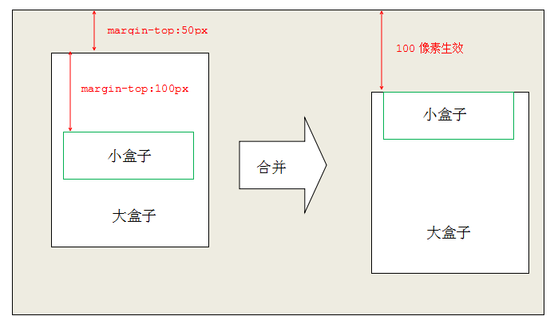 |

 

| bug2效果图                              |
| --------------------------------------- |
| 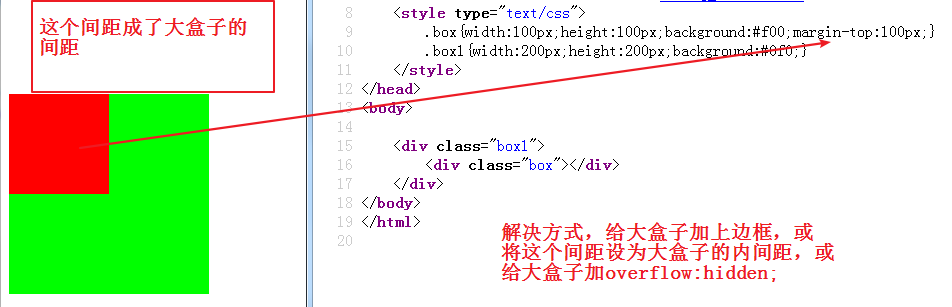 |

解决：

​	a) 给外部盒子加上边框或者上padding-top

​	b) 给外部盒子添加oveflow:hidden

​	

## 元素的可见性

语法：`visibility:值`

取值：hidden隐藏，visible可见的

| 示意图                                  |
| --------------------------------------- |
| 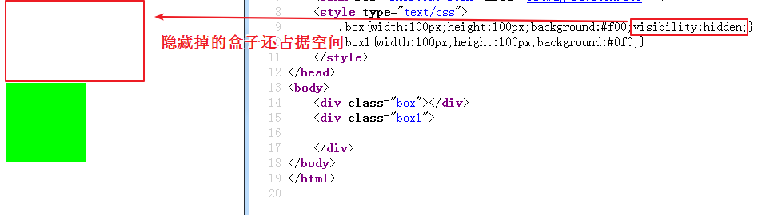 |

多学一招：使用该属性隐藏的元素，在页面中还占用空间

语法：`display:none`

元素隐藏后在页面中不占用空间

| 示意图                                  |
| --------------------------------------- |
| 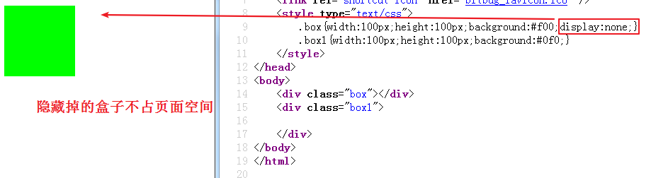 |

