今日目标

· 能够运用盒子的阴影效果

· 能够理解浮动的含义和作用

· 能够理解浮动的基本特性

· 能够熟练使用浮动的两种方式

· 能够理解浮动的清除

· 能够掌握子元素设置浮动对父元素失去垂直支撑的解决方法

## 伪对象

概念：就是给元素追加一个虚拟标签，由css加载，可以节省html的资源开销，必须有content属性，默认是行元素，可以进行转换。

::after:在指定的标签后面添加一个对象

::before:在指定的标签前面添加一个对象

content：元素里面的内容（内容中不能写标签）

语法：

```shell
元素::after{
    content:"";
}
```

<font color="red">注意：伪对象样式中，必须有content属性，否则伪对象无效</font>

多学一招：官方推荐使用双冒号，但是通常为了兼容性更好，我们使用单冒号

上面两个伪对象选择器需要结合属性content一起使用

```html
<style type="text/css">
		.box{width:200px;background:#f00;height:300px;}
		.box::before{
			content:'开头的内容';height:100px;
			line-height:100px;color:#fff;background:#00f;
		}
		.box::after{
			content:'这是一个段落';
			background-color:green;
			display:block;height:50px;
		}
	</style>
</head>
<body>
	<div class="box"></div>
</body>
```


| 效果图                        |
| ----------------------------- |
| 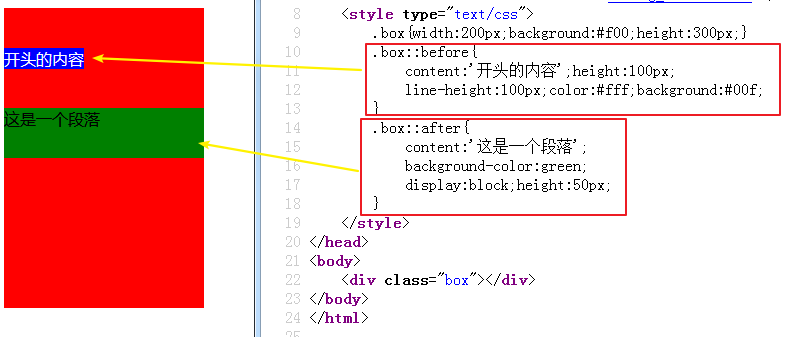 |

总结：

​	1.什么是伪对象？不是实际标签，使用css样式模拟一个标签	

​	2.元素::after{}/元素::before{}

​	3.在伪元素样式中，必须有content属性

​	4.伪元素是行元素


布局的三种方式：

1.标准流：按照标签默认的特性摆放盒子

2.浮动流：利用浮动摆放盒子

3.定位流：利用定位摆放盒子

## 浮动（重点）

| 图文绕排图示                            |
| --------------------------------------- |
| 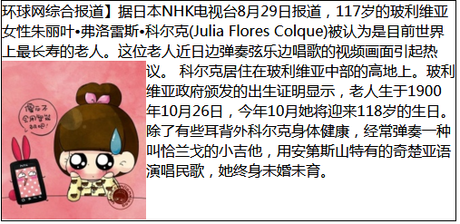 |

浮动最早期做的是图文绕排

```html
<head>
	<meta charset="utf-8">
	<title></title>
	<style type="text/css">
		.news{width:500px;border:1px solid #000;overflow:hidden;}
		img{float:left;}  /* 浮动，还可以是right */
	</style>
</head>
<body>
<div class="news">
	环球网综合报道】据日本NHK电视台8月29日报道，117岁的玻利维亚女性朱丽叶•弗洛雷斯•科尔克(Julia Flores Colque)被认为是目前世界上最长寿的老人。这位老人近日边弹奏弦乐边唱歌的视频画面引起热议。
	
科尔克居住在玻利维亚中部的高地上。玻利维亚政府颁发的出生证明显示，老人生于1900年10月26日，今年10月她将迎来118岁的生日。除了有些耳背外科尔克身体健康，经常弹奏一种叫恰兰戈的小吉他，用安第斯山特有的奇楚亚语演唱民歌，她终身未婚未育。
</div>
</body>
```

浮动的语法：

```css
float:left/right   /none
```


取值：left向左浮动，right向右浮动，none取消浮动

现在的浮动，用的最多是让块元素在同一行显示：就是给一行的所有块元素都加上浮动

浮动的最大价值：让元素排列成一行，或者一左一右

浮动的使用口诀：

​	1.要浮动，兄弟元素也一起浮动

​	2.浮动方向保持一致（尽量都是用左浮动）


总结：

​	1.可以做图文绕排

​	2.主要让块元素排一行，多个元素一起浮动

​	3.注意加了浮动以后元素的顺序，标签顺序，浮动方向

​	4.浮动的元素脱离标准流

### 1.行元素浮动

行元素浮动，会优先于普通元素占据设置方向的位置，不会重叠

| 行元素浮动图示                          |
| --------------------------------------- |
| 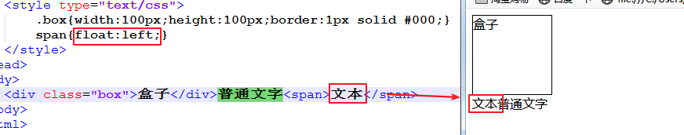 |

### 2.块元素浮动

块元素浮动，会脱离页面原本的文本流（不占据原本的空间），会覆盖其他元素

| 块元素浮动图示                          |
| --------------------------------------- |
| 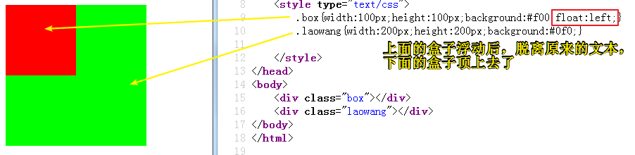 |

多学一招：

1.脱离文本流的元素具有行内的块元素的特性（不换行，能设置宽高），无论原来是行元素还是块元素--例：图文绕排。

2.设置了浮动的元素，居中对元素不起作用

3.浮动元素不会覆盖文字

4.大盒子放不下了，浮动元素会掉下去，掉下去的元素位置根据上一个元素的高度：（1）上一个元素高度比较小，在上一个元素的正下方（2）上一个元素高度比较大，高度的起始位置，在上一个元素的下方


总结：

​	1.所有元素浮动后都变成了行内块

​	2.浮动元素不能覆盖文字


### 浮动引起的问题：

```html
<style>
		
		/* 浮动的盒子撑不开父容器 
			
			解决办法：强制追加一个高度（不推荐，因为很多时候盒子的高度是会变化的）
		*/

		.box {
			width: 500px;
			border: 1px solid #000;
		}
		.info {
			width: 100px;
			height: 100px;
			background-color: green;
			float: left;
		}
		.gebilaowang {
			width: 500px;
			height: 300px;
			background-color: lime;
		}
	</style>
</head>
<body>
	<div class="box">
		<div class="info">1</div>
		<div class="info">2</div>
		<div class="info">3</div>
		<div class="info">4</div>
	</div>
	<div class="gebilaowang"></div>
```


| 效果图                                  |
| --------------------------------------- |
| 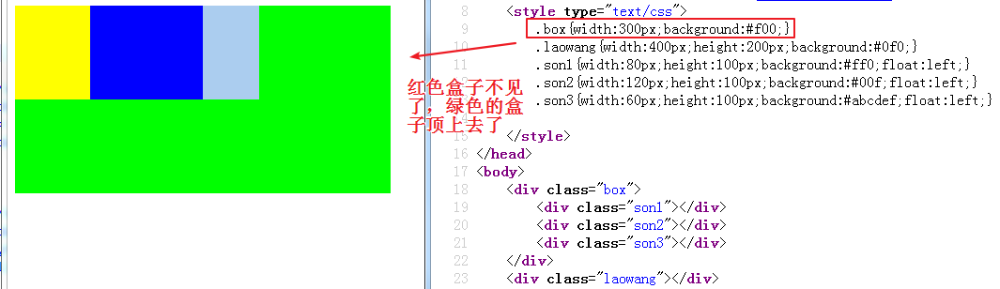 |

### 3.清除浮动

就是清除浮动带来的影响，普通元素不受浮动元素影响

a) 给父元素设置高度（不推荐，因为在项目中很多盒子是不固定高度的）


b 在父元素后设定空标签进行清除浮动

语法：`clear:both`

| 示意图                                  |
| --------------------------------------- |
| 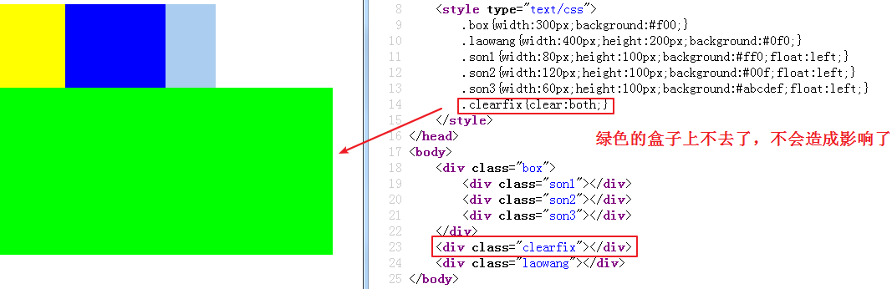 |

c) 设定父元素的overflow

| 示意图                                  |
| --------------------------------------- |
| 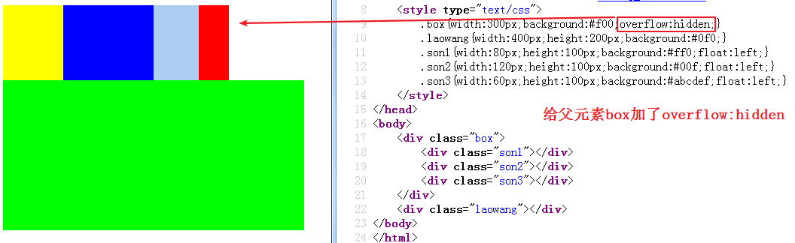 |

overflow的原理：overflow可以创建一个BFC（[块级格式化上下文](http://www.w3.org/TR/CSS21/visuren.html#block-formatting) (Block Fromatting Context)），按照块元素布局，BFC是一个独立的布局环境，其中的元素布局是不受外界的影响。说白了就是将盒子内部的元素和外部的元素进行隔离，互不影响。

d) 使用伪对象代替空标签

| 示意图                                  |
| --------------------------------------- |
| 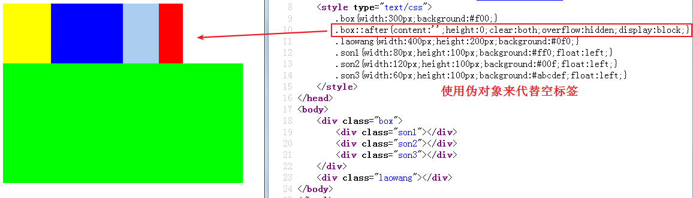 |


## 阴影

### 1.文本阴影

语法：`text-shadow:横向偏移 纵向偏移 模糊距离 颜色`

| 示意图                                  |
| --------------------------------------- |
| 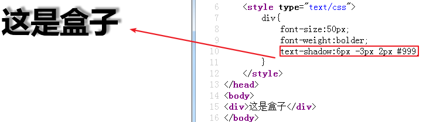 |

### 2.边框的阴影

语法：`box-shadow: 水平偏移 垂直偏移 模糊距离 阴影尺寸 颜色;`

| 示意图                                  |
| --------------------------------------- |
| 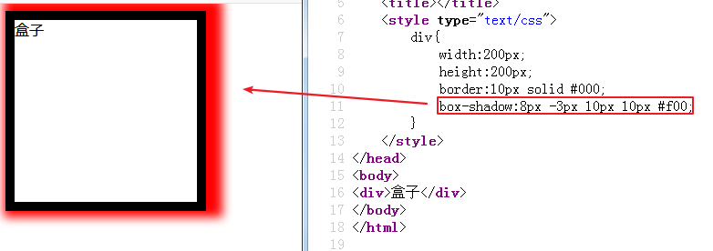 |

注意：边框阴影和边框没有关系

## 细线表格

语法：`border-collapse:collapse;`

| 示意图                                  |
| --------------------------------------- |
| 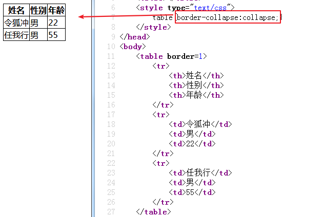 |

注意：一定要加在table标签上，且表格和单元格都加边框属性

## 网站图标和字体图标

### 1.网站图标

作用：一个好的ico图标可以加深用户对于网站的记忆。降低用户记忆成本，就好像现在说道熊爪大家都能够想到度娘，更多的属于用户体验。有利于识别当前窗口是在哪个网站。

制作流程：

​	（1）一张图

​	（2）在网上将图片做成ico图标（网址：http://www.bitbug.net/）

​	（3）在html中引入`<link rel="shortcut icon" href="favicon.ico" />`

例：

生成ico图标

| 示意图                                  |
| --------------------------------------- |
| 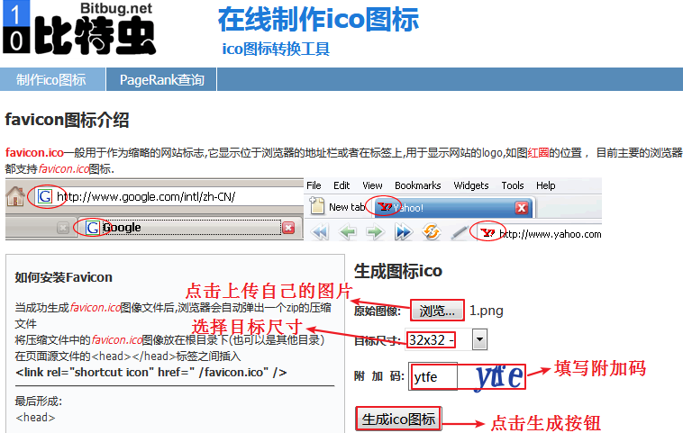 |

在html中使用link标签引入

| 示意图                                  |
| --------------------------------------- |
| 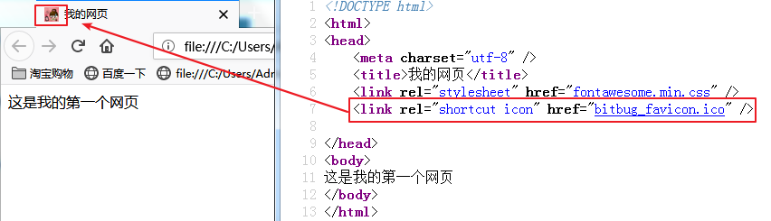 |

### 2.字体图标

图片是一个选择，但是图片不但增加了总文件的大小，还增加了很多额外的"http请求"（服务器加载资源），这会大大降低网页的性能。图片还有一个缺点就是不能很好的进行“缩放”，因此，有时候在网站中需要使用图像的最好解决方案就是不去使用图片-----而使用字体图标恰恰可以解决这一点。

| 示意图                                  |
| --------------------------------------- |
| 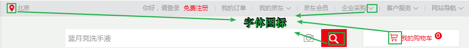 |

使用流程：

​	（1）打开网上的图标库，网址：http://www.iconfont.cn/，搜索需要的图标，或者打开图标库

​	（2）将需要的图标加入购物车

​	（3）打开购物车添加至自己的项目（没有的需要自己创建），点击确定

​	（4）下载至本地

​	（5）在html中引入下载好的css文件

​	（6）在标签中使用（需要两个类名，一个图标类型，一个图标名称）

例：

| 示意图                                  |
| --------------------------------------- |
| 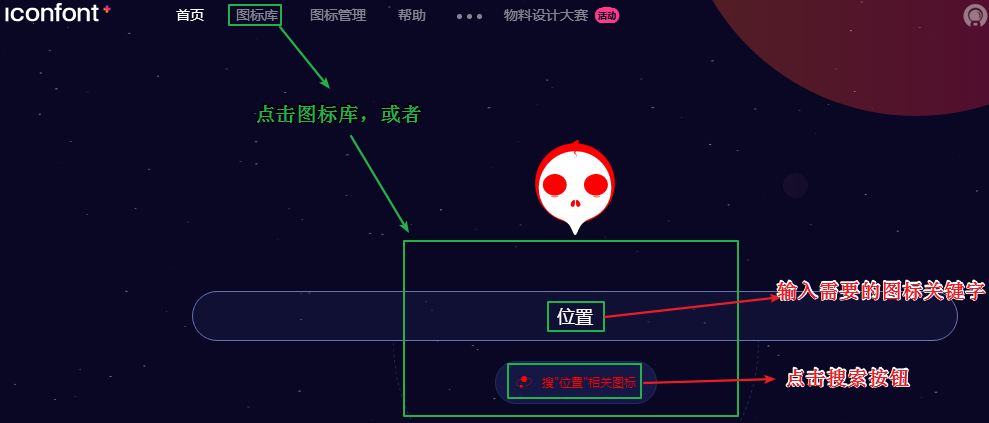 |

将需要的图标加入购物车

| 示意图                                  |
| --------------------------------------- |
| 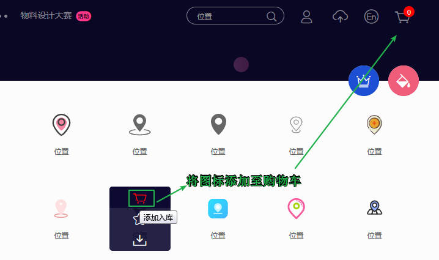 |

在购物车中将图标添加至项目

| 示意图                                  |
| --------------------------------------- |
| 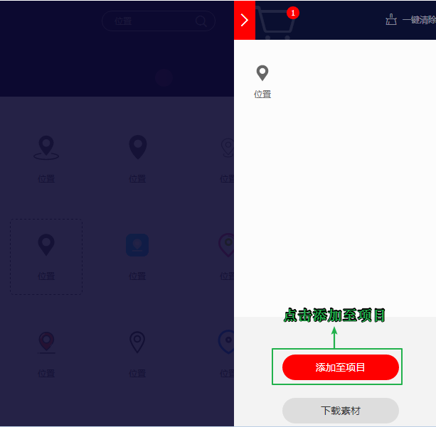 |

有项目就选择，没有就新建

| 示意图                                  |
| --------------------------------------- |
| 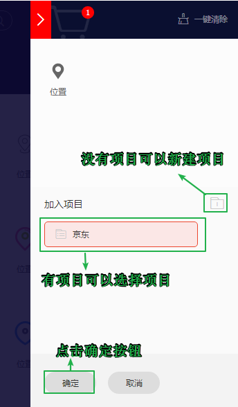 |

下载至本地

| 示意图                                  |
| --------------------------------------- |
| 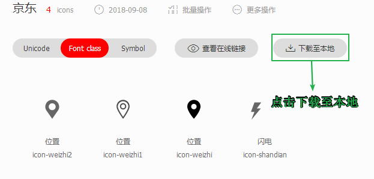 |

在html页面中引入并在标签中使用

| 示意图                                  |
| --------------------------------------- |
| 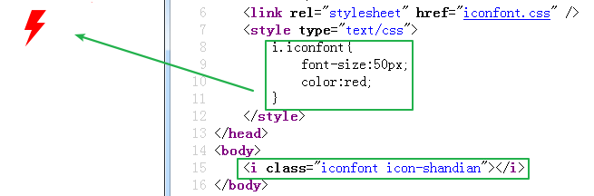 |

 


