今日目标：

· 能够说出元素的3种定位机制

· 能够说出position的4种定位方式的含义

· 能够理解绝对定位和相对定位的区别

· 能够说出固定定位的使用场景(广告)

· 能够说出定位所使用的4个边偏移属性

· 能够理解父元素设置相对定位,子元素设置绝对定位的含义

· 能够理解和使用css3中内减模式属性

· 能够理解css3新增的属性选择器

· 能够理解css3新增的伪类选择器

· 能够理解css3新增的伪元素选择器

## 一、定位（重点）

定位的使用：

​	1.4种定位方式：静态、相对、绝对、固定

​	2.4种边偏移属性：left、right、top、bottom

注意：偏移值准确的理解是“距离什么位置有多少像素” 。 如 top:100px; 距离顶部为100像素 （向下走）

### 1.静态定位

所有标准流都是静态定位

语法：`position:static`

```html
<head>
	<meta charset="utf-8">
	<title></title>
	<style type="text/css">
		.box{
			width:100px;
			height:100px;
			border:1px solid #000;
			position:static;/* 设置静态定位 */
			top:20px;/* 设置边偏移 */
		}
		.box1{
			width:200px;
			height:200px;
			background:#f00;
		}
	</style>
</head>
<body>
	<div class="box"></div>
	<div class="box1"></div>
</body>
```


| 效果图                                  |
| --------------------------------------- |
| 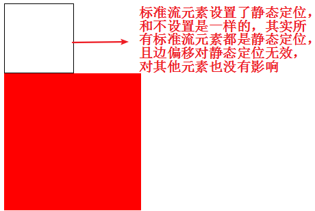 |

总结：

​	1.工作中用的比较少，因为加了静态定位，元素也是标准流

​	2.偏移值对静态定位无效

使用场景：通常是将已经设置过定位的元素还原成标准流

我们以后所说的定位不包含静态定位

### 2.相对定位

相对于自身在标准流的位置进行定位移动	

语法：`position：relative`

```html
<head>
	<meta charset="utf-8">
	<title></title>
	<style type="text/css">
		.box{
			width:100px;
			height:100px;
			border:1px solid #000;
			position:relative;/* 设置相对定位 */
			top:20px;/* 设置边偏移 */
			left:30px;
		}
		.box1{
			width:200px;
			height:200px;
			background:#f00;
		}
	</style>
</head>
<body>
	<div class="box"></div>
	<div class="box1"></div>
</body>
```


| 效果图                                  |
| --------------------------------------- |
| 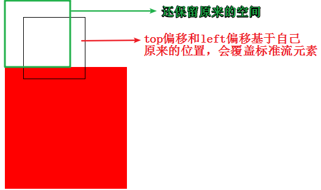 |

总结：

​	1.相对定位参考自身在标准流中的位置进行偏移，移动的出发点是自身标准流的位置

​	2.不会对标准流的元素造成影响，没有脱离文档流，移动之后，自身在标准流中还占有空间，真正占得位置还是标准流的位置（灵魂不在 肉体永驻）

​	3.可以盖在标准流的上方

使用场景：微调元素和配合绝对定位来实现效果

### 3.绝对定位

从父元素一直往上找设置过定位的直系父元素，作为自己的偏移参照物，找不到就继续往上找，直到html停止

语法：`position:absolute`

```html
<head>
	<meta charset="utf-8">
	<title></title>
	<style type="text/css">
		.box{
			width:100px;
			height:100px;
			border:1px solid #000;
			position:absolute;/* 设置绝对定位 */
			top:20px;/* 设置边偏移 */
			left:30px;
		}
		.box1{
			width:200px;
			height:200px;
			background:#f00;
		}
	</style>
</head>
<body>
	<div class="box"></div>
	<div class="box1"></div>
</body>
```


| 效果图                                  |
| --------------------------------------- |
| 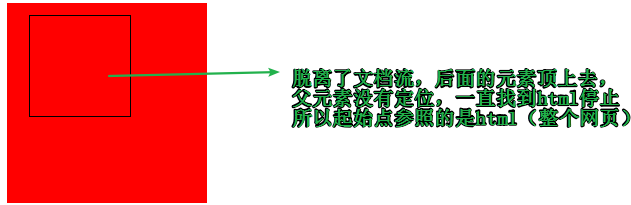 |

总结：

​	1.偏移位置参考设置过定位（相对/绝对/固定）的**直系**父元素或**直系**祖宗元素，没找到就一直往上级找，直到html

​	2.会脱离标准流，不再继承父级的宽度（不论是块元素还是行元素，盒子的大小取决于其中内容），可以定义宽高，不占据标准流的空间

​	3.margin:auto对于设置过绝对定位的元素不起作用

​	4.设置方向偏移的时候，横向或者纵向只设置一个即可，设置多个没有意义

使用场景：配合相对定位使用（一般都会配合相对定位，但不是绝对的都是相对定位）


父相子绝


------

案例：

​	1.让盒子水平垂直居中（水平居中，垂直也居中）

```html
<head>
	<meta charset="utf-8">
	<title></title>
	<style type="text/css">
		.box{
			width:100px;
			height:100px;
			border:1px solid #000;
			position:absolute;/* 设置绝对定位 */
			top:50%;/* 设置上边偏移 */
			margin-left:-50px;/* 往左边移动自身宽度的一般 */
			left:50%;/* 设置做边偏移 */
			margin-top:-50px;/* 往上面移动自身高度的一半 */
		}
	</style>
</head>
<body>
	<div class="box"></div>
</body>
```


| 效果图                                  |
| --------------------------------------- |
| 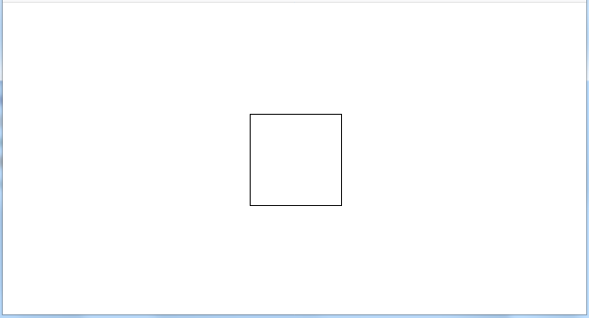 |

2.图片上加logo

| 效果图示                                |
| --------------------------------------- |
| 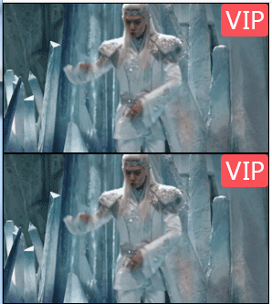 |


```html
<head>
	<meta charset="utf-8">
	<title></title>
	<style type="text/css">
		.box{
			width:290px;
			height:163px;
			position:relative;/* 父元素设置相对定位 */
		}
		.logo{
			width:52px;
			height:36px;
			background:url(2.png);
			position:absolute;/* 设置logo为绝对定位，父元素为相对定位，偏移位置相对父元素 */
			right:0;/* 最右边 */
			top:0;/* 最上面 */
		}
	</style>
</head>
<body>
	<div class="box">
		
		<span class="logo"></span>
	</div>
	<div class="box">
		
		<span class="logo"></span>
	</div>
</body>
```

总结：父元素使用相对定位（不脱离标准流，写多个不会覆盖），子元素绝对定位（相对于父盒子的位置）	---父相子绝

3.轮播图布局（以京东为例）

| 效果图示                                |
| --------------------------------------- |
|  |


```html
<head>
<meta charset="utf-8">
<title>无标题文档</title>
<style>
	.box{
		width:590px;
		height:470px;
		margin:0 auto;
		border:1px solid #000;	
		position:relative;/* 设置相对定位，因为左右按钮和下面的小圆点都需要在当前元素上面 */
	}
	ul,ol{
		list-style:none;
		padding:0;
		margin:0;
	}
	ul li{
		display:none;	
	}
	ul li.on{
		display:block;
	}
	ol{
		width:152px;
		height:18px;	
		position:absolute;/* 设置绝对定位，相对于父元素进行偏移 */
		left:46px;/* 左边偏移 */
		bottom:20px;/* 下面偏移 */
	}
	ol li{
		float:left;
		width:10px;
		height:10px;	
		border-radius:50%;
		border:1px solid #fff;
		margin:4px;
	}
	ol li.on{
		width:4px;
		height:4px;
		border:4px #999 solid;
		background:#fff;	
	}
	.box>a{
		text-decoration:none;
		color:#fff;
		background:#666;
		width:24px;
		height:40px;
		display:block;
		text-align:center;
		line-height:40px;
		position:absolute;/* 设置绝对定位，相对父元素进行偏移 */
		top:50%;/* 上边偏移 */
		margin-top:-20px;/* 向上移动自身高度的一半，已达到居中的效果 */
	}
	.box>a.left{
		left:0;	/* 左按钮左边偏移为0，在最左边 */
	}
	.box>a.right{
		right:0;	/* 右按钮右边偏移为0，在最右边 */
	}
</style>
</head>

<body>

<div class="box">
	<ul>
    	<li class="on"><a href="###"></a></li>
    	<li><a href="###"></a></li>
    	<li><a href="###"></a></li>
    </ul>
    <ol>
    	<li class="on"></li>
    	<li></li>
    	<li></li>
    </ol>
    <a class="left" href="###">&lt;</a>
    <a class="right" href="###">&gt;</a>
</div>
</body>
```

### 4.固定定位

以浏览器作为参考进行偏移，且滚动条对固定定位无效

语法：`position:fixed`

```html
<head>
	<meta charset="utf-8" />
	<title></title>
	<style type="text/css">
		.box{
			width:300px;
			height:200px;
			background:#abcdef;
			position:fixed;/* 设置固定定位，相对于浏览器窗口 */
			left:50%;
			top:50%;
			margin-left:-150px;
			margin-top:-100px;
		}
		.text{
			width:20px;
		}
	</style>
</head>
<body>
	<div class="text">
		日照香炉生紫烟，遥看瀑布挂前川。
		飞流直下三千尺，疑是银河落九天。
	</div>
	<div class="box"></div>
</body>
```


| 效果图                                  |
| --------------------------------------- |
| 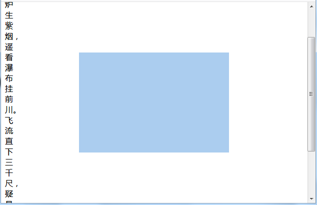 |

总结：

​	1.会脱离文档流，不占据标准流的空间

​	2.不继承父元素的宽高，需要给自身定义宽高

​	3.margin:auto对固定定位的元素不起作用

​	4.不会随着滚动条滚动，永远固定在浏览器窗口中的位置（移动的出发点：浏览器窗口，滚动条对设置了固定定位的元素无效）

使用场景：常用于网页右下角的“回到顶部”，或网站左右两侧的广告

案例：

​	京东最右侧的小列表	

| 案例效果图                              |
| --------------------------------------- |
| 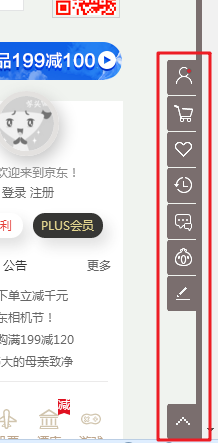 |


```html
<head>
<meta charset="utf-8">
<title>无标题文档</title>
<style>
	*{padding:0;margin:0;}
	.container{
		height:2000px;
		border-right:5px #7A6E6E solid;	
	}
	ul{
		list-style:none;
		padding:0;
		margin:0;	
		position:fixed;
		right:5px;
		top:50%;
		margin-top:-95px;
	}
</style>
</head>

<body>
<div class="container">
	<ul>
    	<li><a href="#"></a></li>
    	<li><a href="#"></a></li>
    	<li><a href="#"></a></li>
    	<li><a href="#"></a></li>
    	<li><a href="#"></a></li>
    </ul>
</div>
</body>
```

**四种定位总结**

| 定位模式         | 是否脱标占有位置     | 是否可以使用边偏移 | 移动位置基准             |
| ---------------- | -------------------- | ------------------ | ------------------------ |
| 静态static       | 不脱标，正常模式     | 不可以             | 正常模式                 |
| 相对定位relative | 不脱标，占有位置     | 可以               | 相对自身位置移动         |
| 绝对定位absolute | 完全脱标，不占有位置 | 可以               | 相对于定位的父级移动位置 |
| 固定定位fixed    | 完全脱标，不占有位置 | 可以               | 相对于浏览器移动位置     |

### 5.定位元素的层叠效果

控制“定位”元素的叠放层级

语法：`z-index:值`

取值：

​	1.数字：

​		正数，数字越大，层级越高，离用户越近

​		负数，数字越小，层级越低，离用户越远

​	2.auto：（默认值）和父元素层级相同

​	3.正数比auto大，负数比auto小

```html
<head>
	<meta charset="utf-8" />
	<title></title>
	<style type="text/css">
		/* 两个盒子都设置相对定位并偏移，中间有重叠的部分，默认后设置的会覆盖先设置的 */
		.box{
			width:100px;
			height:100px;
			background:#f00;
			position:relative;
			top:50px;
			z-index:2;/* 设置层叠高一点，会覆盖后设置的 */
		}
		.box1{
			width:200px;
			height:200px;
			background:#0f0;
			position:relative;
			left:50px;
		}
	</style>
</head>
<body>
	<div class="box"></div>
	<div class="box1"></div>
</body>
```


| 效果图                                  |
| --------------------------------------- |
| 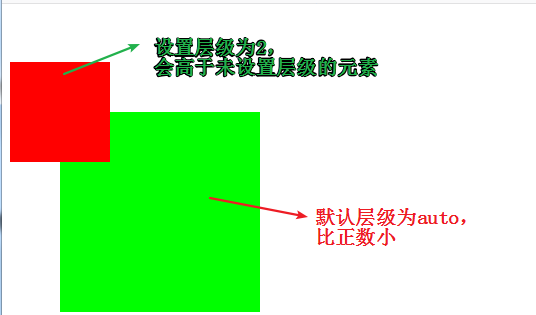 |

总结：

​	1.z-index只针对定位元素有效果（但不包括静态定位）

​	2.z-index值越大，层级越高

​	3.如果父元素已经比较过层级了（父元素“都有”z-index的时候，并且值不为auto），那么子元素与子元素之间是不会再去比较的

**出题**：上大盒子压住下大盒子 ，下大盒子里面的子元素压住上盒子

## 二、css3和css2的区别

css3在原有的基础上新增了很多css属性选择器，伪类选择器，伪对象选择器以及动画

H5=html5 + css3 +js

大前端：js

### 1.内减模式

可以将padding内边距和边框带来增大盒子的影响去掉

语法：`box-sizing:border-box;`

```html
<head>
<meta charset="utf-8">
<title>无标题文档</title>
<style>
	.box{
		width:200px;
		height:200px;
		background:#099;
		border:20px solid #333;
		padding:50px;
		box-sizing:border-box;/* 设置内减模式 */	
	}
</style>
</head>

<body>
<div class="box"></div>
</body>
```


| 效果图                                  |
| --------------------------------------- |
| 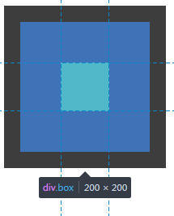 |

总结：不能去margin带来盒子大小的影响

### 2.新增属性选择器

a) 语法：`元素[属性^=值]`

选择以指定字符开头的属性值的元素

```html
<head>
<meta charset="utf-8">
<title>无标题文档</title>
<style>
	[name^='user']{
		color:red;	
	}
</style>
</head>

<body>
<div name="username">这是盒子1</div>
<div name="user-name">这是盒子2</div>
<div name="name user">这是盒子3</div>
<div name="user_name">这是盒子4</div>
<div name="user">这是盒子5</div>
</body>
```


| 效果图                                  |
| --------------------------------------- |
| 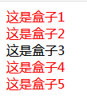 |

b) 语法：`元素[属性$=值]`

选择以指定字符结尾的属性值的元素

```html
<head>
<meta charset="utf-8">
<title>无标题文档</title>
<style>
	/* 属性值以指定字符结尾的元素 */
	[name$="e"]{ 
		color:red;	
	}
</style>
</head>

<body>
<div name="username">这是盒子1</div>
<div name="user-name">这是盒子2</div>
<div name="name user">这是盒子3</div>
<div name="user_name">这是盒子4</div>
<div name="user">这是盒子5</div>
</body>
```


| 效果图                                  |
| --------------------------------------- |
| 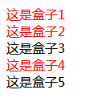 |

### 3.新增伪类选择器

| 伪类选择器         | 作用                                   |
| ------------------ | -------------------------------------- |
| :root              | 可以理解为根                           |
| li:first-child     | 代表找出父元素中第一个li子元素         |
| li:last-child      | 代表找出父元素中最后一个li子元素       |
| li:nth-child(n)    | 找出父元素中的第n个li子元素            |
| li:nth-child(even) | 代表找出父元素中奇数的li子元素         |
| li:nth-child(odd)  | 代表找出父元素中偶数的li子元素         |
| li:empty           | 代表找出父元素中li子元素内容为空的标签 |
| li:nth-of-type(n)  | 找出li标签中第几个                     |
| li:first-of-type   | 找出li标签中第一个                     |
| li:last-of-type    | 找出li标签中最后一个                   |
| li:only-child      | 唯一子元素                             |

总结：重点：li:first-child     li:last-child      li:nth-child(n)      li:nth-child(2n+1)奇数元素

### 4.    2d变换效果

可以设置移动，旋转，大小

语法：`transform:值`

#### 	a)移动

​	语法：`transform:translate(值1,值2);`

​	取值：第一个值代表横向移动的像素，第二个值代表纵向移动的像素

```html
<head>
<meta charset="utf-8">
<title>无标题文档</title>
<style>
	.box{
		width:200px;
		height:200px;
		background:#f00;	
	}
	.box:hover{
		transform:translate(50px,20px);	/* 横线移动和纵向移动 */
		/*transform:translateY(50px);*/
	}
</style>
</head>

<body>
<div class="box"></div>
</body>
```

 

| 效果图                                  |
| --------------------------------------- |
| 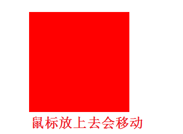 |

​	多学一招：只设置x轴或者y轴的移动可以使用translateX和translateY，里面只设置一个值即可

#### 	b)旋转

​	语法：`transform:rotate(角度);transform-origin:横向坐标 纵向坐标;`

​	取值：

​		1.角度写法：数字deg。

​		2.横向坐标和纵向坐标确定旋转的圆心，可以是像素，也可以是关键字(left,right,top,bottom,center)，不设置的话，旋转的圆心默认是中心点

```html
<head>
<meta charset="utf-8">
<title>无标题文档</title>
<style>
	.box{
		width:200px;
		height:200px;
		background:#f00;
		margin:200px;
		border-left:10px solid #0f0;
		border-bottom:10px solid #00f;
	}
	.box:hover{
		transform:rotate(45deg);/* 设置旋转和角度 */
		transform-origin:left top;/* 设置旋转的圆心 */
	}
</style>
</head>

<body>
<div class="box"></div>
</body>
```


| 效果图                                  |
| --------------------------------------- |
| 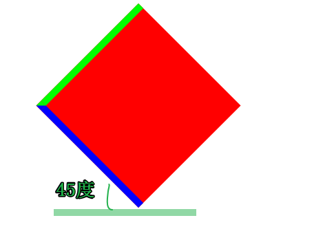 |

#### 	c)缩放

​	语法：`transform:scale(值)`

​	取值：倍数，可以是整数，也可以是小数

```html
<head>
<meta charset="utf-8">
<title>无标题文档</title>
<style>
	.box{
		width:200px;
		height:200px;
		background:#f00;
	}
	.box:hover{
		transform:scale(2);	
	}
</style>
</head>

<body>
<div class="box">
	
</div>
<p>asdf</p>
</body>
```


| 效果图                                  |
| --------------------------------------- |
| 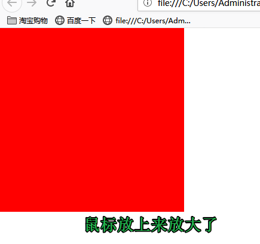 |

​	多学一招：如果有两个值，第一个代表宽度比例，第二个代表高度比例

### 5.过渡效果

是一个动画的效果

语法：`transition:动画css属性 过渡时间秒数 速度类型 延迟的秒数` 

取值：第一个值，写css属性名称，就是要发生改变的css属性，第二个值是时间单位s秒，第三个值是发生改变的曲线linear匀速，ease先慢后快再慢，第四个值可以定义动画在几秒后开始

```html
<head>
<meta charset="utf-8">
<title>无标题文档</title>
<style>
	img{
		display:block;
		margin:50px auto;
		border:1px solid #000;
		/* 加过渡效果，必须是在元素原本的样式上面加，不在伪类上加 */
		transition:transform 2s linear;
	}
	img:hover{
		transform:scale(1.5);	
	}
</style>
</head>

<body>

</body>
```


| 效果图                                  |
| --------------------------------------- |
| 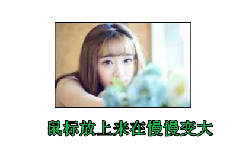 |

 


