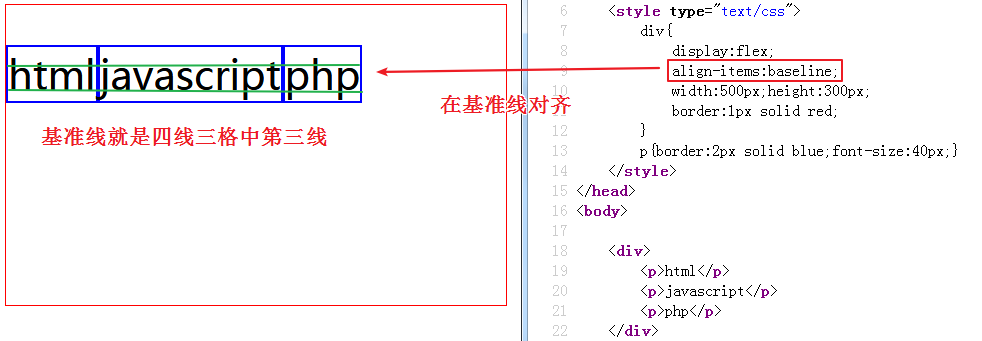

今日目标：

· 能够实现网页两栏布局

· 能够实现网页三栏布局

· 能够理解并实现多栏布局

· 能够设置鼠标形状

· 能够使用盒子缩放属性zoom

· 能够使用盒子的轮廓属性

## 一、css属性补充

1.光标形状

语法：`cursor:值`

取值：

​	text:文本图标  

​	help:问号图标

​	wait:等待的图标

​	pointer:	小手图标

​	move 移动

​	url(),临时替换的样式-----需要在url后面加auto

​	default  箭头

```html
<head>
	<meta charset="utf-8" />
	<title></title>
	<style type="text/css">
		div{
			width:100px;
			height:50px;
			border:1px solid #000;
		}
		.box1{
			cursor:text;
		}
		.box2{
			cursor:help;
		}
		.box3{
			cursor:wait;
		}
		.box4{
			cursor:pointer;
		}
		.box5{
			cursor:move;
		}
		.box6{
			cursor:url('bitbug_favicon.ico'),auto;
		}
		.box7{
			cursor:default;
		}
	</style>
</head>
<body>
	<div class="box1">文本</div>
	<div class="box2">问号</div>
	<div class="box3">等待</div>
	<div class="box4">小手</div>
	<div class="box5">移动</div>
	<div class="box6">图片</div>
	<div class="box7">箭头</div>
</body>
```


应用场景：主要用于修饰鼠标放到元素上面的时候光标的样式

2.强调边框

语法：`outline:值`------盒子轮廓

取值：和边框一样

应用场景：主要用于设置元素周围的边框，起到强调作用（常用于去掉表单选中的蓝色边框）

```html
<head>
	<meta charset="utf-8" />
	<title></title>
	<style type="text/css">
		[type="password"]{outline:none;}
	</style>
</head>
<body>
	<input type="text" />
	<input type="password" />
</body>
```


| 效果                                    |
| --------------------------------------- |
|  |

3.透明度

语法：`opacity:值`

取值：0-1之间的小数

```html
<head>
	<meta charset="utf-8" />
	<title></title>
	<style type="text/css">
		.box{
			width:200px;
			height:100px;
			border:1px solid #000;
			position:relative;
		}
		img{
			position:absolute;
			left:0;top:0;
			opacity:0.5;
		}
	</style>
</head>
<body>
	<div class="box">
		
		这是一张图片
	</div>
</body>
```


| 效果                                    |
| --------------------------------------- |
|  |


4.背景透明

语法：rgba(值1，值2，值3，值4)

取值：1-3个值都是0-255的数字，表示颜色，第4个值是透明度0-1之间取值

```html
<head>
	<meta charset="utf-8" />
	<title></title>
	<style type="text/css">
		.box{
			width:200px;
			height:100px;
			border:1px solid #000;
			position:relative;
		}
		img{
			position:absolute;
			left:0;top:0;
		}
		.box2{
			width:200px;
			height:100px;
			background:rgba(3,3,3,.5);
			color:#fff;
			position:absolute;
			left:0;top:0;
		}
	</style>
</head>
<body>
	<div class="box">
		
		<div class="box2">
			这是一张图片
		</div>
	</div>
</body>
```


| 效果                                    |
| --------------------------------------- |
|  |

5.去掉文本域的自动拉伸效果

语法：`resize:none;`

```html
<head>
	<meta charset="utf-8" />
	<title></title>
	<style type="text/css">
		textarea{
			resize:none;
		}
	</style>
</head>
<body>
	<textarea cols="30" rows="10"></textarea>
</body>
```


| 效果                                    |
| --------------------------------------- |
|  |

6.行内文字溢出省略号形式显示

```html
overflow: hidden;
white-space: nowrap;文字不换行
text-overflow:ellipsis;/* 超出的部分以省略号形式显示 */
```

```html
<style>
	.box{
		width:300px;
		height:100px;
		border:1px solid #000;	
		overflow:hidden;
		white-space: nowrap;/* 设置文本不换行，单行显示 */
		text-overflow:ellipsis;/* 超出的文本使用省略号代替 */
	}
	
</style>
<div class="box">
	央视网消息：“健全人可以活出精彩的人生，残疾人也可以活出精彩的人生。我们每个人都要珍惜生命、追求健康，努力创造无愧于时代的精彩人生。”

　　残疾人是一个特殊困难的群体，需要格外关心、格外关注。习近平曾多次强调，全面建成小康社会，残疾人一个也不能少。做好残疾人工作，事关八千多万残疾人及其家庭的民生福祉，事关全面建成小康社会大局。党的十八大以来，以习近平同志为核心的党中央高度重视残疾人事业发展，不断健全残疾人权益保障制度，努力“让广大残疾人安居乐业、衣食无忧，过上幸福美好的生活”。

　　在中国残联第七次全国代表大会到来之际，让我们重温习近平总书记对残疾人朋友和残疾人事业的关爱和支持。

全面建成小康社会 残疾人一个也不能少

　　中国有几千万残疾人，2020年全面建成小康社会，残疾人一个也不能少。为残疾人事业做更多事情，也是全面建成小康社会的一个重要方面。

　　——2016年7月28日，习近平在河北省唐山市考察时的讲话

　　因病致贫、因残致贫问题时有发生，扶贫机制要进一步完善兜底措施，在医保、新农合方面给予更多扶持。
</div>
```


| 效果                                    |
| --------------------------------------- |
|  |

总结：3步走，一步也不能少

7.vertical-align

作用：控制行内块与文字的对齐方式，写在行内块元素上面

baseline 图片的基线和文字的基线保持对齐
top 图片的顶线和文字的顶线（行高的顶线）对齐
bottom 图片的底线和文字的底线（行高的底线）对齐
middle 图片的中线和文字的中线对齐

```html
<head>
<meta charset="utf-8">
<title>无标题文档</title>
<style>
	.box{
		width:300px;
		height:200px;
		border:1px solid #000;
		line-height:200px;
	}
	img{
		vertical-align:middle;	
	}
</style>
</head>

<body>
<div class="box">
	
    鸿飞万里
</div>
</body>
```


| 效果                                    |
| --------------------------------------- |
|  |

案例：让一个张图片在盒子中水平垂直居中

```html
<head>
<meta charset="utf-8">
<title>无标题文档</title>
<style>
	.box{
		width:300px;
		height:300px;
		border:1px solid #000;
		text-align:center;/* 水平居中 */
		line-height:300px;
	}
	img{
		vertical-align:middle;	/* 垂直居中 */
	}
</style>
</head>

<body>
<div class="box">
	
</div>
</body>

```


| 效果                                    |
| --------------------------------------- |
|  |

## 二、缩放zoom

语法：`zoom:值`

取值：值是一个倍数

```html
<head>
<meta charset="utf-8">
<title>无标题文档</title>
<style>
	.box{
		width:200px;
		height:200px;
		border:1px solid #000;
		
	}
	div.box:hover{
		transform:scale(2);
		/*zoom:2;*/
	}
	.box1{
		width:100px;
		height:100px;
		background:#990;	
	}
</style>
</head>

<body>
<div class="box">
	
</div>
<div class="box1"></div>
</body>
```


| 效果                                    |
| --------------------------------------- |
|  |

 

```html
<head>
<meta charset="utf-8">
<title>无标题文档</title>
<style>
	.box{
		width:200px;
		height:200px;
		border:1px solid #000;
		
	}
	div.box:hover{
		/*transform:scale(2);*/	
		zoom:2;
	}
	.box1{
		width:100px;
		height:100px;
		background:#990;	
	}
</style>
</head>

<body>
<div class="box">
	
</div>
<div class="box1"></div>
</body>
```


| 效果                                    |
| --------------------------------------- |
|  |

## 三、弹性布局

### 1.多栏布局

概念：实现多个栏目的布局，类似于报纸

| 示意图                                  |
| --------------------------------------- |
|  |

a) 分栏显示--语法：`column-count:值` 

取值：值是一个栏目的数量

```html
<style type="text/css">
		.box{column-count:3;width:500px;}
	</style>
</head>
<body>
	<div class="box">
		本次论坛以“智能互联时代的媒体变革与发展”为主题，由中共中央网络安全和信息化委员会办公室指导，中华全国新闻工作者协会、中国网络社会组织联合会、中共宁波市委、宁波市人民政府、中共浙江省委网络安全和信息化领导小组办公室主办，央视网、中共宁波市委宣传部（市委网络安全和信息化领导小组办公室）共同承办，宁波日报报业集团（甬派传媒）、新浪网协办。

　　为了对论坛主题进行更深入、透彻地探讨，论坛将邀请主管部门、各地网信办、中央和地方主要新闻网站、重点商业网站和知名新媒体机构负责人等，共同研讨和应对当前网上内容建设和管理过程中遇到的问题和挑战，预测未来网络媒体发展趋势，解决技术变革带来的实际问题，分析分享媒体未来发展方向。

　　截至目前，承办方已邀请相关政府官员、中央及地方新闻网站和主要商业网站代表、专家学者、运营商代表等700多位嘉宾参会。
	</div>
</body>
```


| 效果                                    |
| --------------------------------------- |
|  |

b) 多栏隔断框--语法：`column-rule:值` 

取值：这里的取值和边框的取值是一样的，也有边框厚度，边框颜色，边框样式

```html
<style type="text/css">
		.box{column-rule:5px solid red;column-count:3;width:500px;}
	</style>
</head>
<body>
	<div class="box">
		本次论坛以“智能互联时代的媒体变革与发展”为主题，由中共中央网络安全和信息化委员会办公室指导，中华全国新闻工作者协会、中国网络社会组织联合会、中共宁波市委、宁波市人民政府、中共浙江省委网络安全和信息化领导小组办公室主办，央视网、中共宁波市委宣传部（市委网络安全和信息化领导小组办公室）共同承办，宁波日报报业集团（甬派传媒）、新浪网协办。

　　为了对论坛主题进行更深入、透彻地探讨，论坛将邀请主管部门、各地网信办、中央和地方主要新闻网站、重点商业网站和知名新媒体机构负责人等，共同研讨和应对当前网上内容建设和管理过程中遇到的问题和挑战，预测未来网络媒体发展趋势，解决技术变革带来的实际问题，分析分享媒体未来发展方向。

　　截至目前，承办方已邀请相关政府官员、中央及地方新闻网站和主要商业网站代表、专家学者、运营商代表等700多位嘉宾参会。
	</div>
</body>
```


| 效果                                    |
| --------------------------------------- |
|  |

c) 设置每一栏的宽度--语法：`column-width:值`

取值：值和宽度的值一样

```html
<style type="text/css">
		.box{column-width:80px;width:500px;border:1px solid red;}
	</style>
</head>
<body>
	<div class="box">
		本次论坛以“智能互联时代的媒体变革与发展”为主题，由中共中央网络安全和信息化委员会办公室指导，中华全国新闻工作者协会、中国网络社会组织联合会、中共宁波市委、宁波市人民政府、中共浙江省委网络安全和信息化领导小组办公室主办，央视网、中共宁波市委宣传部（市委网络安全和信息化领导小组办公室）共同承办，宁波日报报业集团（甬派传媒）、新浪网协办。

　　为了对论坛主题进行更深入、透彻地探讨，论坛将邀请主管部门、各地网信办、中央和地方主要新闻网站、重点商业网站和知名新媒体机构负责人等，共同研讨和应对当前网上内容建设和管理过程中遇到的问题和挑战，预测未来网络媒体发展趋势，解决技术变革带来的实际问题，分析分享媒体未来发展方向。

　　截至目前，承办方已邀请相关政府官员、中央及地方新闻网站和主要商业网站代表、专家学者、运营商代表等700多位嘉宾参会。
	</div>
</body>
```


| 效果                                    |
| --------------------------------------- |
|  |

### 2.弹性布局

概念：可以实现类似浮动的效果，但是不会脱离文档流

语法：`display:flex`  -------------设置一个弹性容器

主要属性（都需要先设置display:flex;）：

### 	a) 设置弹性布局的方向--语法：`	flex-direction:值`

取值：

​	（1）row横向排列，等同于左浮动浮动效果

| 示意图                                  |
| --------------------------------------- |
|  |

​	（2）row-reverse 横向反向排列，等同于右浮动的效果

| 示意图                                  |
| --------------------------------------- |
|  |

​	（3）column 纵向排列

| 示意图                                  |
| --------------------------------------- |
|  |

​	（4）column-reverse 纵向反向排列，从下到上的排列

| 示意图                                  |
| --------------------------------------- |
|  |

### b) 设置 弹性布局是否换行，语法：`flex-wrap:值`

取值：

​	（1）不换行（默认），nowrap

| 示意图                                  |
| --------------------------------------- |
|  |

​	（2）换行， wrap

| 示意图                                  |
| --------------------------------------- |
|  |

​	（3）换行，并反向排列（从下往上排列），wrap-reverse------从下往上，从左往右进行排列

| 示意图                                  |
| --------------------------------------- |
|  |

### c) 设置弹性布局的水平对齐方式，语法：`justify-content:值`

取值：

​	（1）从左向右（左对齐），默认，flex-start

| 示意图                                  |
| --------------------------------------- |
|  |

​	（2）从右往左排列（右对齐），flex-end

| 示意图                                  |
| --------------------------------------- |
|  |

​	（3）两端对齐，中间等距离隔开，space-between

| 示意图                     |
| -------------------------- |
|  |

​	（4）两端的空白是中间空白的一半，space-around------------环绕对齐

| 示意图                                  |
| --------------------------------------- |
|  |

​	（5）居中对齐，center

| 示意图                                  |
| --------------------------------------- |
|  |

​	（6）等距离排列，space-evenly

| 示意图                                  |
| --------------------------------------- |
|  |

### d) 垂直对齐方式，语法：`align-content:值`（在换行的时候用）

取值：

​	（1）默认的排列方式，stretch--------靠上排列，但是元素之间有间距

| 示意图                                  |
| --------------------------------------- |
|  |

​	（2）靠上排列（上对齐），flex-start

| 示意图                                  |
| --------------------------------------- |
|  |

​	（3）靠下排列（下对齐），flex-end

| 示意图                                  |
| --------------------------------------- |
|  |

​	（4）垂直上下两端对齐，中间等距离空白，space-between

| 示意图                                  |
| --------------------------------------- |
|  |

​	（5） 两端的空白是中间的空白的一半，space-around

| 示意图                                  |
| --------------------------------------- |
|  |

​	（6）居中对齐，center

| 示意图                                  |
| --------------------------------------- |
|  |

（7）等距离摆放，space-evenly

| 示意图                                  |
| --------------------------------------- |
|  |

### e) 交叉对齐方式，语法：`align-items:值` ，需要横向排列

取值：

​	（1）flex-start，从起始位置对齐

| 示意图                                  |
| --------------------------------------- |
|  |

​	（2）flex-end，在结束位置对齐--------底部对齐

| 示意图                                  |
| --------------------------------------- |
|  |

​	（3）center，居中对齐---------垂直居中

| 示意图                                  |
| --------------------------------------- |
|  |

​	（4）baseline，在基准线对齐

| 示意图                                  |
| --------------------------------------- |
|  |

​	（5）stretch，拉伸子元素------图片不行

| 示意图                                  |
| --------------------------------------- |
|  |

 使用场景：当网页结构鲜明，简单，使用弹性布局

### f)子元素单独在y轴上的对齐方式，语法：`align-self:值`

取值：

​	auto：默认值，元素继承了它的父容器的align-items属性，如果没有父容器则为"stretch"

​	stretch：拉伸

​	center：居中

​	flex-start：最上面

​	flex-end：最下面

​	baseline：容器的基线

其实这个属性的结果和align-items的一样，只是align-items修饰的弹性容器中的所有子元素，align-self修饰的当前这一个元素。


text-align:center;和margin:auto;的区别

​	text-align:center;

​		1.文本水平居中对齐

​		2.设置在父元素上，作用于子元素（行元素和行内块，不能对块元素生效）

​	margin:auto;

​		1.盒子水平居中

​		2.设置在自身，作用于自身（自己是块元素，在父元素中居中，不能对行元素生效）


