今日目标：

· 能够理解div+浮动布局的基本做法

· 能够理解css初始化的含义和基本做法

· 能够理解并使用css精灵技

## 一、css精灵技术 

网址：http://mil.news.sina.com.cn/china/2018-08-31/doc-ihiixyeu1558608.shtml

| 示意图                                  |
| --------------------------------------- |
| 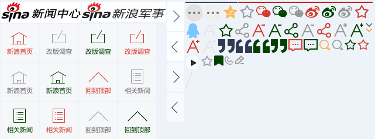 |

网页加载每一张图片都需要对服务器进行一次请求，所以对服务器的负荷会很大，可以将多个小图放到一张大图上，每个地方使用小图片都对大图进行背景定位即可，这样只需要加载一张大图片，对服务器只做一次请求，可以减少服务器的开销，提供网站的性能


微信案例其实就是用的精灵图

```html
<head>
	<meta charset="UTF-8">
	<title>微信案例</title>
	<style type="text/css">
		.box{
			height:74px;
			background:url(img/wx_bg.jpg);
			padding-left:300px;
		}
		ul{
			list-style:none;
			padding:0;
			margin:0;
		}
		li{
			float:left;
			margin-top:20px;
			margin-right:20px;
		}
		a{
			display:inline-block;
			text-decoration: none;
			color:#fff;
			height:33px;
			background:url(img/wxli_bg.png) left -192px;
			line-height:33px;
			padding-left:17px;
		}
		span{
			display:inline-block;
			height:33px;
			background:url(img/wxli_bg.png) right -192px;
			line-height:33px;
			padding-right:17px;
		}
		a:hover{
			color:green;
		}
	</style>
</head>
<body>
	<div class="box">
		<ul>
			<li><a href="#"><span>首页</span></a></li>
			<li><a href="#"><span>下载吧</span></a></li>
			<li><a href="#"><span>公共平台</span></a></li>
		</ul>
	</div>
</body>
```


| 示意图                                  |
| --------------------------------------- |
|  |

## 二、滑动门效果

概念：3个盒子浮动，左边和右边写宽高，负责加载两边的背景，中间的盒子宽度不定，让文字撑开

```html
<head>
	<meta charset="UTF-8">
	<title>滑动门</title>
	<style type="text/css">
		.box{
			height:33px;
			margin-left:300px;
		}
		.box div{
			float:left;
			height:33px;
		}
		.left{
			width:18px;
			background:url(img/left.png);
		}
		.center{
			line-height:33px;
			color:#fff;
			background:url(img/center.png);
		}
		.right{
			width:17px;
			background:url(img/right.png);
		}
	</style>
</head>
<body>
	<div class="box">
		<div class="left"></div>
		<div class="center">这是文字进来了</div>
		<div class="right"></div>
	</div>	
</body>
```


| 效果                                    |
| --------------------------------------- |
|  |

字间距


单词间距


## 三、ps简单操作

### 1.放大缩小

按住alt键滚动鼠标

| 示意图                                  |
| --------------------------------------- |
| 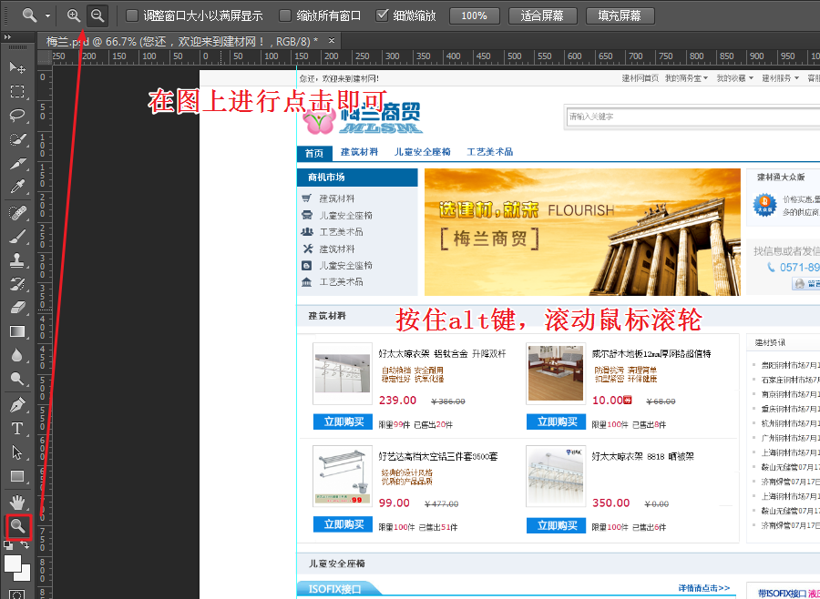 |

### 2.移动

按住空格键使用鼠标抓取

| 示意图                                  |
| --------------------------------------- |
| 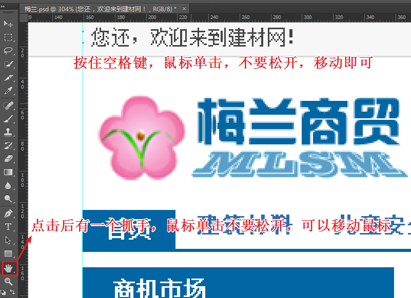 |

### 3.量尺寸

使用矩形选框工具

| 示意图                                  |
| --------------------------------------- |
| 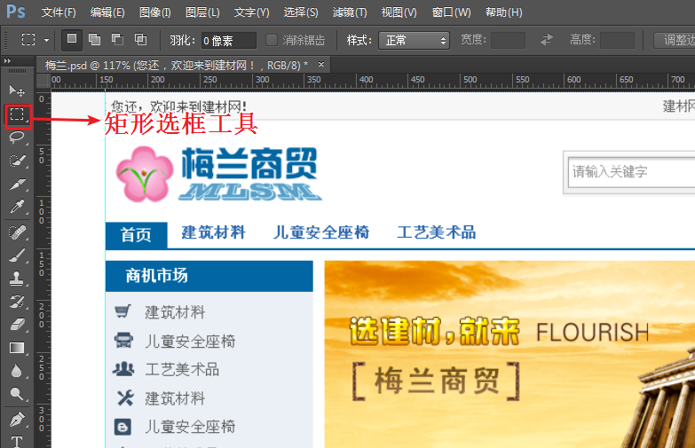 |

### 4.采集颜色

使用吸管工具

| 示意图                                  |
| --------------------------------------- |
|  |

### 5.文字复制

使用文本工具

| 示意图                                  |
| --------------------------------------- |
| 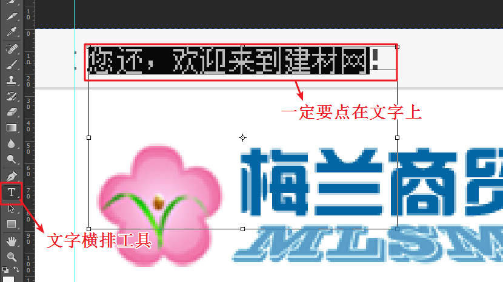 |

### 6.切图片

使用切片工具


## 四、梅兰练习

引入字体图标css和当前文件的css

```html
    <link rel="stylesheet" type="text/css" href="font/iconfont.css">
    <link rel="stylesheet" type="text/css" href="css/index.css">
```


顶部代码：

```html
<!-- 顶部开始 -->
<div class="top container">
    <div class="content clearfix">
        <div class="welcome">您还，欢迎来到建材网！</div>
        <ul>
            <li><a href="#">建材首页</a></li>
            <li><a href="#">我的商务室</a><i class="iconfont icon-ico_arrows_unfold"></i></li>
            <li><a href="#">我的收藏</a><i class="iconfont icon-ico_arrows_unfold"></i></li>
            <li><a href="#">建材服务</a><i class="iconfont icon-ico_arrows_unfold"></i></li>
            <li><a href="#">客服中心</a></li>
            <li><a href="#">网站导航</a><i class="iconfont icon-ico_arrows_unfold"></i></li>
        </ul>
    </div>
</div>
<!-- 顶部结束 -->
```

顶部css

```css
/* CSS Document */
/* 公共 */
*{
	padding:0;
	margin:0;
}
.container{
	width:100%;
}
.content{
	width:970px;
	margin:0 auto;
}
ul{
	list-style:none;
}
a{
	text-decoration:none;
	color:#000;
}
.clearfix:after{
	content:"";
	display:block;
	clear:both;
}
/* 顶部 */
.top{
	background:#f7f7f7;
	border-bottom:1px solid #d8d8d8;
	line-height:26px;
	font-size:12px;
}
.top .welcome{
	float:left;
}
.top ul{
	float:right;
}
.top ul li{
	float:left;
	padding:0 8px;
	text-align:center;
}
.top ul li i{
	font-size:12px;
	margin-left:4px;
}
```


| 效果图                                  |
| --------------------------------------- |
| 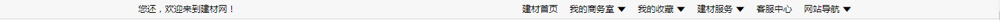 |

logo和搜索html

```html
<!-- logo和导航开始 -->
<div class="container">
    <div class="content clearfix search">
        
        <form class="search">
            <input type="text" placeholder="请输入关键字">
            <input type="submit" value="搜索" />
        </form>
    </div>
</div>
<!-- 导航和搜索结束 -->
```

logo和搜索css

```css
/* 导航和搜索 */
.logo{
	float:left;
}
.search form{
	float:right;
	margin-top:29px;
	width:528px;
	height:40px;
	border:1px solid #c9c9c9;
}
.search form input{
	float:left;
	border:none;
}
.search form input[type="text"]{
	width:416px;
	height:28px;
	margin:5px;
	margin-right:0;
	border:1px solid #a6a6a6;
	padding-left:4px;
}
.search form input[type="submit"]{
	width:98px;
	height:30px;
	background:#2f70d0;
	color:#fff;
	margin-top:5px;
}
```


| 效果图                                  |
| --------------------------------------- |
|  |

导航部分html

```html
<!-- 导航部分开始 -->
<div class="container">
    <div class="content nav clearfix">
        <ul>
            <li><a class="on" href="#">首页</a></li>
            <li><a href="#">建筑材料</a></li>
            <li><a href="#">儿童安全座椅</a></li>
            <li><a href="#">工艺美术品</a></li>
        </ul>
    </div>
</div>
<!-- 导航部分结束 -->
```

导航css

```css
/* 导航 */
.nav{
	border-bottom:2px solid #0266a3;
	height:25px;
	margin-bottom:10px;
}
.nav ul li{
	float:left;
}
.nav ul li a{
	padding:0 16px;
	display:inline-block;
	height:25px;
	text-align:center;
	line-height:25px;
	font-size:14px;
}
.nav ul li a.on,.nav ul li a:hover{
	background:#0266a3;
	color:#fff;
}
```


| 效果图                                  |
| --------------------------------------- |
|  |

banner部分html

```html
<!-- banner部分开始 -->
<div class="container">
    <div class="content banner clearfix">
        <div class="menu">
            <h3>商机市场</h3>
            <ul>
                <li><a href="#"><span>建筑材料</span></a></li>
                <li><a href="#"><span>儿童安全座椅</span></a></li>
                <li><a href="#"><span>工艺美术品</span></a></li>
                <li><a href="#"><span>建筑材料</span></a></li>
                <li><a href="#"><span>儿童安全座椅</span></a></li>
                <li><a href="#"><span>工艺美术品</span></a></li>
            </ul>
        </div>
        
        <div class="message">
            <div class="introduce">
                <h4>建材通大众版</h4>
                
                <p>
                    价格实惠，量身为营销预算不多的供应商所设。了解详情
                </p>
            </div>
            <div class="contact">
                <span>找信息或者发信息遇到问题？</span>
                <p>
                    0571-89938887
                </p>
                <button>留言咨询</button>
            </div>
        </div>
    </div>
</div>
<!-- banner部分结束 -->
```

banner部分css

```css
/* banner */
.banner>div{
	float:left;
}
.banner .menu{
	width:200px;
	height:210px;
	background:#ebf0f6;
}
.banner .menu h3{
	background:#0266a3;
	font-size:14px;
	line-height:30px;
	color:#fff;
	padding-left:20px;
}
.banner .menu ul li a{
	line-height:28px;
	font-size:14px;
}
.banner .menu ul li a img{
	vertical-align:middle;
	margin:0 12px 0 8px;
}
.banner>img{
	margin:0 9px 0 11px;
	float:left;
}
.banner .message .introduce{
	width:227px;
	height:91px;
	background:#f7faff;
	border:1px solid #e0e6f0;
}
.banner .message .introduce h4{
	font-size:12px;
	padding-left:18px;
	padding-top:7px;
}
.banner .message .introduce img{
	margin-top:20px;
	margin-left:10px;
	float:left;
}
.banner .message .introduce p{
	float:left;
	width:156px;
	font-size:12px;
	margin-top:25px;
	margin-left:10px;
	line-height:20px;
}
.banner .message .contact{
	width:229px;
	height:82px;
	background:#f7f7f7;
	margin-top:21px;
	text-align:center;
	padding-top:12px;
}
.banner .message .contact span{
	color:#999;
}
.banner .message .contact p{
	background:url(../images/phone.jpg) 35px top no-repeat;
	margin-top:9px;
	color:#3f9ce0;
	font-size:14px;
}
.banner .message .contact button{
	width:74px;
	height:21px;
	border:none;
	border:1px solid #afc6e7;
	border-radius:2px;
	font-size:12px;
	line-height:21px;
	text-align:left;
	padding-left:25px;
	color:#1a649d;
	background:url(../images/button_bg.jpg) no-repeat 5px 2px;
	letter-spacing:-1px;
}
```


| 效果图                                  |
| --------------------------------------- |
| 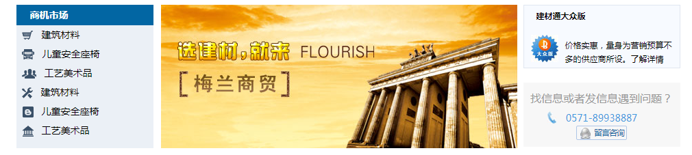 |

建筑材料html

```html
<!-- 建筑材料开始 -->
<div class="container">
    <div class="content pro1 clearfix">
        <h3>建筑材料</h3>
        <ul>
            <li>
                <div class="pro-info">
                    <a href="#"></a>
                    <div class="info">
                        <a href="#">好太太晾衣架&nbsp;铝钛合金&nbsp;升降双杆</a>
                        <p>
                            自动换挡&nbsp;安全耐用<br>
                            稳定性好&nbsp;抗氧化强
                        </p>
                        <span>
                            <b>239.00</b>
                            <s>￥386.00</s>
                        </span>
                    </div>
                </div>
                <div class="shopping">
                    <button>立即购买</button>
                    <p>限量<span>99</span>件&nbsp;已售出<span>20</span>件</p>
                </div>
            </li>
            <li>
                <div class="pro-info">
                    <a href="#"></a>
                    <div class="info">
                        <a href="#">威尔舒木地板12mm厚网络超值特</a>
                        <p>
                            防滑抗污&nbsp;清理简单
                            扣型紧密&nbsp;环保健康
                        </p>
                        <span>
                            <b>10.00</b>
                            <s>￥68.00</s>
                        </span>
                    </div>
                </div>
                <div class="shopping">
                    <button>立即购买</button>
                    <p>限量<span>100</span>件&nbsp;已售出<span>8</span>件</p>
                </div>
            </li>
            <li>
                <div class="pro-info">
                    <a href="#"></a>
                    <div class="info">
                        <a href="#">好艺达高档太空铝三件套3500套</a>
                        <p>
                            经典的设计风格<br>
                            油脂的产品品质
                        </p>
                        <span>
                            <b>99.00</b>
                            <s>￥447.00</s>
                        </span>
                    </div>
                </div>
                <div class="shopping">
                    <button>立即购买</button>
                    <p>限量<span>100</span>件&nbsp;已售出<span>51</span>件</p>
                </div>
            </li>
            <li>
                <div class="pro-info">
                    <a href="#"></a>
                    <div class="info">
                        <a href="#">好太太晾衣架&nbsp;8818&nbsp;晒被架</a>
                        <p>
                            自动换挡&nbsp;安全耐用
                            稳定性好&nbsp;抗氧化强
                        </p>
                        <span>
                            <b>350.00</b>
                            <s>0.00</s>
                        </span>
                    </div>
                </div>
                <div class="shopping">
                    <button>立即购买</button>
                    <p>限量<span>100</span>件&nbsp;已售出<span>6</span>件</p>
                </div>
            </li>
        </ul>
        <div class="pro-news">
            <h4>建材资讯</h4>
            <ul>
                <li><a href="#">贵阳钢材市场7月17日价格行情</a></li>
                <li><a href="#">贵阳钢材市场7月17日价格行情</a></li>
                <li><a href="#">贵阳钢材市场7月17日价格行情</a></li>
                <li><a href="#">贵阳钢材市场7月17日价格行情</a></li>
                <li><a href="#">贵阳钢材市场7月17日价格行情</a></li>
                <li><a href="#">贵阳钢材市场7月17日价格行情</a></li>
                <li><a href="#">贵阳钢材市场7月17日价格行情</a></li>
                <li><a href="#">贵阳钢材市场7月17日价格行情</a></li>
                <li><a href="#">贵阳钢材市场7月17日价格行情</a></li>
                <li><a href="#">贵阳钢材市场7月17日价格行情</a></li>
                <li><a href="#">贵阳钢材市场7月17日价格行情</a></li>
                <li><a href="#">贵阳钢材市场7月17日价格行情</a></li>
            </ul>
        </div>
    </div>
</div>
<!-- 建筑材料结束 -->
```

建筑材料css

```css
/* 建筑材料 */
.pro1{
	margin-top:14px;
}
.pro1 h3{
	height:34px;
	background:#ecf1f7;
	line-height:34px;
	border-top:2px solid #c3d7e4;
	font-size:14px;
	padding-left:22px;
	margin-bottom:12px;
}
.pro1>ul{
	float:left;
	width:718px;
	height:344px;
	border:1px solid #d8d8d8;
	padding:0 5px;
}
.pro1>ul li{
	padding-top:14px;
	padding-left:22px;
	padding-bottom:12px;
	float:left;
	border-bottom:1px solid #eee;
	width:336px;
}
.pro1>ul li .pro-info>a{
	float:left;
	width:97px;
	height:100px;
	border:1px solid #cacaca;
	text-align:center;
}
.pro1>ul li .pro-info>.info{
	float:left;
	margin-left:10px;
}
.pro1>ul li .pro-info>.info>a{
	display:block;
	font-size:14px;
	margin-top:6px;
}
.pro1>ul li .pro-info>.info>p{
	color:#863e01;
	font-size:10px;
	width:100px;
	margin-top:10px;
}
.pro1>ul li .pro-info>.info>span{
	display:block;
	margin-top:16px;
}
.pro1>ul li .pro-info>.info>span b{
	color:#c50934;
	font-size:14px;
	margin-right:25px;
}
.pro1>ul li .pro-info>.info>span s{
	color:#555;
	font-size:8px;
}
.pro1>ul li .shopping button{
	border:none;
	margin-top:14px;
	float:left;
	background:#0a84e3;
	width:99px;
	height:26px;
	text-align:center;
	line-height:26px;
	color:#fff;
}
.pro1>ul li .shopping p{
	float:left;
	margin-left:10px;
	font-size:12px;
	margin-top:26px;
}
.pro1>ul li .shopping p span{
	color:#c50934;
}
.pro1 .pro-news{
	float:right;
	border:1px solid #e0e6f0;
	width:228px;
}
.pro1 .pro-news h4{
	background:#fcfcfc;
	font-size:12px;
	border-bottom:1px solid #e0e6f0;
	line-height:28px;
	height:28px;
	padding-left:15px;
}
.pro1 .pro-news ul{
	list-style-type:square;
	font-size:12px;
	padding-left:20px;
	line-height:24px;
	padding-top:5px;
	height:310px;
}
```


| 效果图                                  |
| --------------------------------------- |
| 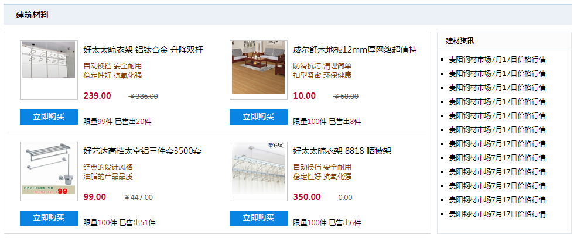 |

儿童安全座椅html

```html
<!-- 儿童安全座椅开始 -->
<div class="container">
    <div class="content pro2 clearfix">
        <h3>儿童安全座椅</h3>
        <div class="pro-info">
            <p>
                <span>ISOFIX接口</span>
                <a href="#">详情点击>></a>
            </p>
            <ul class="clearfix">
                <li>
                    <a href="#"></a>
                    <span>英国百代适-至尊者(带<br />ISOFIX接口)奔驰宝马专用</span>
                    <p>适合年龄：9个月-4岁</p>
                    <p>市场价：<s>￥5580元</s></p>
                    <p>直销价：<b>￥3380元</b></p>
                </li>
                <li>
                    <a href="#"></a>
                    <span>欧贝儿童安全座椅3-12岁<br>ISOFIX儿童汽车安全座椅</span>
                    <p>适合年龄：3-12岁</p>
                    <p>市场价：<s>￥1980元</s></p>
                    <p>直销价：<b>￥1380元</b></p>
                </li>
                <li>
                    <a href="#"></a>
                    <span>西班牙JANE(INDY&nbsp;PLUS<br>TEAM)3-12岁&nbsp;H65带ISOfix</span>
                    <p>适合年龄：3-12岁</p>
                    <p>市场价：<s>￥2980元</s></p>
                    <p>直销价：<b>￥1980元</b></p>
                </li>
                <li>
                    <a href="#"></a>
                    <span>欧贝儿童安全座椅3-12岁<br>ISOFIX儿童汽车安全座椅</span>
                    <p>适合年龄：3-12岁</p>
                    <p>市场价：<s>￥1980元</s></p>
                    <p>直销价：<b>￥1380元</b></p>
                </li>
            </ul>
        </div>
        <div class="pro-hot">
            
            
        </div>
    </div>
</div>
<!-- 儿童安全座椅结束 -->
```

儿童安全座椅css

```css
/* 儿童安全座椅 */
.pro2 h3{
	background:#ecf1f7;
	height:34px;
	border-top:2px solid #c3d7e4;
	padding-left:22px;
	line-height:34px;
	font-size:14px;
	margin-top:15px;
}
.pro2 .pro-info{
	float:left;
	width:726px;
	
}
.pro2 .pro-info>p{
	height:34px;
	border-bottom:2px solid #4daee1;
}
.pro2 .pro-info>p span{
	float:left;
	width:123px;
	background:#4daee1;
	height:23px;
	margin-top:11px;
	border-top-left-radius:8px 7px;
	border-top-right-radius:29px 100%;
	color:#fff;
	padding-left:21px;
}
.pro2 .pro-info>p a{
	float:right;
	font-size:12px;
	color:#1a66b3;
	margin-top:17px;
	margin-right:10px;
}	
.pro2 .pro-info>ul{
	border:1px solid #cacaca;
	border-top:none;
	display:flex;
	flex-direction:row;
	justify-content:space-around;
}	
.pro2 .pro-info>ul li{
	float:left;
	width:163px;
	text-align:center;
	font-size:12px;
	height:300px;
}	
.pro2 .pro-info>ul li>a{
	width:163px;
	height:169px;
	display:block;
	margin-bottom:5px;
	margin-top:5px;
}
.pro2 .pro-info>ul li>span{
	line-height:19px;
}	
.pro2 .pro-info>ul li>p{
	color:#999;
	line-height:24px;
}	
.pro2 .pro-info>ul li>p b{
	color:#a10000;
}
.pro2 .pro-hot{
	float:left;
	margin-left:18px;
}	
.pro2 .pro-hot img:first-child{
	display:block;
	border:1px solid #cbcbcb;
	margin-top:13px;
	margin-bottom:10px;
}	
```


| 效果图                                  |
| --------------------------------------- |
| 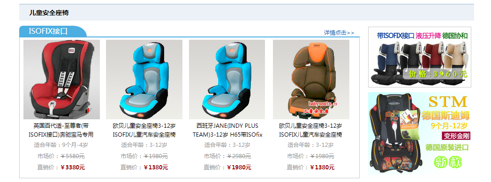 |

工艺美术品html

```html
<!-- 工艺美术品开始 -->
<div class="container">
    <div class="content pro1 pro3 clearfix">
        <h3>工艺美术品</h3>
        <ul>
            <li>
                <div class="pro-info">
                    <a href="#"></a>
                    <div class="info">
                        <a href="#">好太太晾衣架&nbsp;铝钛合金&nbsp;升降双杆</a>
                        <p>
                            自动换挡&nbsp;安全耐用<br>
                            稳定性好&nbsp;抗氧化强
                        </p>
                        <span>
                            <b>239.00</b>
                            <s>￥386.00</s>
                        </span>
                    </div>
                </div>
                <div class="shopping">
                    <button>立即购买</button>
                    <p>限量<span>99</span>件&nbsp;已售出<span>20</span>件</p>
                </div>
            </li>
            <li>
                <div class="pro-info">
                    <a href="#"></a>
                    <div class="info">
                        <a href="#">威尔舒木地板12mm厚网络超值特</a>
                        <p>
                            防滑抗污&nbsp;清理简单
                            扣型紧密&nbsp;环保健康
                        </p>
                        <span>
                            <b>10.00</b>
                            <s>￥68.00</s>
                        </span>
                    </div>
                </div>
                <div class="shopping">
                    <button>立即购买</button>
                    <p>限量<span>100</span>件&nbsp;已售出<span>8</span>件</p>
                </div>
            </li>
            <li>
                <div class="pro-info">
                    <a href="#"></a>
                    <div class="info">
                        <a href="#">好艺达高档太空铝三件套3500套</a>
                        <p>
                            经典的设计风格<br>
                            油脂的产品品质
                        </p>
                        <span>
                            <b>99.00</b>
                            <s>￥447.00</s>
                        </span>
                    </div>
                </div>
                <div class="shopping">
                    <button>立即购买</button>
                    <p>限量<span>100</span>件&nbsp;已售出<span>51</span>件</p>
                </div>
            </li>
            <li>
                <div class="pro-info">
                    <a href="#"></a>
                    <div class="info">
                        <a href="#">好太太晾衣架&nbsp;8818&nbsp;晒被架</a>
                        <p>
                            自动换挡&nbsp;安全耐用
                            稳定性好&nbsp;抗氧化强
                        </p>
                        <span>
                            <b>350.00</b>
                            <s>0.00</s>
                        </span>
                    </div>
                </div>
                <div class="shopping">
                    <button>立即购买</button>
                    <p>限量<span>100</span>件&nbsp;已售出<span>6</span>件</p>
                </div>
            </li>
        </ul>
        <div class="pro-news">
            <h4>建材商社</h4>
            <div class="textimg clearfix">
                
                <p>在装灯具时，如果装上分控开关，可以省去很多烦恼。因为如果只有一个总开关</p>
            </div>
            <ul>
                <li><a href="#"><span>[采暖论坛]</span>精心洗选大半年，终于满足小</a></li>
                <li><a href="#"><span>[采暖论坛]</span>精心洗选大半年，终于满足小</a></li>
                <li><a href="#"><span>[采暖论坛]</span>精心洗选大半年，终于满足小</a></li>
                <li><a href="#"><span>[采暖论坛]</span>精心洗选大半年，终于满足小</a></li>
                <li><a href="#"><span>[采暖论坛]</span>精心洗选大半年，终于满足小</a></li>
                <li><a href="#"><span>[采暖论坛]</span>精心洗选大半年，终于满足小</a></li>
                <li><a href="#"><span>[采暖论坛]</span>精心洗选大半年，终于满足小</a></li>
                <li><a href="#"><span>[采暖论坛]</span>精心洗选大半年，终于满足小</a></li>
            </ul>
        </div>
    </div>
</div>
<!-- 工艺美术品结束 -->
```

工艺美术品css

```css
/* 工艺品 */
.pro3 .pro-news{
	border:none;
}
.pro3 .pro-news .textimg{
	margin-top:14px;
	color:#777;
}
.pro3 .pro-news .textimg img{
	float:left;
}
.pro3 .pro-news .textimg p{
	float:left;
	width:108px;
	font-size:12px;
	margin-left:7px;
	line-height:21px;
}	
.pro3 .pro-news>ul{
	list-style:none;
	padding:0;
	margin:0;
	height:auto;
}	
.pro3 .pro-news>ul>li>a{
	color:#444;
}
.pro3 .pro-news>ul>li>a>span{
	color:#999;
}	
```


| 效果图                                  |
| --------------------------------------- |
| 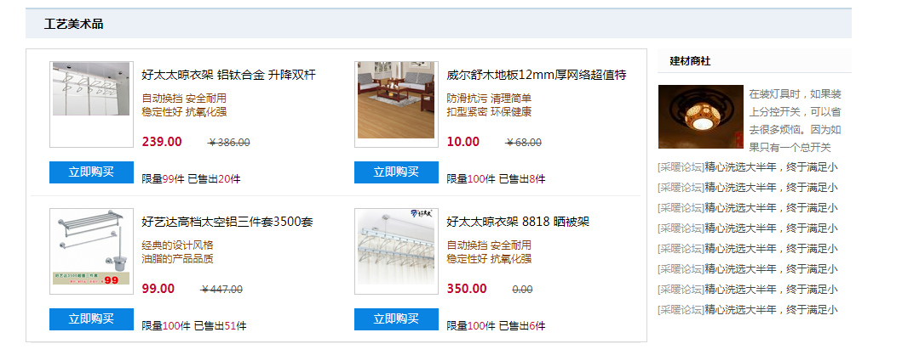 |

友情链接html

```html
<!-- 友情链接开始 -->
<div class="container">
    <div class="content friendlink clearfix">
        <ul>
            <li>友情链接：</li>
            <li><a href="#">央视网盟</a></li>
            <li><a href="#">央视网盟</a></li>
            <li><a href="#">央视网盟</a></li>
            <li><a href="#">央视网盟</a></li>
            <li><a href="#">央视网盟</a></li>
            <li><a href="#">央视网盟</a></li>
            <li><a href="#">央视网盟</a></li>
            <li><a href="#">央视网盟</a></li>
            <li><a href="#">央视网盟</a></li>
            <li><a href="#">央视网盟</a></li>
            <li><a href="#">央视网盟</a></li>
            <li><a href="#">央视网盟</a></li>
            <li><a href="#">央视网盟</a></li>
            <li><a href="#">央视网盟</a></li>
            <li><a href="#">央视网盟</a></li>
            <li><a href="#">央视网盟</a></li>
            <li><a href="#">央视网盟</a></li>
            <li><a href="#">央视网盟</a></li>
            <li><a href="#">央视网盟</a></li>
        </ul>
    </div>
</div>
<!-- 友情链接结束 -->
```

友情链接css

```css
/* 友情链接 */	
.friendlink{
	padding-top:23px;
	border-top:1px solid #ddd;
	margin-top:18px;
	padding-bottom:28px;
}
.friendlink ul li{
	float:left;
	margin-right:8px;
	font-size:12px;
	line-height:26px;
}
.friendlink ul li a{
	color:#666;
}	
```


| 效果图                                  |
| --------------------------------------- |
| 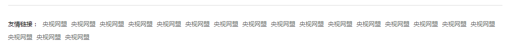 |

底部html

```html
<!-- 底部开始 -->
<div class="container">
    <div class="content footer">
        <ul>
            <li><a href="">关于我们</a></li>
            <li><a href="">关于我们</a></li>
            <li><a href="">关于我们</a></li>
            <li><a href="">关于我们</a></li>
            <li><a href="">关于我们</a></li>
            <li><a href="">关于我们</a></li>
            <li><a href="">关于我们</a></li>
            <li><a href="">关于我们</a></li>
            <li><a href="">关于我们</a></li>
            <li><a href="">关于我们</a></li>
        </ul>
        <p>版权所有2000-2012 服务热线：0571-89938887 请与我们联系：Service@BMlink 建材网会员互动群：153120106</p>
        <span>本站网络实名：中间网本站通用网址：中国建材网 浙B2-20060159</span>
    </div>
</div>
<!-- 底部结束 -->
```

底部css

```css
/* 底部 */	
.footer{
	border-top:3px solid #0a7ec3;
	text-align:center;
	padding-top:16px;
}
.footer ul{
	display:inline-block;
}
.footer ul li{
	float:left;
	font-size:12px;
}
.footer ul li:first-child a{
	border-left:none;
}
.footer ul li a{
	padding:0 10px;
	border-left:1px solid #ccc;
}	
.footer p{
	font-size:12px;
	line-height:38px;
}	
.footer span{
	font-size:12px;
}
```


| 效果图                                  |
| --------------------------------------- |
| 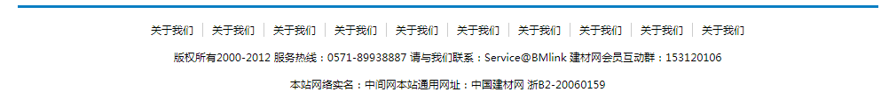 |


