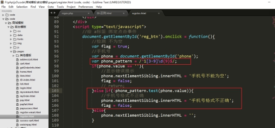
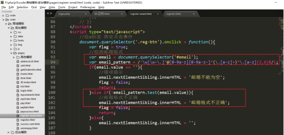
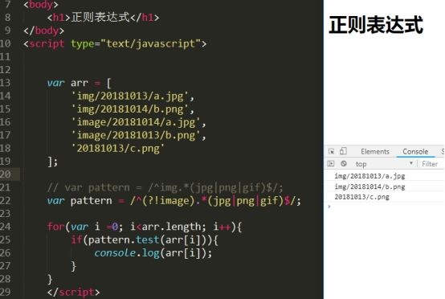

----


## 第1章 什么是正则表达式

### 1、概述

正则表达式(regular expression)


正则表达式是对[字符](https://baike.baidu.com/item/%E5%AD%97%E7%AC%A6)串操作的一种逻辑公式，就是用事先定义好的一些特定字符、及这些特定字符的组合，组成一个“规则字符串”，这个“规则字符串”用来对字符串的进行匹配。

用途：

检查一个字符串中是否含有某种子串

将匹配的某种子串做替换

从某个字符串中取出符合某个条件的子串等。

 

“996.icu” 

1、判断有没有99

2、判断有没有小数点.

3、icu 替换为 tsc  //   ‘996.icu’.replace(/icu/, ‘tsc’)

4、获取其中的9 和 u

 

### 2、应用场景

（1）表单验证里面，验证字符的合法性，如邮箱是否合法，手机号是否合法等等。

（2）信息过滤，如论坛帖子或者评论中的非法字符，例如 sql注入、js脚本注入、煽动性的言论。

（3）信息采集，采集别人网站上面的内容，例如整页采集时 筛选出需求的部分

（4）信息替换。

（5）页面伪静态的规则（url重写）。

### 3、入门案例

```javascript
	//匹配str字符串中p是否存在
	var str = 'php';
	var result = str.match(/p/);
	//var result = str.match(/参数就是正则表达式/); //返回包含匹配结果的数组或者null
```

其中，正则表达式前后的 斜杠/ 叫做定界符，是固定格式。

```javascript
	//匹配str字符串中所有p
	var str = 'php';
	var result = str.match(/p/g);//进行全局匹配，匹配所有
```

g是global，表示全局的意思，它是正则表达式语法中的修饰符，修饰符应该放到定界符(/)的后面。


## 第2章 正则语法-元字符

正则表达式中的字符：

元字符：一些具有特殊含义的特殊符号。

普通字符：包括所有大写和小写字母、所有数字、所有标点符号和一些其他符号。

**正则表达式三步走**

① 匹配符（查什么）（等价符、字符簇、修饰符、转义符）

② 限定符（查多少）

③ 定位符（从哪查）

### 1、限定符

限定符（量词）用来指定正则表达式的一个给定组件必须要出现多少次才能满足匹配。有 * 或 + 或 ? 或 {n} 或 {n,} 或 {n,m} 共6种。

| *     | 匹配前面的子表达式零次或多次。例如，zo* 能匹配 "z" 以及 "zoo"。* 等价于{0,}。 |
| ----- | ---------------------------------------- |
| +     | 匹配前面的子表达式一次或多次。例如，'zo+' 能匹配 "zo" 以及 "zoo"，但不能匹配 "z"。+ 等价于 {1,}。 |
| ?     | 匹配前面的子表达式零次或一次。例如，"do(es)?" 可以匹配 "do" 、 "does" 中的 "does" 、 "doxy" 中的 "do" 。? 等价于 {0,1}。 |
| {n}   | n 是一个非负整数。匹配确定的 n 次。例如，'o{2}' 不能匹配 "Bob" 中的 'o'，但是能匹配 "food" 中的两个 o。 |
| {n,}  | n 是一个非负整数。至少匹配n 次。例如，'o{2,}' 不能匹配 "Bob" 中的 'o'，但能匹配 "foooood" 中的所有 o。'o{1,}' 等价于 'o+'。'o{0,}' 则等价于 'o*'。 |
| {n,m} | m 和 n 均为非负整数，其中n <= m。最少匹配 n 次且最多匹配 m 次。例如，"o{1,3}" 将匹配 "foooood" 中的前三个 o。'o{0,1}' 等价于 'o?'。请注意在逗号和两个数之间不能有空格。 |

```javascript
	var str = 'phpphp';
	var res = str.match(/p+/g);//匹配所有的一个p或多个连在一起的p
	console.log(res);//["p", "pp", "p"]
```

贪婪匹配与非贪婪匹配:

默认情况下，正则表达式执行贪婪匹配（尽可能取多的情况）

非贪婪匹配：相对于贪婪匹配来说的。设置方式：将？加在其他限定符之后。

```javascript
	var str = 'phpphp';

	var res = str.match(/p+?/g);//+后面有? 执行非贪婪匹配（最少匹配）

	console.log(res);//["p", "p", "p", "p"]

```

非贪婪匹配使用场景举例：<div id="div1"><div id="div2">abc</div></div>

匹配div2标签


### 2、等价符

| .    | 匹配除换行符（\n、\r）之外的任何单个字符。要匹配包括 '\n' 在内的任何字符，请使用像"**(.\|\n)**"的模式。 |
| ---- | ------------------------------------------------------------ |
| \d   | 匹配一个数字字符。等价于 [0-9]。                             |
| \D   | 匹配一个非数字字符。等价于 [ ^0-9]。                         |
| \w   | 匹配一个字母、数字、下划线。等价于[A-Za-z0-9_]。             |
| \W   | 匹配非（字母、数字、下划线）。等价于 [ ^A-Za-z0-9_]。        |
| \s   | 匹配任何空白字符，包括空格、制表符、换页符等等。等价于 [ \f\n\r\t\v]。 |
| \S   | 匹配任何非空白字符。等价于 [ ^ \f\n\r\t\v]。                 |
| \n   | 匹配一个换行符。等价于 \x0a 和 \cJ。                         |
| \r   | 匹配一个回车符。等价于 \x0d 和 \cM。                         |
| \t   | 匹配一个制表符。等价于 \x09 和 \cI。                         |

```javascript
常用的：  .  \d  \w
var str = 'php1js22';
var res = str.match(/\d+/g);//匹配所有的数字
console.log(res);//["1", "22"]
```


### 3、定位符

定位符用来描述字符串或单词的边界，**^** 和 **$** 分别指字符串的开始与结束，**\b** 描述单词的前或后边界，**\B** 表示非单词边界。

| ^    | 匹配输入字符串开始的位置。如果设置了 RegExp 对象的 Multiline 属性，^ 还会与 \n 或 \r 之后的位置匹配。 |
| ---- | ---------------------------------------- |
| $    | 匹配输入字符串结尾的位置。如果设置了 RegExp 对象的 Multiline 属性，$ 还会与 \n 或 \r 之前的位置匹配。 |
| \b   | 匹配一个单词边界，也就是指单词和空格间的位置。例如， 'er\b' 可以匹配"never" 中的 'er'，但不能匹配 "verb" 中的 'er'。 |
| \B   | 匹配非单词边界。'er\B' 能匹配 "verb" 中的 'er'，但不能匹配 "never" 中的 'er'。 |

```javascript
注意： 通常在表单数据验证时，严格检测字符串格式，需要使用^$
<script>
	var str = '1234';
	var res = str.match(/^\d+$/);//匹配整个数字字符串（匹配id参数值）
	console.log(res);//["1234"]
</script>
```

 

### 4、字符簇（方括号）

方括号表示一个范围，也称为**字符簇**，匹配满足条件的一个字符。

| [xyz]  | 字符集合。匹配所包含的任意一个字符。例如， [abc]可以匹配 "plain" 中的 'a'。 |
| ------ | ------------------------------------------------------------ |
| [^xyz] | 负值字符集合。匹配未包含的任意字符。例如，  [ ^abc] 可以匹配 "plain" 中的'p'、'l'、'i'、'n'。 |
| [a-z]  | 字符范围。匹配指定范围内的任意字符。例如， [a-z] 可以匹配 'a' 到 'z' 范围内的任意小写字母字符。 |
| [^a-z] | 负值字符范围。匹配任何不在指定范围内的任意字符。例如，[ ^a-z]可以匹配任何不在 'a' 到 'z' 范围内的任意字符。 |
| x\|y   | 或的用法：匹配 x 或 y。例如，'z\|food' 能匹配 "z" 或 "food"。'(z\|f)ood' 则匹配 "zood" 或 "food"。 |

字符范围 参考ASCII码表

示例：

[0-9] 查找任何从 0 至 9 的一个数字。

[a-z] 查找任何从小写 a 到小写 z 的字符。 

[A-Z] 查找任何从大写 A 到大写 Z 的字符。 

[A-z] 查找任何从大写 A 到小写 z 的字符。包括[ \ ]^_`等六个字符。

[A-Za-z]查找任何从大写 A 到小写 z 的字符，不包括[ \ ]^_`等六个字符。

```javascript
var str = 'adcd1234ABCD';
var res = str.match(/[a-z]+/g);//匹配所有小写字母字符串
console.log(res);//["abcd"] 
```

### 5、修饰符

修饰符的用法，修饰符一定要写到正则表达式末尾/之后，可以一次性使用多个修饰符。

i  执行对大小写不敏感的匹配。实际上就是不区分大小写的匹配（默认区分大小写） 

g  执行全局匹配（查找所有匹配而非在找到第一个匹配后停止）。 

m 执行多行匹配（^和$能匹配每行的开始与结束）。

/i用法示例:

```javascript
var str = 'adcd1234ABCD';
var res = str.match(/[a-z]+/gi);//匹配所有字母字符串(忽略大小写)
console.log(res);//["adcd", "ABCD"]
```

/m用法示例 

```javascript
	var str = '1234\r\n5678';
	var res = str.match(/^\d+$/gm);//匹配整个数字字符串
	console.log(res);//["1234", "5678"]
```


### 6、转义字符（\）

| \    | 将下一个字符标记为一个特殊字符、或一个原义字符、或一个 向后引用、或一个八进制转义符。例如，'n' 匹配字符 "n"。'\n' 匹配一个换行符。序列 '\ \ ' 匹配 "\ " 而 "\ (" 则匹配 "("。 |
| ---- | ------------------------------------------------------------ |
|      |                                                              |

如果匹配的字符串在正则中有特殊含义的都必须加转义字符。如[]$.*?+|^{}()

但是不要乱加转义。

```javascript
	var str = 'php.php';//目标字符串中包含普通字符.
	var res = str.match(/p\.p/g);//匹配普通字符. 需要转义
	console.log(res);//["p.p"]
```

匹配图片名称

```javascript
	var str = '123.jpg';//目标字符串中包含普通字符.
	var res = str.match(/.*\.jpg/g);//匹配jpg后缀的图片名称
	console.log(res);//["123.jpg"]
```

练习题：

匹配字符串开始和结束的数字 预期结果 123   789；  ^  \d  |  $

```javascript
var str = '123abc456def789';
var res = str.match(/(^\d+)|(\d+$)/g);//匹配开始或结束的数字
console.log(res);//["123","789"]
```

 

## 第3章 js中正则对象

正则对象两种定义方式：js中正则表达式两边不用加引号

```javascript
	var pattern = /[a-z]/;//将正则表达式直接当做对象使用。
	var pattern = new RegExp(/[a-z]/);//实例化RegExp对象
```

### 1、test方法

test方法检测目标字符串和正则表达式是否匹配，如果匹配返回true，不匹配返回false。

正则表达式中，一般不需要加全局修饰符g。

```javascript
	var str = 'php1js22';
	var pattern = /^[a-z]/;//以小写字母开头
	var res = pattern.test(str);//匹配字符串是否以小写字母开头
	console.log(res);//true
```

### 2、exec方法

exec方法执行一个正则匹配，**只匹配一次**，匹配到结果就返回一个数组类型的结果，匹配不到就返回null。

正则表达式中，一般不需要加全局修饰符g。

即使正则表达式中，使用了全局匹配修饰符g，也只匹配一次。

```javascript
	var str = 'php1js22';
	var pattern = /[a-z]/;//匹配小写字母字符串
	//var pattern = /[a-z]/g;//全局匹配小写字母字符串
	var res1 = pattern.exec(str);
	console.log(res1);//["p"] 只匹配一次，返回数组
```

### 3、lastIndex属性

表示正则表达式，上一次匹配结束后的位置（目标字符串中的索引），即下一次匹配开始的位置。

lastIndex是一个整数，。没有更多匹配重置lastIndex为0.

test 方法和exec方法默认都只匹配一次。匹配后lastIndex 被自动重置为0.

特殊情况：如果正则表达式使用了全局匹配修饰符g，则lastIndex不会被重置为0.

```javascript
	var str = 'php1js22';
	//var pattern = /[a-z]/;//匹配小写字母字符串
	var pattern = /[a-z]/g;//全局匹配小写字母字符串
	var res1 = pattern.exec(str);
	console.log(res1);//["p"] 只匹配一次，返回数组
	console.log(pattern.lastIndex);//1  下一次匹配开始的位置
	var res2 = pattern.exec(str);
	console.log(res2);//["h"] //从位置1开始匹配
```

 

## 案例一

### 1、检测手机号格式

手机号特点：11位，纯数字，1开头， [23位号段，具体咨询各大运营商]

简单版（限制前两位）：1开头，第二位3-9，后面9位数字

```javascript
/^1[3-9]\d{9}$/
```

精确版（限制前三位）：（如果出现新的手机号段，则不适用，需更新）

示例：

13[0-9]开头、14[579]开头、15[0-3,5-9]开头、166开头、17[0135678]开头、18[0-9]开头、19[89]开头

```javascript
/^1(3[0-9]|4[579]|5[0-3,5-9]|6[6]|7[0135678]|8[0-9]|9[89])\d{8}$/
```

手机号检测案例：register.html

 

### 2、检测邮箱格式

邮箱特点：

2342.3s_-df@sina.com.cn

通用的邮箱的特点：

简单版：必须有@  正则 /@/

 

精确版：

​	必须有@和.

​	@前面是邮箱名，要求至少一个字符，要求是数字、字母、下划线、[还可以用.-]，但是开头必须是数字字母下划线

​	@和点之间：是一个域名，要求至少一个字符，可以是数字字母中横线，要求开头是数字或字母

​	点后面：要求是至少一个字符，必须是字母

​	点xxx，这部分可以出现一次，也可以出现多次

最后一个点后面，字符长度为2-6的字母

```javascript
var pattern = /^\w[\w\.-]*@[0-9a-z][0-9a-z-]*(\.[a-z]+)*\.[a-z]{2,6}$/i;
```

register-email.html

 

 

## 第4章 分组/捕获和反向引用

**捕获和反向引用的语法的解释**：

**子表达式**
在正则表达式中，通过一对圆括号括起来的内容，我们就称之为“子表达式”。如：
`var reg = /\d(\d)\d/gi;`

**捕获**（分组）
在正则表达式中，子表达式匹配到相应的内容时，系统会自动捕获这个行为，
然后将子表达式匹配到的内容放入系统的缓存区中。我们把这个过程就称之为“捕获”。


**反向引用**
在正则表达式中，我们可以使用\n（n>0，正整数，代表系统中的缓冲区编号）
来获取缓冲区中的内容，我们把这个过程就称之为“反向引用”。


在正则语法中，用“\1”来引用前面的捕获（使用子表达式匹配的结果）。用\2表示第二个捕获的内容….

在正则语法外（如replace时），用“$1”来引用前面的捕获。

```javascript
	var str = '1122 3434 5566 7879 9887';
	//匹配连续四个数字，第一和第二数字相同，第三和第四数字相同
	var res = str.match(/(\d)\1(\d)\2/g);
	console.log(res);
	//匹配连续四个数字，第一和第三数字相同，第二和第四数字相同
	var res = str.match(/(\d)(\d)\1\2/g);
	console.log(res);
	//匹配连续四个数字，第一和第三数字相同
	var res = str.match(/(\d)\d\1\d/g);
	console.log(res);
	//匹配连续四个数字，第一和第二数字相同，第三和第四数字相同，并将相同的数字只保留一个
	var res = str.replace(/(\d)\1(\d)\2/g, '$1$2');
	console.log(res);
```


禁止引用

(?:正则) 这个小括号中的内容不能够被引用

​	//第一次捕获禁止引用

```javascript
	var str = '1122 3434 5566 7879 9887';
	var res = str.match(/(?:\d)(\d)\1\d/g);
	console.log(res);
```

 

## 第5章 匹配中文（utf-8编码）

每个字符（中文、英文字母、数字、各种符号、拉丁文、韩文、日文等）都对应着一个Unicode编码。

查看Unicode编码，找到中文的部分，然后获取中文的Unicode编码的区间，就可以用正则匹配了。

前面我们用[a-z]表示小写字母，[0-9]表示数字，这就是一个范围表示，如果有一个数x能够表示第一个中文，有一个数y能够表示最后一个中文，那么[x-y]就可以表示所有的中文了。

中文的Unicode编码从4E00开始，到9FA5结束。

[\u4E00-\u9FA5]这个区间就能够表示中文。

**完整的Unicode编码表**：[http://blog.csdn.net/hherima/article/details/9045861](http://blog.csdn.net/hherima/article/details/9045861)

```javascript
	var str = "你好，世界";
	var res = str.match(/[\u4E00-\u9FA5]/g);
	console.log(res);//["你", "好", "世", "界"]
```


## 案例二

### 解决结巴程序

把“今今今天晚晚晚晚晚晚上吃吃吃吃吃吃鸡”字符串换成单字的形式，即“今天晚上吃鸡”；

核心思想：匹配到重复的字符时，保留一个。

```javascript
	var str = "今今今天晚晚晚晚晚晚上吃吃吃吃吃吃鸡";
	//今天晚上吃鸡
	var res = str.replace(/([\u4E00-\u9FA5])\1+/g, '$1');
	console.log(res);
```


## 第6章 环视

也叫 预查、断言、零宽断言。

正则表达式中，用于查找某些内容之前或者之后的东西，叫做环视。

环视通常也叫做预查、断言或者零宽断言。

### 1、正向肯定预查

也叫 顺序肯定环视

every(?=n) 匹配任何其后紧接指定字符串 n 的字符串。

```javascript
	//匹配后面字符为10的win
	var str = "win7 win8 win10";
	var res = str.match(/win(?=10)/g);
	console.log(res); //["win"]
```


### 2、正向否定预查

也叫 顺序否定环视

every(?!n) 匹配任何其后没有紧接指定字符串 n 的字符串。

```javascript
	//匹配后面字符不为10的win
	var str = "win7 win8 win10";
	var res = str.match(/win(?!10)/g);
	console.log(res); //["win", "win"]
```

(?!B)[A-Z]这种写法，其实它是[A-Z]范围里，排除B的意思，前置的(?!B)只是对后面数据的一个限定，从而达到过滤匹配的效果。

```javascript
	var str = "abcd1234";
	var res = str.match(/(?!c)[a-z]/g);
	console.log(res); //["a", "b", "d"]
```

练习：从一堆图片地址中，找出符合条件的图片地址。

```javascript
	var arr = [
		'img/20181013/a.jpg',
		'img/20181014/b.png',
		'image/20181014/a.jpg',
		'image/20181013/b.png',
		'20181013/c.png'
	];
```

匹配img开头的图片地址

```javascript
/^img.*(jpg|png|gif)$/g
```

匹配不以image开头的图片地址

```javascript
/^(?!image).*(jpg|png|gif)$/
```

 

## 第7章  String 对象的正则方法

### 1、match方法

stringObj.match(regex)

在字符串中检索匹配正则表达式regex的子串；

如果匹配，返回包含匹配结果的一个数组；不匹配返回null。

 

正则表达式regex中不带全局修饰符g，则只匹配一次。

正则表达式regex中带全局修饰符g，则匹配所有结果。

```javascript
	var str = "1234@qq.com";
	var res = [str.match(/[@\.\]/g);](mailto:str.split(/[@/.]/);) // .要加转义
	console.log(res); //["@", "."]
```

### 2、replace方法

stringObj.replace(regex, replacement)

在字符串中检索匹配正则表达式regex的子串，并替换为指定的字符串replacement；

返回替换之后的新字符串。

正则表达式regex中不带全局修饰符g，则只匹配一次并替换一次。

正则表达式regex中带全局修饰符g，则匹配所有结果并替换所有结果。

 

替换的时候，使用"$1"表示匹配的第一个子表达式：

用$2表示第二个子表达式，以此类推。

（见案例二）

### 3、search方法

stringObj.search(regex)

在字符串中搜索符合正则表达式的结果。如果找到结果返回结果的起始位置，**停止向后检索**，也就是说忽略全局标识符g；如果没有匹配结果，返回-1.

```javascript
	var str = "1234@qq.com";
	var res = [str.search(/[@\.\]/);](mailto:str.split(/[@/.]/);) // .要加转义
	console.log(res); //4
```


### 4、split方法

stringObj.split(regex)

把一个字符串分割成字符串数组, 返回一个数组

```javascript
	var str = "1234@qq.com";
	var res = [str.split(/[@\.\]/);](mailto:str.split(/[@/.]/);) // .要加转义
	console.log(res); //["1234", "qq", "com"]
```

 
