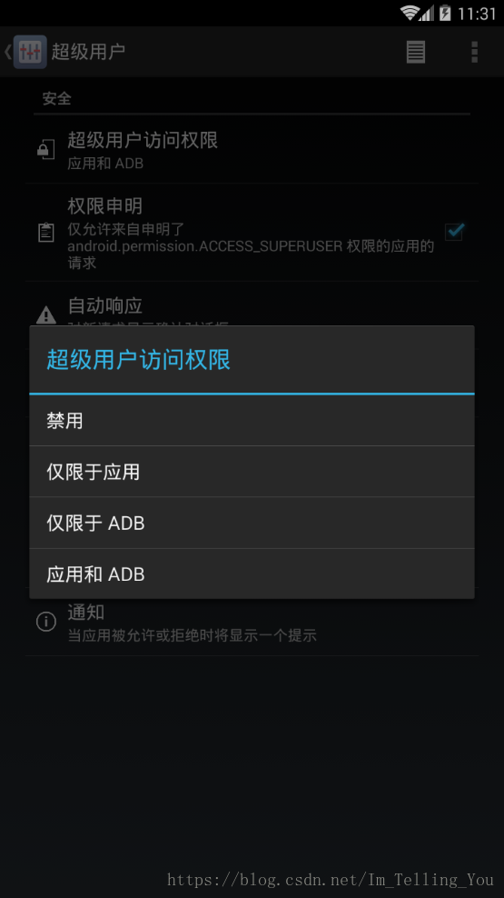
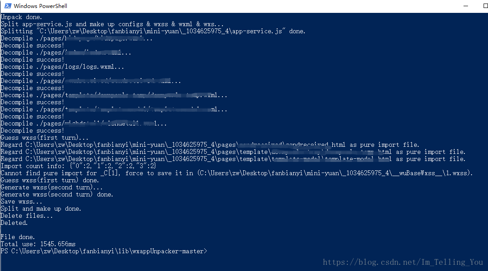
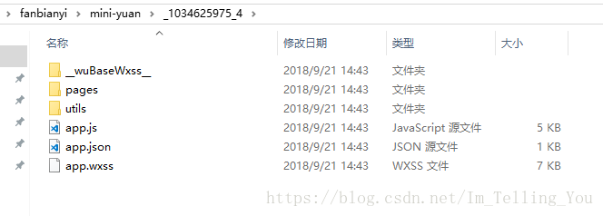

### **一、前言**

反编译，听起来很屌，其实还是简单的，基本是傻瓜式操作。要想拿到微信小程序源码，找到源文件在手机存放的位置就行，源文件拿到，用反编译脚本跑一下，微信小程序代码包里的所有文件、所有资源就出来了（除了project.config.json小程序配置文件）。拿到源码后，跑起来是能跑，但登录、授权等涉及到appid的功能是不能用的，因为被反编译小程序的服务端appid和你本地添加的不一样，这就是为啥拉下来的源码没有project.config.json文件的原因，项目中appid是配置在这个文件里，这里一定程度上保护原小程序。

### **二、所需工具**

1.夜神模拟器，地址：[夜神模拟器](https://www.yeshen.com/)

- 用来找寻微信小程序源文件，真机当然也可以，但麻烦，又是root权限，又是越狱的，夜神模拟器方便，直接在设置里就可以设置超级用户权限，超级权限拿到，就可以为所欲为了，通过下面这个RE文件管理器看到微信小程序源文件。

2.RE文件管理器（拖到模拟器内自动安装），地址：[RE](http://www.pc6.com/az/56118.html)

- 用来找寻微信小程序源文件，官方没改动的话，应该会在这么个路径下，/data/data/com.tencent.mm/MicroMsg/.../appbrand/pkg/，路径中有一段...，这里表示不确定具体一个，反正就在这个MicroMsg下的其中一个文件夹，紧接着会看到appbrand文件夹，如果这样那就找到位置了。

3.nodejs运行环境，地址：[nodejs](http://nodejs.cn/)

- 反编译脚本所需运行环境

4.反编译脚本，地址：[wxappUnpacker](https://github.com/vobear/wxappUnpacker.git)

-  用来反编译微信小程序源文件，把源代码给编译出来，这是GitHub上一位大神的杰作，找到了这个比较好用的，其他版本自寻。

### **三、开始搞事情**

1.安装好夜神模拟器后，并将在电脑下载好的RE文件管理器拖到模拟器内安装。

2.打开手机设置->找到超级用户->右上角三个小点点击一下，设置->点击‘超级用户访问权限’，选择‘仅限于应用’，这样超级用户权限就拿到了。

3.打开微信，没有的在应用市场下载就行，打开想反编译的微信小程序，小程序打开后，可以切换到RE文件管理器去找源文件了。

- 这里有一个机制，当点开一个微信小程序，如果本地这个文件夹下未找到即将运行的小程序，会从微信服务器下载到本地，在以后的某个时刻又运行这个小程序，运行时，微信服务器会通知有没有小程序新版本，如有新版本，会在后台静默下载，小程序继续运行，新版本要到下一次运行才会启用，这就是微信小程序的更新机制。

4.打开RE文件管理器，从根目录开始，/data/data/com.tencent.mm/MicroMsg/.../appbrand/pkg/，找到源文件后，长按->点击右上角三个小点，打开菜单，选择‘压缩所选文件’->完成后，点击查看->长按，还是右上角，将压缩包从模拟器发送出来到电脑上，方式多种，随意。

 

4.上面找到源文件并把源文件拉出来，从GitHub下载反编译文件后，在桌面就有了这样的文件夹结构

mini-yuan这个文件夹下这里放的是微信小程序源文件

lib这个文件夹下放的是反编译脚本

5.进入到目录：...\lib\wxappUnpacker-master文件夹下，右键，在这里打开命令行窗口，将这几句命令跑一下

- npm install esprima
- npm install css-tree
- npm install cssbeautify
- npm install vm2
- npm install uglify-es
- npm install js-beautify
- npm install escodegen

- 最后使用这个命令进行反编译源文件：node wuWxapkg.js filepath，例如我的是：node wuWxapkg.js C:\Users\zw\Desktop\fanbianyi\mini-yuan\_1034625975_4.wxapkg，反编译过程过如遇到抛出缺少某个文件的提示，用npm install filename再次跑一下就行（filename为抛出缺少文件名）。

6.反编译完成，用node wuWxapkg.js filepath执行成功后

查看反编译成功后的文件夹，源码中除了project.config.json这个配置文件，其他的都有。

**四、结语**

至此微信小程序的反编译过程就结束了，学会之后，欣喜若狂，一顿操作猛如虎，拉了两个小程序源码后，心生一种罪恶感。这种反编译方法很简单，由此可见微信小程序源码的安全性不好，过不久估计就不能这么干了，漏洞终究会被填补的。

 