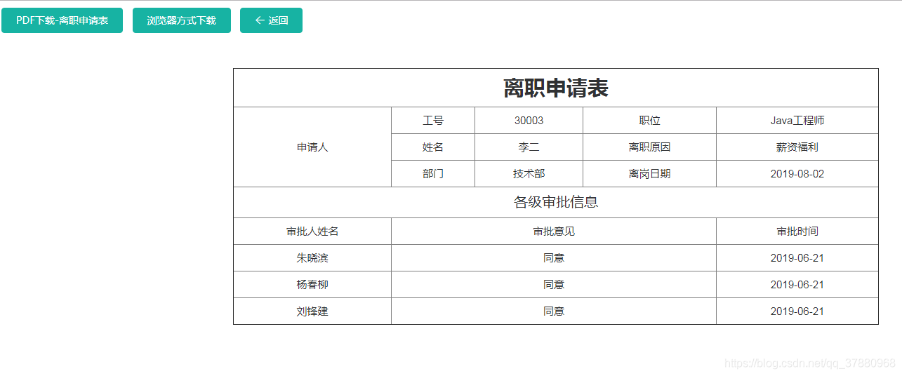
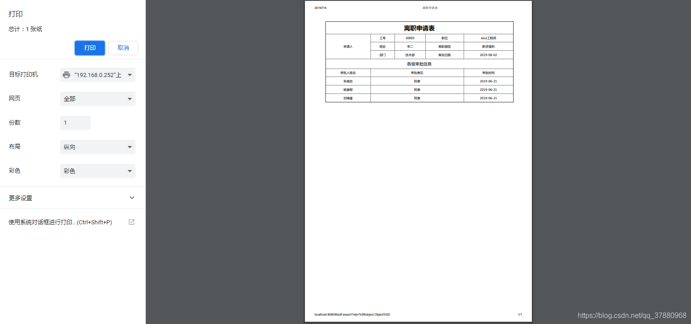
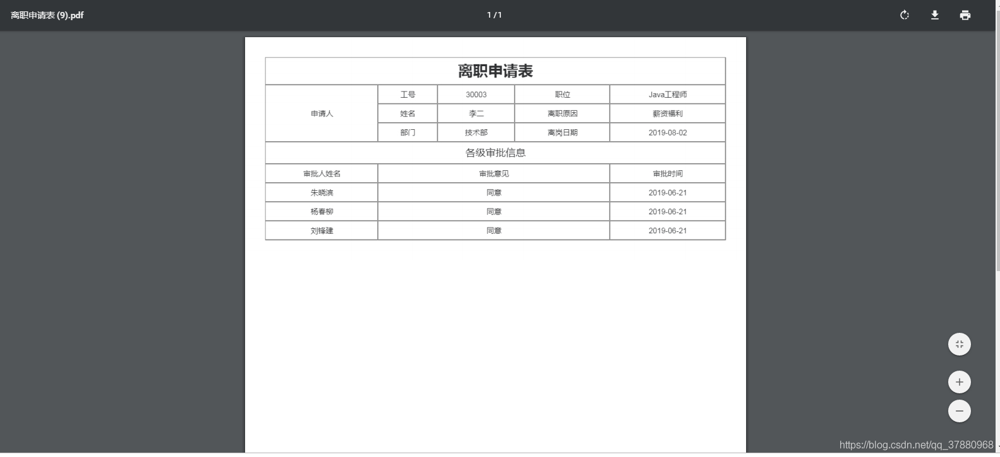

## vue 项目导出pdf两种方式 ：

1.使用 html2Canvas + jsPDF 导出PDF， 这种方式什么都好，就是下载的pdf太模糊了。对要求好的pdf这种方式真是不行啊！
2.调用浏览器自身的方法。window.print() 来打印（打印时可选下载），这种方式打印出来会清楚点，但纯在浏览器兼容问题。 谷歌浏览器比较好用点

## 首先看下导出的样式，是否是你需要的，如果是你想要的恭喜你找到答案了！！！！！！！



## 浏览器导出pdf方式



## js组件导出pdf方式



## 1 、我们要添加两个模块

```
第一个.将页面html转换成图片
npm install --save html2canvas 
第二个.将图片生成pdf
npm install jspdf --save
1234
```

## 2、定义函数,创建两个工具js文件（htmlToPdf.js、htmlToPdfJQ.js）

(1) 创建一个htmlToPdf.js文件在指定位置.我个人习惯放在(’\src\unit\htmlToPdf.js’)

```js
/* eslint-disable */
//不使用JQuery版的
import html2canvas from 'html2canvas';
import JsPDF from 'jspdf';

/**
 * @param  ele          要生成 pdf 的DOM元素（容器）
 * @param  padfName     PDF文件生成后的文件名字
 * */

function downloadPDF(ele, pdfName){

    let eleW = ele.offsetWidth;// 获得该容器的宽
    let eleH = ele.offsetHeight;// 获得该容器的高
    let eleOffsetTop = ele.offsetTop;  // 获得该容器到文档顶部的距离
    let eleOffsetLeft = ele.offsetLeft; // 获得该容器到文档最左的距离

    var canvas = document.createElement("canvas");
    var abs = 0;

    let win_in = document.documentElement.clientWidth || document.body.clientWidth; // 获得当前可视窗口的宽度（不包含滚动条）
    let win_out = window.innerWidth; // 获得当前窗口的宽度（包含滚动条）

    if(win_out>win_in){
        // abs = (win_o - win_i)/2;    // 获得滚动条长度的一半
        abs = (win_out - win_in)/2;    // 获得滚动条宽度的一半
        // console.log(a, '新abs');
    }
    canvas.width = eleW * 2;    // 将画布宽&&高放大两倍
    canvas.height = eleH * 2;

    var context = canvas.getContext("2d");
    context.scale(2, 2);
    context.translate(-eleOffsetLeft -abs, -eleOffsetTop);
    // 这里默认横向没有滚动条的情况，因为offset.left(),有无滚动条的时候存在差值，因此
    // translate的时候，要把这个差值去掉

    // html2canvas(element).then( (canvas)=>{ //报错
    // html2canvas(element[0]).then( (canvas)=>{
    html2canvas( ele, {
        dpi: 300,
        // allowTaint: true,  //允许 canvas 污染， allowTaint参数要去掉，否则是无法通过toDataURL导出canvas数据的
        useCORS:true  //允许canvas画布内 可以跨域请求外部链接图片, 允许跨域请求。
    } ).then( (canvas)=>{
        var contentWidth = canvas.width;
        var contentHeight = canvas.height;
        //一页pdf显示html页面生成的canvas高度;
        var pageHeight = contentWidth / 592.28 * 841.89;
        //未生成pdf的html页面高度
        var leftHeight = contentHeight;
        //页面偏移
        var position = 0;
        //a4纸的尺寸[595.28,841.89]，html页面生成的canvas在pdf中图片的宽高
        var imgWidth = 595.28;
        var imgHeight = 595.28/contentWidth * contentHeight;
        var pageData = canvas.toDataURL('image/jpeg', 1.0);
        var pdf = new JsPDF('', 'pt', 'a4');
        //有两个高度需要区分，一个是html页面的实际高度，和生成pdf的页面高度(841.89)
        //当内容未超过pdf一页显示的范围，无需分页
        if (leftHeight < pageHeight) {
            //在pdf.addImage(pageData, 'JPEG', 左，上，宽度，高度)设置在pdf中显示；
            pdf.addImage(pageData, 'JPEG', 0, 0, imgWidth, imgHeight);
            // pdf.addImage(pageData, 'JPEG', 20, 40, imgWidth, imgHeight);
        } else {    // 分页
            while(leftHeight > 0) {
                pdf.addImage(pageData, 'JPEG', 0, position, imgWidth, imgHeight);
                leftHeight -= pageHeight;
                position -= 841.89;
                //避免添加空白页
                if(leftHeight > 0) {
                    pdf.addPage();
                }
            }
        }
        //可动态生成
        pdf.save(pdfName);
    })
}
export default {
    downloadPDF
}

```

(2) 创建一个htmlToPdfJQ.js文件在指定位置.我个人习惯放在(’\src\unit\htmlToPdfJQ.js’)

```js
/* eslint-disable */
//使用JQuery方式写的。

import html2canvas from 'html2canvas';
import JsPDF from 'jspdf';
import $ from 'jquery';

// console.log($, '这是什么什么');
function download(ele){
    var element = $("#demo");    // 这个dom元素是要导出pdf的div容器
    console.log(element,'1212122');
    // var element = ele;    // 这个dom元素是要导出pdf的div容器
    var w = element.width();    // 获得该容器的宽
    var h = element.height();    // 获得该容器的高
    var offsetTop = element.offset().top;    // 获得该容器到文档顶部的距离
    var offsetLeft = element.offset().left;    // 获得该容器到文档最左的距离

    console.log(offsetTop,'------',offsetLeft);
    var canvas = document.createElement("canvas");
    var abs = 0;
    var win_i = $(window).width();    // 获得当前可视窗口的宽度（不包含滚动条）
    var win_o = window.innerWidth;    // 获得当前窗口的宽度（包含滚动条）

    console.log(canvas, abs, win_i, win_o);

    if(win_o>win_i){
        abs = (win_o - win_i)/2;    // 获得滚动条长度的一半
    }

    canvas.width = w * 2;    // 将画布宽&&高放大两倍
    canvas.height = h * 2;
    var context = canvas.getContext("2d");
    context.scale(2, 2);
    context.translate(-offsetLeft-abs,-offsetTop);
    // 这里默认横向没有滚动条的情况，因为offset.left(),有无滚动条的时候存在差值，因此
    // translate的时候，要把这个差值去掉
    // html2canvas(element).then( (canvas)=>{ //报错
    html2canvas(element[0]).then( (canvas)=>{
        var contentWidth = canvas.width;
        var contentHeight = canvas.height;
        //一页pdf显示html页面生成的canvas高度;
        var pageHeight = contentWidth / 592.28 * 841.89;
        //未生成pdf的html页面高度
        var leftHeight = contentHeight;
        //页面偏移
        var position = 0;
        //a4纸的尺寸[595.28,841.89]，html页面生成的canvas在pdf中图片的宽高
        var imgWidth = 595.28;
        var imgHeight = 592.28/contentWidth * contentHeight;

        var pageData = canvas.toDataURL('image/jpeg', 1.0);
        var pdf = new JsPDF('', 'pt', 'a4');

        //有两个高度需要区分，一个是html页面的实际高度，和生成pdf的页面高度(841.89)
        //当内容未超过pdf一页显示的范围，无需分页
        if (leftHeight < pageHeight) {
            pdf.addImage(pageData, 'JPEG', 0, 0, imgWidth, imgHeight);
        } else {    // 分页
            while(leftHeight > 0) {
                pdf.addImage(pageData, 'JPEG', 0, position, imgWidth, imgHeight)
                leftHeight -= pageHeight;
                position -= 841.89;
                //避免添加空白页
                if(leftHeight > 0) {
                    pdf.addPage();
                }
            }
        }
        pdf.save('我的简历.pdf');
    })
}
export default {
    download
}

```

## 3 、在我们自己业务中使用导出组件功能

```js
<template>
	<div class="mod-config">
		<div style="padding: 10px;">
			<el-button type="primary" @click="handleDown">PDF下载-离职申请表</el-button>
			<el-button type="primary" @click="handleWindowPrint( '#demo', '离职申请表' )">浏览器方式下载</el-button>
			<el-button class="filter-item" style="margin-left: 10px;" type="primary" icon="el-icon-back" @click="goBack">返回
			</el-button>
		</div>
		<div style="width: 100%">
			<div id="demo">
				<table border="1" class="table_style">
					<thead>
						<th colspan="5" style="font-size: 30px">离职申请表</th>
					</thead>
					<tbody>
						<tr>
							<td rowspan="3">申请人</td>
							<td>工号</td>
							<td>{{leaveData.userno}}</td>
							<td>职位</td>
							<td>{{leaveData.position}}</td>
						</tr>
						<tr>
							<td>姓名</td>
							<td>{{leaveData.realName}}</td>
							<td>离职原因</td>
							<td>{{leaveData.reason | typeFilter}}</td>
						</tr>
						<tr>
							<td>部门</td>
							<td>{{leaveData.dept}}</td>
							<td>离岗日期</td>
							<td>{{leaveData.leaveDate}}</td>
						</tr>
						<tr>
							<td colspan="5" style="font-size: 20px">各级审批信息</td>
						</tr>
						<tr>
							<td>审批人姓名</td>
							<td colspan="3">审批意见</td>
							<td>审批时间</td>
						</tr>
						<tr v-for="(item,index) in approvalLogs" :key="index">
							<td>{{item.approveName}}</td>
							<td colspan="3">{{item.approveMsg}}</td>
							<td>{{item.approveDate}}</td>
						</tr>
					</tbody>
				</table>

			</div>
		</div>
	</div>
</template>

<script>
	import htmlToPdf from '@/assets/htmlToPdf'
	const libraryOption = [{
			id: 0,
			name: '家庭原因'
		}, {
			id: 1,
			name: '个人发展'
		}, {
			id: 2,
			name: '薪资福利'
		},
		{
			id: 3,
			name: '工作环境'
		}, {
			id: 4,
			name: '工作时间'
		}, {
			id: 5,
			name: '身体健康'
		}
	]
	const calendarTypeKeyValue = libraryOption.reduce((acc, cur) => {
		acc[cur.id] = cur.name
		return acc
	}, {})
	export default {
		// name: 'PdfDemo',
		data() {
			// 和导出pdf没关系
			return {
				leaveData: {
					dimId: ''
				},
				approvalLogs: [{
					approveName:'111',
					approveMsg:'111',
					approveDate:'2020-10-12'
				},{
					approveName:'111',
					approveMsg:'111',
					approveDate:'2020-10-12'
				},{
					approveName:'111',
					approveMsg:'111',
					approveDate:'2020-10-12'
				},{
					approveName:'111',
					approveMsg:'111',
					approveDate:'2020-10-12'
				},{
					approveName:'111',
					approveMsg:'111',
					approveDate:'2020-10-12'
				},]
			}
		},
		filters: {
			typeFilter(type) {
				return calendarTypeKeyValue[type]
			}
		},
		created() {
		},
		methods: {
			handleWindowPrint(ele, fileName) {
				// 留存原来的 html
				// let bdHtml = window.document.body.innerHTML;
				// let bdHtml = document.querySelector('#app').innerHTML;

				// 要打印的 内容 html
				// document.body.innerHTML =  document.querySelector('#demo').innerHTML;
				// document.body.innerHTML =  document.querySelector('#demo').outerHTML;
				// document.querySelector('#app').innerHTML =  document.querySelector('#demo').outerHTML;
				// document.querySelector('#main').innerHTML =  document.querySelector('#demo').outerHTML;
				console.log(666)
				// 去除页面不必要的 head 标签内  内容， 避免影响打印页 ， title 为保存为 pdf 的文件时的 文件名
				document.head.innerHTML = '<meta charset="utf-8">\n' +
					' <title> ' + fileName + '</title>\n' +
					' <meta name="format-detection" content="telephone=no">\n' +
					' <meta http-equiv="X-UA-Compatible" content="IE=edge,chrome=1">\n' +
					' <meta name="viewport" content="width=device-width,initial-scale=1.0">\n' +
					' <link rel="stylesheet" href="./static/css/contract.css"/>' // 生成pdf的外部css样式
				// document.body.innerHTML =  document.querySelector('#demo').outerHTML;
				// document.querySelector('#main').innerHTML =  document.querySelector('#demo').outerHTML;
				// document.body.innerHTML =  document.querySelector('#demo').outerHTML;
				document.body.innerHTML = document.querySelector(ele).outerHTML

				// window.print();

				// 转异步 等待dom元素渲染（样式）完毕在打印
				setTimeout(() => {
					// 打印
					window.print()
					// 刷新页面
					window.location.reload()
				}, 20)

				// 重新设会当前页面
				// window.document.body.innerHTML = bdHtml;
				// document.querySelector('#app').innerHTML =  bdHtml;
				// 刷新页面
				// window.location.reload();
			},
			goBack() {
				this.$router.go(-1)
			},
			handleDown() {
				htmlToPdf.downloadPDF(document.querySelector('#demo'), '离职申请表')
			}
		}
	}
</script>

<style scoped>
	#demo {
		background-color: #fff;
		width: 1000px;
		/* height: 400px; */
		margin: auto;
		padding: 40px;
		box-sizing: border-box;
	}

	.table_style td,
	th {
		padding: 10px;
		font-size: 15px;
	}

	.table_style {
		border-collapse: collapse;
		width: 100%;
		text-align: center
	}
</style>

```
## 设置同步设置缩放属性可以解决导出模糊问题
```js
var opts = {
        scale: 4, //设置可以解决导出模糊问题
        dpi: 300,
        // allowTaint: true,  //允许 canvas 污染， allowTaint参数要去掉，否则是无法通过toDataURL导出canvas数据的
        useCORS:true  //允许canvas画布内 可以跨域请求外部链接图片, 允许跨域请求。
    } 
 
    canvas.width = eleW * 8;    // 将画布宽&&高放大两倍
    canvas.height = eleH * 8;
 
    //设置画布属性
    var context = canvas.getContext("2d");
 
    context.scale(2, 2);
```