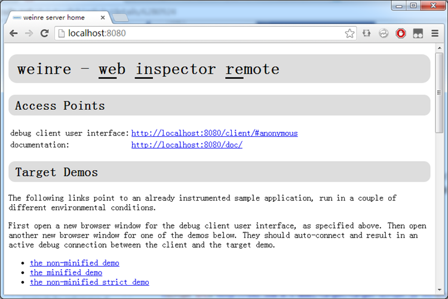
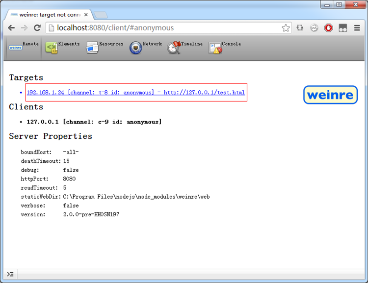
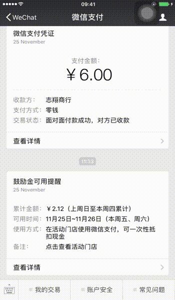
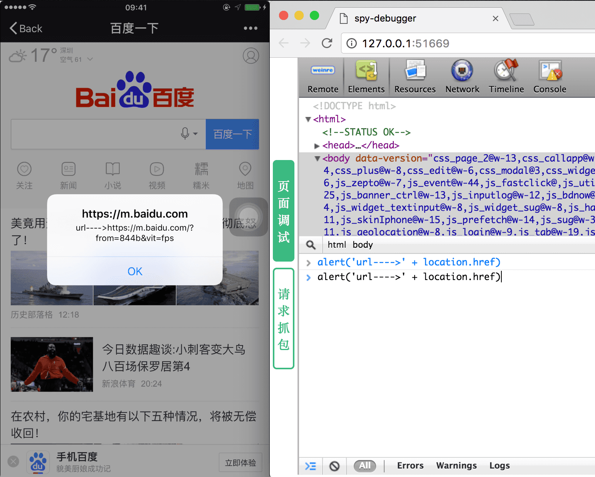
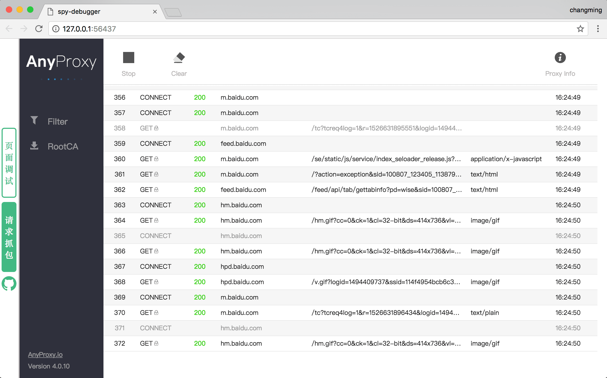
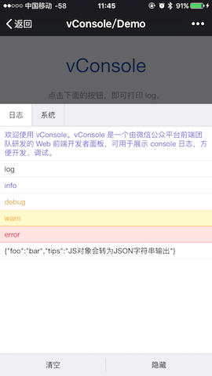
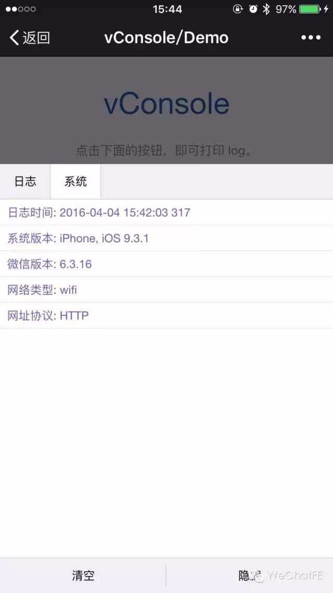
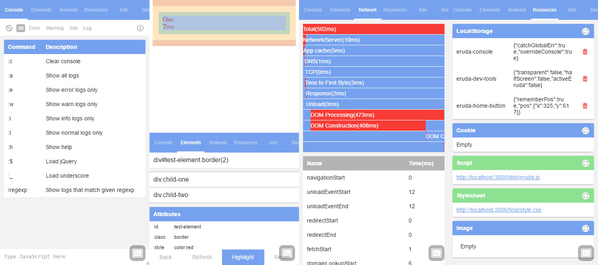
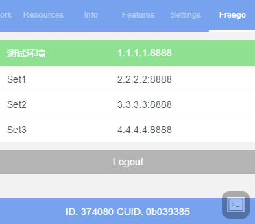

# weinre
>https://github.com/nupthale/weinre
### 获取Weinre

在任何的支持 Node.js 环境的系统下通过包管理器（npm）即可安装Weinre

```
npm install -g weinre
```

### 使用Weinre进行远程调试

1 启动 WeinreDe bug 服务端

```
weinre --httpPort 8080 --boundHost -all-
```

2 通过PC浏览器（WebKit内核）打开 WeinreDe bug 客户端

```
Open in your pc browser http://localhost[Your IP]:8080
```



3 在你需要调试的页面加上通信用的脚本


4 在手机上访问你的测试页面，在电脑上进入到 WeinreDe bug 客户端 看是否通信成功，如果一切没问题，可见到如下的页面

```
Open in your pc browser http://localhost[Your IP]:8080/client/#anonymous
```



 最后跟你平时一样实时调试你的页面吧，是不是很爽。

# Spy-Debugger 一站式页面调试工具
>https://github.com/wuchangming/spy-debugger

# 关于spy-debugger

一站式页面调试、抓包工具。远程调试任何手机浏览器页面，任何手机移动端webview（如：微信，HybridApp等）。支持HTTP/HTTPS，无需USB连接设备。  

## 特性

1、页面调试＋抓包
2、[操作简单](https://github.com/wuchangming/spy-debugger#三分钟上手)，无需USB连接设备
3、**支持HTTPS**。
4、`spy-debugger`内部集成了[`weinre`](http://people.apache.org/~pmuellr/weinre/docs/latest/)、[`node-mitmproxy`](https://github.com/wuchangming/node-mitmproxy)、[`AnyProxy`](https://github.com/alibaba/anyproxy)。
5、自动忽略原生App发起的https请求，只拦截webview发起的https请求。对使用了SSL pinning技术的原生App不造成任何影响。
6、可以配合其它代理工具一起使用(默认使用AnyProxy) [(设置外部代理)](https://github.com/wuchangming/spy-debugger#设置外部代理默认使用anyproxy)

## 使用案例

#### 页面编辑模式

启动命令：`spy-debugger -w true`
[](https://github.com/wuchangming/spy-debugger/blob/master/demo/img/spy-debugger-w.gif)

#### weiner页面调试界面


[](https://github.com/wuchangming/spy-debugger/blob/master/demo/img/demo.png)

#### anyproxy抓包界面

[](https://github.com/wuchangming/spy-debugger/blob/master/demo/img/AnyProxy.png)

## 安装

Windows 下

```
    npm install spy-debugger -g
```

Mac 下

```
    sudo npm install spy-debugger -g
```

## 三分钟上手

第一步：手机和PC保持在同一网络下（比如同时连到一个Wi-Fi下）

第二步：命令行输入`spy-debugger`，按命令行提示用浏览器打开相应地址。

第三步：设置手机的HTTP代理，代理IP地址设置为PC的IP地址，端口为`spy-debugger`的启动端口(默认端口：9888)。

- Android设置代理步骤：`设置 - WLAN - 长按选中网络 - 修改网络 - 高级 - 代理设置 - 手动`
- iOS设置代理步骤：`设置 - 无线局域网 - 选中网络 - HTTP代理手动`


第四步：手机安装证书。**注：手机必须先设置完代理后再通过(非微信)手机浏览器访问`http://s.xxx`[`(地址二维码)`](https://github.com/wuchangming/spy-debugger/blob/master/demo/img/QRCodeForCert.png)安装证书**（手机首次调试需要安装证书，已安装了证书的手机无需重复安装)。[iOS新安装的证书需要手动打开证书信任](https://github.com/wuchangming/spy-debugger/issues/42)

第五步：用手机浏览器访问你要调试的页面即可。

## 自定义选项

#### 端口


(默认端口：9888)

```
spy-debugger -p 8888
```

#### 设置外部代理（默认使用AnyProxy）


```
spy-debugger -e http://127.0.0.1:8888
```

spy-debugger内置AnyProxy提供抓包功能，但是也可通过设置外部代理和其它抓包代理工具一起使用，如：Charles、Fiddler。

#### 设置页面内容为可编辑模式


该功能使页面内容修改更加直观方便。 (默认： false)

```
spy-debugger -w true
```

内部实现原理：在需要调试的页面内注入代码：`document.body.contentEditable=true`。暂不支持使用了iscroll框架的页面。

#### 是否允许weinre监控iframe加载的页面


(默认： false)

```
spy-debugger -i true
```

#### 是否只拦截浏览器发起的https请求


(默认： true)

```
spy-debugger -b false
```

有些浏览器发出的connect请求没有正确的携带userAgent，这个判断有时候会出错，如**UC浏览器**。这个时候需要设置为false。大多数情况建议启用默认配置：true，由于目前大量App应用自身（非WebView）发出的请求会使用到SSL pinning技术，自定义的证书将不能通过app的证书校验。

#### 是否允许HTTP缓存


(默认： false)

```
spy-debugger -c true
```
# vConsole 手机前端开发调试利器
>https://github.com/Tencent/vConsole
### 1 前言

我们在开发手机版网页的时候，常常会出现下面的情景：

 (1) 开发时，在自己电脑上运行得好好的，在手机上打开就挂了，但是手机上又看不到error log； 

 (2) 上线后，某用户表示页面失灵，但我们自己又重现不出来，看不到用户侧的出错信息。

如果说(1)还可以通过电脑连接手机以查看log来解决，那(2)在没有完善的前端上报体系时就非常被动了。

作为开发者，我们的诉求很简单：有没有快捷的方法在手机前端页面看到log日志？

### 2 vConsole前端调试面板

莫慌，抱紧vConsole！

vConsole是一款由微信公众平台前端团队打造的前端调试面板，专治手机端看log难题。

目前vConsole自带有2个面板，默认为“日志”面板，负责展示log。



细心的同学可能会发现上面的log颜色各有不同。与电脑端的Developer Tools一样，开发者可以通过调用不同的方法来打出不同的颜色，以便快速区分日志类型：

```
console.log('foo'); // 白底黑字  console.info('bar'); // 白底紫字  console.debug('oh'); // 白底黄字  console.warn('foo'); // 黄底黄字  console.error('bar'); // 红底红字
```

第二个是“系统”面板，vConsole会自动将一些基础信息（如系统版本）打印出来，方便开发者定位问题。若页面是在微信内置浏览器中打开的，vConsole还会打印出微信版本号、当前网络类型等额外信息。



默认情况下，vConsole的面板是隐藏起来的。我们可以点击右下角的“面板”悬浮按钮来显示vConsole面板。

### 3 使用方法

Talk is cheap, show me the code.

首先，在需要展示日志的页面引入vConsole模块。我们建议在<head>中而非<body>底部引入，方便后续的新版本vConsole在页面初始化时预埋各种debug钩子。引入后，会自动生成window.vConsole对象实例。

```
<head> <script src='path/to/vconsole.min.js'></script> </head>
```

对于更通常的情况，我们只需在调试模式下才启用vConsole，平时用户无需看到调试面板。这时候就需要开发者自行判断引入模块的时机。以PHP为例，通过判断URL中有无 dev_mode参数来选择性加载vConsole：

```
<?php if($_GET['dev_mode'=='1'){?> <script src='path/to/vconsole.min.js'></script> <?php}?>
```

如果项目中用到了CommonJS或SeaJS这种AMD/CMD规范的模块加载方式，可以在module中使用require()引入vConsole：

```
var vConsole =require('path/to/vconsole.min.js');
```

好了，怎么打印log呢？与电脑端一致，可以直接使用console.log()等方法来打印日志，目前支持的方法有：

```
console.log('foo'); console.info('bar'); console.debug('oh'); console.warn('foo'); console.error('bar');
```

若页面未加载vConsole模块，console.log()会直接输出到原生控制台中；加载模块后，日志则会输出到原生控制台+前端面板。因此不必担心兼容性问题。

引入模块后，vConsole会有一小段时间用于初始化工作，在渲染出面板HTML之前将无法立即打印log。因此，若要在引入模块后立即打印log，应使用vConsole.ready()方法：

```
vConsole.ready(function() { console.log('Hello World'); 
});
```

### 4 在线demo

微信扫描以下二维码（或微信内长按图片识别二维码），即可体验vConsole面板。


目前vConsole已开源到WeChatFE的Github中。


# Eruda 手机网页前端调试面板
>https://github.com/liriliri/eruda



**示例**

**
**

请在手机上打开链接：http://liriliri.github.io/eruda/index.html?eruda=true

**安装**

你可以通过npm来下载使用该工具：

```
npm install eruda --save
```

然后在页面中引入以下脚本：

```
(function () {
    var src = 'node_modules/eruda/dist/eruda.min.js';
    if (!/eruda=true/.test(window.location) && localStorage.getItem('active-eruda') != 'true') return;
    document.write('<scr' + 'ipt src="' + src + '"></scr' + 'ipt>');
})();
```

可以看到只有当url上带有eruda=true或本地存储active-eruda为true的时候，工具才会被加载并执行。其中设置面板有选项可以设置active-eruda使工具常驻，不用每次都在url上添加eruda=true。

  注：该插件的文件gzip后大小约有50+kb，相比于项目页均js脚本量几kb来说还是太大，并不适合在现网环境加载影响页面载入速度。

**功能面板介绍**

**Console面板**
该面板会替换console对象中的log，error，info，warn，dir，time，timeEnd方法以不同的样式显示出来，同时默认会通过onerror捕获全局错误（可以在设置面板关闭），打出错误信息及其堆栈。当然，日志的清除与过滤也是支持的，还可以直接在该面板输入js脚本并在全局作用域下执行。该面板还内置了一些快捷指令来快速执行一些有用的功能，比如在页面载入jQuery或underscore，使用正则表达式过滤log等。

**Elements面板**
查看Dom状态对于调试工具自然是一个必不可少的功能。通过该工具，你无需连接PC端调试工具就能轻松查看DOM节点上的各个属性值，内容，应用的CSS样式。被查看的元素也会在页面上高亮，能够使你快速知晓DOM元素的margin，padding。

注：感谢weinre项目，扒了一点代码:)

**Network面板**

Network面板通过performance接口以图表的形式展示页面的加载速度。计划在resource timing api得到广泛应用时再加入各个资源的加载情况，不过目前它仅仅只能得到页面的加载速度。

**Resources面板**

该面板主要用来展示localStorage，cookie，页面脚本，样式，图片等资源，同时能够对其执行一些简单的操作，如清除指定的localStorage条目。

**Info面板**

很多时候会需要查看复制浏览器上的指定信息，比如通过JsBridge获取到的用户Id，用于后台数据查错。又比如，测试碰到某些页面错误时，我们首先做的一件事经常是：把链接发给我看看，然而APP里并没有复制链接的选项:( 还有，一个页面在不同环境下需要有不同的表现，项目H5页面经常需要在不同APP里有不同表现以及调用不同jsApi。靠什么来区分？UA。然而有时候对某个版本UA检测不准确就会造成页面出BUG，这时候如果有个方便的方法能够快速查看到出错者的浏览器UA就太好了。

综上，Info面板默认会展示出url和user-agent两条信息，你也可以通过调用它的接口输出其它指定信息。

**Snippets面板**

Console面板可以执行js脚本，但在手机上输入代码体验实在不怎么样。利用该面板你可以添加一些方法以便于快速和多次触发它。Sinppets默认加入了两个脚本，为页面所有元素加border查看排版结构以及重刷页面。

**Features面板**

嗯，之前碰到过BUG，结果发现是APP的WebView没开启对localStorage的支持，所以有了该面板。它会检测一些常用的功能是否被浏览器所支持，不支持的话将以红色高亮进行显示。

**自定义插件**

Eruda本质上只是一个可拖拽的入口按钮加一个Tab组件，其中的每个面板都是一个独立的插件。所以，事实上你可以自行添加各种自定义的信息展示面板，具体可参考这个[页面FPS展示插件](https://github.com/liriliri/eruda-fps)。这是一个很有用的特性，因为通用组件很难做到适应于各类需求，有很多时候你会想要去扩展它。比如，项目用于移动端测试环境切换的工具会在每个页面嵌入该插件用于不同环境的切换，同时显示ID便于查找单次请求所对应的完整HTTP记录，它长下面这个样子：



**结语**

Eruda调试面板的基础工具库：http://liriliri.github.io/eustia/